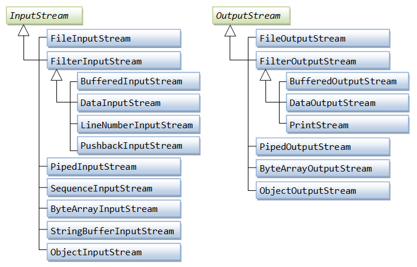
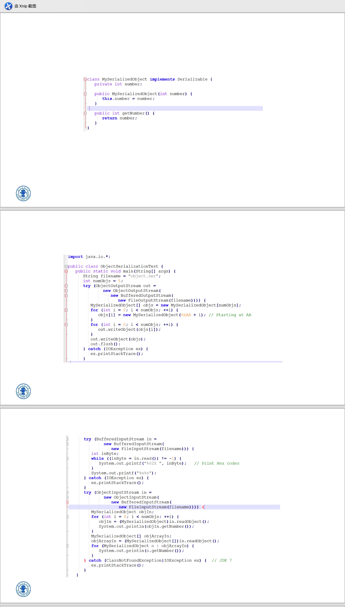

# Java的IO流

~~又到了每个语言里面最麻烦的流部分了~~

## 命令行流

在命令行，可以使用`java TestArgs ar gv1 "hello\"\' wrold"`运行Java程序，并且把`ar`、`gv1`和`hello"\' wrold`这三个参数传进了`main`方法的参数`String[] args`里

在IDEA，点击`main`方法左边的运行图标，选`Modify Run Configuration`，在弹页面就可以更改了

可以看出，命令行里的`"`可以通过`\"`转义进去，其他的特殊符号则不需要


## 控制台IO(console IO)

在Java中，有三个自带的IO流，即`System.out`、`System.err`、`System.in`，分别是输出流、错误流、输入流，前两者为`PrintStream`，后者为`InputStream`


## `File`类

### `File`类初印象

在《Java编程思想》里有介绍到，Java的`File`类本质是“文件路径”类，我们可以通过下面的例子了解个大概：

```java
package TestFileClass;

import java.util.*;
import java.io.*;
import java.math.*;
import java.time.*;
import java.lang.*;
import java.util.regex.*;

public class AccessAllFiles {
    public static void main(String[] args) throws IOException {
        File dir = new File("/Users/lee/轮子");
        System.out.println(listdfs(dir));
    }
    static final String onlyCCpp=".*\\.c.*|.*\\.C.*|.*\\.cpp.*|.*\\.Cpp.*"; // 只配对.c或者.cpp文件
    public static int listdfs(File dir) {
        int cnt = 0;
        String name=dir.toString();
        if (dir.isDirectory()) { // 判断是不是文件夹
            File[] items = dir.listFiles();
            assert items != null; // IDEA要求加的
            for (File item : items) {
                int tmp = listdfs(item);
                cnt += tmp;
            }
        } else if(Pattern.matches(onlyCCpp,dir.toString())) { // 如果item确实和onlyCCpp匹配
            ++cnt;
        }
        return cnt;
    }
}

```

`listdfs`方法可以用于遍历文件夹，在这里实际上就对`File`的作用有了一个大概的想象，感觉上似乎`File`会保存某些路径，并且我们可以对这些路径进行访问，也可以把这些文件列出来变成`File[]`

我们下面逐一研究这些方法


### `File`里的变量

总结地说，`File`里的变量有 用于多平台协同的字符和字符串 以及 用于检查状态的枚举和枚举对象 和 一些预处理内容

#### 用于多平台协同的变量

由于每个系统的文件夹分隔符和多路径分隔符是不同的，所以为了实现跨平台，`File`保存了基于平台的这些信息，见下：

```java
public class File implements Serializable, Comparable<File>{
    /**
     * The FileSystem object representing the platform's local file system.
     */
    private static final FileSystem fs = DefaultFileSystem.getFileSystem();
    
    /**
     * This abstract pathname's normalized pathname string. A normalized
     * pathname string uses the default name-separator character and does not
     * contain any duplicate or redundant separators.
     */
    private final String path;
    
    /**
     * The system-dependent default name-separator character.  This field is
     * initialized to contain the first character of the value of the system
     * property <code>file.separator</code>.  On UNIX systems the value of this
     * field is '/'; on Microsoft Windows systems it is '\\'.
     */
    public static final char separatorChar = fs.getSeparator(); // 获得合适的分隔符
    
    /**
     * The system-dependent default name-separator character, represented as a
     * string for convenience.  This string contains a single character, namely
     */
    public static final String separator = "" + separatorChar;
    
    /**
     * The system-dependent path-separator character.  This field is
     * initialized to contain the first character of the value of the system
     * property path.separator.  This character is used to
     * separate filenames in a sequence of files given as a path list.
     * On UNIX systems, this character is ':'; on Microsoft Windows systems it is ';'.
     */
    public static final char pathSeparatorChar = fs.getPathSeparator();
    
    
    /**
     * The system-dependent path-separator character, represented as a string
     * for convenience.  This string contains a single character, namely
     * {@link #pathSeparatorChar}.
     */
    public static final String pathSeparator = "" + pathSeparatorChar;
}
```

先解释下抽象路径(abstract path)：根据[这篇文章](https://blog.csdn.net/qq_23617681/article/details/50822713)，抽象路径指的是与系统无关的文件名表达形式

这里可以看到很多`static`的变量，这些都是为了同样代码在不同系统产生相同效果


#### 检查状态的枚举和枚举对象以及一些预处理

```java
public class File implements Serializable, Comparable<File>{
	/**
     * Enum type that indicates the status of a file path.
     */
    private static enum PathStatus { INVALID, CHECKED };

    /**
     * The flag indicating whether the file path is invalid.
     */
    private transient PathStatus status = null; // transient不用管，这里注意status的类型是PathStatus这个enum
    
    final boolean isInvalid() {
        if (status == null) {
            status = (this.path.indexOf('\u0000') < 0) ? PathStatus.CHECKED
                                                       : PathStatus.INVALID;
        }
        return status == PathStatus.INVALID;
    }
    
    /**
     * The length of this abstract pathname's prefix, or zero if it has no prefix.
     */
    private final transient int prefixLength;
    
    /**
     * Returns the length of this abstract pathname's prefix.
     * For use by FileSystem classes.
     */
    int getPrefixLength() { // 注意这玩意是包访问权限
        return prefixLength;
    }
}
```

在`File`里只要没有`'\0'`就是valid字符串。。。可还行


### `File`构造器

我们只看`public`使用路径名的

```java
public class File implements Serializable, Comparable<File>{
    /**
     * Creates a new <code>File</code> instance by converting the given
     * pathname string into an abstract pathname.  If the given string is
     * the empty string, then the result is the empty abstract pathname.
     */
    public File(String pathname) {
        if (pathname == null) {
            throw new NullPointerException();
        }
        this.path = fs.normalize(pathname);
        this.prefixLength = fs.prefixLength(this.path);
    }
    // 下面这部分源码要看注释
    public File(String parent, String child) {
        if (child == null) {
            throw new NullPointerException();
        }
        if (parent != null) {
            if (parent.equals("")) { // resolve就是拼接成一个完整路径
                this.path = fs.resolve(fs.getDefaultParent(), // getDefaultParent()和系统有关，但是一般是指根，即/或\\
                                       fs.normalize(child)); // normalize转化成通用路径
            } else {
                this.path = fs.resolve(fs.normalize(parent),
                                       fs.normalize(child));
            }
        } else {
            this.path = fs.normalize(child); // 如果parent==null就直接用child，和上一个构造器一样了
        }
        this.prefixLength = fs.prefixLength(this.path);
    }
    public File(File parent, String child) {...} // 这个实际上和上一个一样的。。。只是把parent改成了parent.path
}
```

也就是如果是一个参数的构造器，就会直接参数作为`this.path`（顺便，如果想要使用相对路径要使用`new File(".")`构造）

如果是使用两个的，将两个参数拼接成的路径作为`this.path`

还有一个使用`URL`的，这里就不管了


### 一些属性方法

这些方法的实现我都隐去了，主要关注功能

#### 路径内容访问

用于访问`this.path`这个路径里的内容

```java
public class File implements Serializable, Comparable<File>{
    public String getName() {...} // 返回当前 文件夹/文件 名
    public String getParent() {...} // 返回父文件夹名，如果没有可以返回null
    public File getParentFile() {...} // 返回使用getParent()得到的字符串构造的File，如果getParent()==null这里也会是null
}
```


#### 路径信息

用于查看`this.path`的信息，比如是不是绝对路径之类的

```java
public class File implements Serializable, Comparable<File>{
	public boolean isAbsolute() {return fs.isAbsolute(this);} // 返回是不是绝对路径
    public String getPath() {...} // return path;
    public String getAbsolutePath() {return fs.resolve(this);} // 返回绝对路径
    public File getAbsoluteFile() {...} // 使用getAbsolutePath()构造
    public String getCanonicalPath() throws IOException {...} // 见下
    public File getCanonicalFile() throws IOException {...} // 使用getCanonicalPath()构造
}
```

`getPath()`返回的是`File`构造方法里的路径，是什么就是什么，不增不减
`getAbsolutePath()`返回的其实是`user.dir+getPath()`的内容
`getCanonicalPath()`返回的就是标准的将符号完全解析的路径（我们实际上可以通过`../`去往上一级路径，这导致同一个文件路径有非常多种方法表示，这个函数返回唯一的一种）


#### `path`的状态

这些方法可以返回`this.path`指向文件的一些状态

```java
public class File implements Serializable, Comparable<File>{
    public boolean isDirectory() {...} // 返回是不是文件夹
    public boolean isFile() {...} // 返回是不是文件
    public boolean isHidden() {...} // 返回是否被隐藏了
    public long lastModified() {...} // 返回最后更改时间
    public long length() {...} // 如果this.path是文件，返回以B为单位的大小；如果是文件夹结果不确定
}
```


#### 文件操作

```java
public class File implements Serializable, Comparable<File>{
	public boolean createNewFile() throws IOException {...} // 创建文件（必须当原文件不存在时）
    public boolean delete() {...} // 删除文件
    public void deleteOnExit() {...} // 将文件放入“退出时删除列表”
    
    public String[] list() {...} // 返回文件名的数组，和terminate里面的ls一样。这里返回的就是文件名，不包括祖先路径
    
    // FilenameFilter和FileFilter是接口，我们会在后面看到应该怎么实现这个接口
    public String[] list(FilenameFilter filter) {...} // 返回文件夹下满足filter.accept(this, names[i])的文件名
    public File[] listFiles() {...} // list()中的使用File(this,name[i])一个个构造出来
    public File[] listFiles(FilenameFilter filter) {...} // list(FilenameFilter filter)中的使用File(this,name[i])一个个构造出来
    public File[] listFiles(FileFilter filter) {...} // 返回文件夹下满足filter.accept(filepath)的所有File组成的数组
    // 补充一下，accept参数接受的都会是完整路径
}
```

下面简单看一下`FilenameFilter`和`FileFilter`这两个接口

```java
@FunctionalInterface
public interface FileFilter {
    /**
     * Tests whether or not the specified abstract pathname should be
     * included in a pathname list.
     * @param  pathname  The abstract pathname to be tested
     * @return  <code>true</code> if and only if <code>pathname</code>
     *          should be included
     */
    boolean accept(File pathname); // 这里输入的会包括整个路径
}
@FunctionalInterface
public interface FilenameFilter {
    /**
     * Tests if a specified file should be included in a file list.
     *
     * @param   dir    the directory in which the file was found.
     * @param   name   the name of the file.
     * @return  <code>true</code> if and only if the name should be
     * included in the file list; <code>false</code> otherwise.
     */
    boolean accept(File dir, String name); // 这里输入的是dir文件被发现的文件夹，name文件(夹)的名字
}
```

我们之前使用过`Pattern.matches(onlyCCpp,dir.toString())`来匹配所有满足`onlyCCpp`这个正则表达式的串，现在我们可以先实现上述接口来达到只访问部分文件夹的目的

```java
package TestFileClass;

import java.util.*;
import java.io.*;
import java.math.*;
import java.time.*;
import java.lang.*;
import java.util.regex.*;

class filt implements FileFilter{
    static final String onlyCCpp=".*\\.c|.*\\.C|.*\\.cpp|.*\\.Cpp"; // 原来的.class会被包括。。。贼傻逼
    @Override
    public boolean accept(File pathname) {
        return Pattern.matches(onlyCCpp,pathname.toString()) || pathname.isDirectory();
    }
}

public class AccessAllFiles {
    public static void main(String[] args) throws IOException {
        File dir = new File(".");
        System.out.println(dir.getAbsoluteFile());
        System.out.println(Arrays.toString(dir.list()));
        System.out.println(listdfs(dir));
    }
    public static int listdfs(File dir) {
        if(new filt().accept(dir)){
            int cnt = 0;
            String name=dir.toString();
            File [] sonfile=dir.listFiles(new filt()); // 记得这里要new
            if(sonfile!=null) { // 如果dir就是个文件的话就会引起sonfile=null
                for(File f:sonfile){
                    cnt+=listdfs(f);
                }
            }else{
                cnt=1;
            }
            return cnt;
        }else{
            return 0;
        }

    }
}

```

`FilenameFilter filter`基本一样的，只不过要注意`FilenameFilter`的`accept`接收的第一个参数是文件被发现的文件夹路径，第二个参数就是文件名。这样其实更适合做文件名匹配


#### 其他

实际上还有很多其他的方法，比如获得根路径等等，这里就不介绍了，可以自行查看


### `File`类不能做什么

在C中，有文件指针这个东西，可以直接通过文件指针读写，但是在Java中`File`类不能直接改写内容，必须借助流

实际上在C++中我们也一般使用流而不是`fprintf`/`fscanf`了


## `InputStream`和`OutputStream`

实际上我们一直在用的`System.in`就是一个`InputStream`、`System.out`就是一个`PrintStream`

我们可以使用`setIn(InputStream in)`来重定向`System.in`到一个新的流，注意`InputStream`是一个抽象类（并且没有构造器），实际上这里传入的是一个继承类；也可以使用`setOut(PrintStream out)`来重定向`System.out`到一个新的流。注意新的流一定是`PrintStream`（或其继承类）

关于`InputStream`和`OutputStream`的继承关系见下



### 共有方法

所有的`InuptStream`和`OutputStream`都实现了`Closeable`接口，也就是一定有一个`close()`方法，可以用于关闭流

在读完/写完之后一定要`close()`（`System.out`貌似不关也没事。。。这里不太清楚是怎么实现的，实际上在C++中`cout`不关也没事，但是不清楚是为什么）


### `FileInputStream`和`FileOutputStream`

这里简单写了

`FileInputStream`里面有常用构造器如下：

```java
public FileInputStream(String filename); // 实际上是路径
public FileInputStream(File file)
```

如果使用一个不存在的`File`构造，会抛出`java.io.FileNotFoundException`


`FileOutputStream`里面常用构造器如下：

```java
public FileOutputStream(String filename);
public FileOutputStream(File file);
public FileOutputStream(String filename, boolean append);
public FileOutputStream(File file, boolean append);
```

和`FileInputStream`，如果输入的文件并不存在，会创建一个

如果文件已经存在，前两个构造器会删除文件，后两个构造器会根据`append`参数的情况决定是在文件后面加内容还是直接删除


### `FilterInputStream`和`FilterOutputStream`

`Filter`是指过滤器，很明显这两个会对数据进行一些处理

单纯的`FilterInputStream`只是用“将所有输入给到`InputStream`的各个方法”的方式覆写了`InputStream`的方法，而`FilterInputStream`的子类可以进一步重写其中的一些方法，还可以提供额外的方法和字段。`FilterOutputStream`同理

#### `DataInputStream`和`DataOutputStream`

这两个是可以看作是位级别的输入输出（和C的`fwrite`很像）。具体的使用这里就不管了，可以翻源代码/JDK文档


### `ObjectInputStream`和`ObjectOutputStream`

如果想要二进制(或者说以`byte`方式)输出一个`Object`就可以使用`ObjectInputStream`和`ObjectOutputStream`

看下图了解




我们看到，`MySerializedObject`实现了`Serializable`这个接口，那这个接口是干嘛的呢？

实际上`Serializable`是一个标记接口，其不包含任何方法，所以代码里不需要新加任何东西。它表示这个类是可以序列化的（也就是二进制化），如果真的去说的话，只有基础类型（和数组）可以序列化。那么不能被序列化的东西在某一个类里然后这个类又实现了`Serializable`接口，我们强行输出它会发生什么事呢？

答案是会得到一个`java.io.NotSerializableException`。如果想要输出一个包含了不可序列话的数据但是又想要`Serializable`怎么办呢？答案是可以对于所有不应该被序列化的变量加上`transient`这个关键字


## `Scanner`类

`Scanner`可以方便地进行输入输出。这里我们不关注输入输出乃至构造的具体实现了，只看`Scanner`有哪些常用的构造器/方法

### 构造器

```java
public final class Scanner implements Iterator<String>, Closeable {
    public Scanner(Readable source) {...}
    public Scanner(InputStream source) {...}
    public Scanner(String source) {
        this(new StringReader(source), WHITESPACE_PATTERN);
    }
}
```

先不管声明里面实现的接口，我们就看构造器

可以看出，`Scanner`类可以使用实现了`Readable`接口的类来构造自己，也可以使用`InputStream`这个类来构造自己，甚至可以使用`String`来构造自己（基本上相当于C++里面的`StringStream`）

注意，如果`source`被重定向了，`Scanner`的内容不会被重定向

如果我们想要从一个文件输入，可以使用`Scanner cin=new Scanner(new FileInputStream("./data.in"));`这种方式，注意最后可能需要`.close()`


### `hasNext()`和`next()`的真面目

先看下声明：其实现了`Iterator<String>`这个接口，那么这个接口有什么用呢？见下

```java
public interface Iterator<E> {
    boolean hasNext();
    E next();
}
```

所以实际上`Scanner`的`next`和`hasNext`实际上是实现自`Iterator<String>`的


## `PrintStream`类

`PrintStream`是`FilterOutputStream`的一个继承类

我们只看简单的构造器，其他的在Java基础中有讲过了。`autoFlush`是啥以后说。。。目前没有查到资料《！》

```java
public class PrintStream extends FilterOutputStream
    implements Appendable, Closeable
{
	public PrintStream(OutputStream out) {...}
    public PrintStream(OutputStream out, boolean autoFlush) {...}
    public PrintStream(String fileName) throws FileNotFoundException {...} // filename是路径
    public PrintStream(File file) throws FileNotFoundException {...}
}
```

一定要记得`.close()`！


## 一些小点

如果去看源码我们会发现每个流都有两个输出器，见下

```java
private BufferedWriter textOut;
private OutputStreamWriter charOut;
```

这是因为很多数据是需要使用`byte`的方式来输出的，而基础类型这种只需要输出`char`就行了


