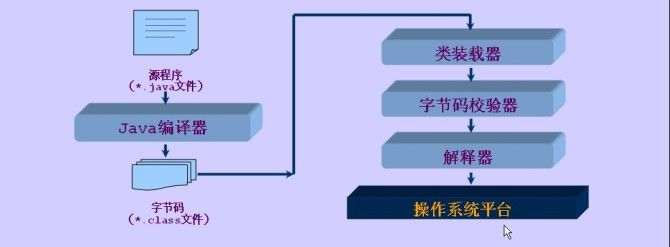

# 行文问题

《？》是有疑问的点

《！》是需要填坑的点

# 基础知识

## Java特性

### 基本类型

#### 基本知识

直接列出知识点：

1. 总共有`int`，`boolean`，`char`，`byte`，`short`，`long`，`float`，`double`八个基本类型，这八个基本类型在传参数、`=`赋值的时候都是传值

   相对的类型是引用类型，引用类型传参数、`=`赋值的时候传的都是引用（或者指针）

3. 类型之间有下图关系：

   

   这张图表示的是：对于类型`T1`和`T2`，如果`T1`经过箭头指向`T2`，那么`T1`的量可以直接赋值给`T2`，但是`T2`的量需要经过强制类型转换才能赋值给`T1`

   比如`T1`为`float`，`T2`为`double`，那么`double d=0.5;float f=d;`的语句就过不了编译，因为第二句应当写成`float f=(float)d;`；而`float f=0.5f;double d=f;`就没有问题

   补充一句，可以直接赋值不代表没有问题，实际上是有精度问题的，比如`long x=1234567890;float f=x;`虽然可以过编译，但是`x`在转换到`f`的过程中是有精度丢失的

4. 浮点数字面值

   前面的`float=0.5f;`里`0.5`后面的`f`表示这个值是一个`float`，否则Java会默认`0.5`是一个`double`，然后就认为`float f=0.5;`就会被当作将`double`转化成`float`，然后就过不了编译

   具体来说，`1e4`、`3.14`会被看作`double`，`1e5f`、`3.14f`会被看作`float`

5. 整数字面值

   对于整数来说，情况复杂些：`byte b=127;`是可行的，`byte b=128;`则不可行，原因在于Java会自动判断字面值数据范围然后决定其类型再转过去（`byte`最大能表示的整数就是`127`），对于`int`之类的也是一样；但是如果字面值的数据超过了`int`，就需要在字面值最后加上`L`表示这是个`long`数据

   比如`long x=10000000000;`过不了编译，`long x=10000000000L;`则可以

6. 编译器会尽可能检查使用前是否赋值：

   下面语句过不了编译：

   ```java
   int x;
   System.out.println(x);
   ```

   因为编译器检查出来了`x`并没有被赋值

   但是有可能有编译器检查不了的情况，此时基础类型的值就是`0`，注意对于`char`来说我们说的`0`是`'\u0000'`（表示`Unicode`编码的`0`），对于`double`是`0.0`。比如：

   ```java
   class Tes{
   	int i;double d;
   	void print(){ // 执行到这里的时候i和d并没有被赋值
   		System.out.println("i : " + i + " ");
   		System.out.println("d : " + d + " ");
   	}
   }
   public class TestEquals {
   	public static void main(String[] args) {
   		Tes tes=new Tes();
   		tes.print();
   	}
   }
   ```

   这个输出是

   ```java
   i : 0 
   d : 0.0 
   ```

   


#### 运算规则

在不同类型的数字运算的时候会有类型转换的问题，这里对这个进行讨论：

1. 这里讨论的运算只针对单纯二元运算，对于连续运算，比如`(5/2)*1.5`，按照运算顺序逐次考察。讲完单纯二元运算之后再讲回这个例子

2. 所有的整型数据在运算前都会转化成`int`，因此我们剩下需要讨论的整形数据只有`int`和`long`了

3. `int`或`long`运算的结果：两个运算数如果至少有一个是`long`，那么将`int`转化成`long`运算并且结果返回`long`；如果都是`int`就只用`int`计算、返回`int`

   ```java
   byte b = 1;short s = 2;int i = 4;long l = 8;char c = 16;
   // short _s = s + b; // WRONG, s+b is a int
   // char _c = c + b; // WRONG, c+b is a int
   // short _s = b + c; // WRONG, b+c is a int
   // int _i = i + l; // WRONG, i+l is a long
   ```

4. 只有浮点数据（`float`和`double`）且两个数据类型不相同时，所有数据转化成`double`运算，运算返回`double`

   ```java
   double d=3.14;
   float f=3.14f;
   int i=1;
   // float _f=f+d; // WRONG, f+d is a double
   float _f=i+f; // RIGHT, i+f is a float, see below
   float __f=f+f; // RIGHT, f+f is a float
   ```

5. 当浮点和整型在一起运算时，整型数据会变成浮点型然后运算产生浮点型，比如：

   ```java
   byte b = 1;
   short s = 2;
   int i = 4;
   long l = 8;
   char c = 16;
   double d = 3.14;
   float f = 3.14f;
   
   float _f = i + f; // RIGHT, i+f is a float
   double _d = i + d; // RIGHT, i+d is a double
   // float __f = i + d; // WRONG, i+d is a double
   ```

6. 连续运算的例子：

   ```java
   System.out.println(5/2*1.5); // 3.0, 5/2=2 (int), 2*1.5=2.0*1.5
   ```

   `5`和`2`计算产生`int`的`2`，然后`int`的`2`转化成`double`的（因为`1.5`是`double`的）`2.0`与`1.5`运算产生`double`的`3.0`
   
7. 总结：对于一个二元运算，依次检测下面的条件，

   1. 某一个运算数是`double`：那么另一个运算数会被转成`double`参与运算；否则检测2.
   2. 某一个运算数是`float`：那么另一个运算数会被转成`float`参与运算；否则检测3.
   3. 某一个运算数是`long`：那么另一个运算数会被转成`long`参与运算；否则检测4.
   4. 全部转化成`int`运算

8. 特例：`char ch='1';ch+=5;`没有任何问题，尽管`ch=ch+5;`是错的，因为编译器会自动帮助做类型转换


### 引用类型

1. Java里除了基本数据类型之外的类，本质都是引用

   另外从某种意义上来说这里的引用说成指针会更好（具体相关知识可以查看[Java 到底是值传递还是引用传递？ - Intopass的回答 - 知乎 ](https://www.zhihu.com/question/31203609/answer/50992895)）

2. 尽管一切都看作对象，但是标识符的操纵实际上是对象的一个“引用”，并且在Java中程序员并不需要在意对象的生存周期

3. 在C++中我们一般使用`delete`来清除不再被使用的对象，并且还需要特别注意析构函数的设计，但是在Java中我们无需这么做，Java会自己控制内存的回收

   > 在考试时，我们认为如果指向某个实例的指针都消失了，那么这个实例就会被回收，比如：
   >
   > ```java
   > Object obj=new Object(); // 我们假设这个Object在内存的空间为#
   > Object _obj=obj;
   > _obj=null;
   > obj=null; // 这行结束后，（考试时）就认为#的空间会被回收
   > ```
   >
   > 但是实际上不是这样的，Java的垃圾回收机制并不会每时每刻监视变量的引用数（就是有多少指针指向对象），而是每隔一段时间查询一遍、打上标记，当空间不够时回收内存（具体垃圾回收机制请查阅Java专业书籍）

4. 和基础类型一样，编译器会尽可能检查使用前是否赋值（或者说指向有效内容）：

   ```java
   Tes tes;
   System.out.println(tes);
   ```

   这个过不了编译，因为编译器查出来了`tes`没有被赋值

   但是有可能有编译器检查不了的情况，此时引用类型的值就是`null`：

   ```java
   class Tes{
   	int i;double d;
   	void print(){
   		System.out.println("i : " + i + " ");
   		System.out.println("d : " + d + " ");
   	}
   }
   class TT{
   	Tes tes;
   	void print(){
   		System.out.println(tes);
   	}
   }
   public class TestEquals {
   	public static void main(String[] args) {
   		TT t=new TT();
   		t.print();
   	}
   }
   ```

   输出为`null`

   基础类型没有被赋值就被使用只是会被当作`0`，但是引用类型没被赋值就被使用就会产生大问题，比如上面的语句如果我们在`main`里面调用了`t.tes.print()`就会产生大问题——因为`tes`还是`null`，调用`print`就会产生错误


### 语法方面

这里主要是一些细节

* Java不会将所有空变量（比如`null`、`0`）都看作`false`，也就是需要`boolean`的地方语句的返回值必须是`boolean`

  比如在C++中我们经常写`while(cnt--)`，C++会在`cnt--`返回`0`的时候结束`while`循环；但是在Java中就必须写`while(cnt-->0)`（~~看起来像cnt趋向于0~~），因为`while`的括号里必须返回一个`boolean`值

* Java的函数如果不用接受参数的话不能使用`void`占位

  `static public void fun(void){}`会报错

* 注意Java没有`const`，但是`const`是一个保留字，所以并不能声明一个叫做`const`的变量

* Java是半编译半解释型语言，具体过程见下图

  

  也就是Java还是会编译的，实际上很多错误也会在编译的时候就被发现

* Java的输入一般使用的是`Scanner`类及其类函数(一般被命名成`next...`)

  需要特别注意的是，`.nextLine`会读取所有行内容直到`'\n'`，所以如果一道题说"第一行为一个整数n表示n组样例，接下来n行样例"，我们可以这么写

  ```Java
  Scanner cin=new Scanner("System.in");
  int n=cin.nextInt();
  cin.nextLine(); // 吸收掉多余的'\n';
  while(n-->0){
  	String[] strs=cin.nextLine().split(" "); // 这样数组里每一个位置都是一个存储信息的String，当然，这么做会导致效率其低
  }
  ```

* Java支持javadoc，下面的

  ```java
  /**
   *
   *
   *s
  /** */
  ```

  会自动变成Javadoc，可以在IDEA里面看效果


##  类相关

* `native`是什么：

  在Java中`Object`类(后面介绍)中，有一个方法`hashCode()`，有一个关键字叫`native`，那这个关键字是干嘛用的呢？

  根据[简书：JAVA中的native是什么？](https://www.jianshu.com/p/429dc9aa2ce4)的内容，认为这表示这个方法是一个不在Java中实现的接口，所以看到这个方法(主要是在Java源码中)就可以默认它有着一种实现方式，只不过不在Java类内实现
  
* Java的文件名`FileName.java`里面必须只有`FileName`这一个类是`public`的，其他的不可是`public`

* 在C++中我们对于一个对象很多时候会默认其有一种`==`的运算符重载，但是在Java中并不存在运算符重载！实际上

  ```Java
  Scanner cin=new Scanner("System.in");
  String str1=cin.nextLine();String str2=cin.nextLine();
  if(str1==str2){
      // todo
  }
  ```

  里面的`str1==str2`比较的是两个引用是否相等（也就是是不是指向同一块内存）！对于Java来说，如果想要比较`String`（或者说两个非基本类）是否相等，应该使用`str1.equals(str2)`的形式

* Java是没有运算符重载的！比如Java有一个类叫做高精度整数`BigInteger`，这个可以看成一个位数不限的整数，但是它本质是一个类，所以用起来很麻烦，比如下例

  这个计算的是`(x-y)%z`

  ```c++
  public class Main {
      public static void main(String[] args) {
          Scanner cin = new Scanner(System.in);
          BigInteger x=BigInteger.valueOf(100);
          BigInteger y=new BigInteger(String.valueOf(50)); // 本质是使用字符串初始化
  //        BigInteger z=new BigInteger(BigInteger.TWO); // 这个过不了编译，似乎是因为BigInteger并没有去实现复制构造函数
          BigInteger z=BigInteger.TWO; // BigInteger.TWO 就是valueOf(2)
          System.out.print(x.subtract(y).mod(z));
      }
  }
  ```
  
  这里绝对不能写`x++`的语句

* 在Java中只能使用`TYPE t=new TYPE() `的方式来新建对象，而不存在在C++中的`TYPE t(xx);`的方式


## 流程控制相关

在Java里，支持给循环标上`label`：

```java
import java.util.Random;

public class TestLoop {
	public static void main(String[] args) {
		Random R=new Random(System.nanoTime());
		int n=10;
		double d;
		OUT:for(int i=1;i<=n;++i){ // 这行for被打上了OUT的label
			CON:for(int j=1;j<=n;++j){ // 这行for被打上了CON的label
				for(int k=1;k<=n;++k){
					d=R.nextDouble();
					System.out.println("( "+i+" , "+j+" , "+k+") : "+d);
					if(d<0.5){
						continue CON;
					}else if(d>0.9){
						break OUT;
					}
				}
			} // 被打CON的label的for循环结束处，continue CON会跳到这里，然后继续这层循环
		} // 被打OUT的label的for循环结束处，break OUT会跳到这里，然后跳出这层循环
	}
}
```

具体来说，`break LABEL;`会跳到`LABEL`标注的循环的结束处，然后跳出循环；`continue CON;`会跳到`LABEL`标注的循环的结束处，然后继续这层循环


不过`break`也有C/C++的`goto`作用：

```java
ALLREAD:{
    Scanner cin = new Scanner(System.in);
    int x;
    while (true) {
        x = cin.nextInt();
        if (x == -1) {
            break ALLREAD;
        }
    }
}
// #
```

当`x`被输入一个`-1`时，`break ALLREAD;`会让程序跳到`#`处继续执行


## 其他进阶特性

* 我们在C++中可以在声明函数的时候标注上其**期望**抛出的异常，如下：

  ```c++
  void func(void) throw (expt,int){
      // ...
  }
  ```

  这里的`throw (expt,int)`表示`func`函数期望抛出`expt`或者`int`的异常，但是注意这不是强制的，也就是如果有其他的异常被抛出也是可以的，编译器不会对此报错

  但是在Java中，这里标注的必须是所有可能被抛出的类，而且这些类必须实现了`throwable`接口（接口后面介绍）

  具体可以参考下面代码

  ```java
  class tes {
      public void expt() throws intExpt,doubleExpt{
          Random r=new Random();
          if(r.nextInt()>0){
              throw new intExpt();
          }else{
              throw new doubleExpt();
          }
      }
  }
  
  class intExpt extends Exception{
      int x;
  }
  
  class doubleExpt extends Exception{
      double x;
  }
  ```

* 我们知道C++里面如果一个类我们写成下面这样

  ```c++
  // in tes.hpp
  class tes{
  private:
  	int t;double x;    
  public:
  	tes(){
          t=0;x=0;
      }    
  }; // 这里还有个不同，Java的类最后并不需要分号
  
  // in main.cpp
  tes tt;
  ```

  `main`里面的`tt`会调用默认构造函数`tes()`

  但是如果我们在Java中类似地写

  ```java
  public class tes{
      int t;double x;
  }
  public class Main{
      public static void main(){
          tes tt;
          tt.x=10;
      }
  }
  ```

  就会被报错，应该写成`tes tt=new tes();`

  Java里类如果没有默认初始化/赋值的话，编译器会检查出来并抛编译ERROR

  

  另外，拓展一下，Java里面的数组如果使用C++的方式可能会出错

  ```c++
  class tes{
  private:
      int len;
      char * str;
  public:
      tes():len(0){
          str=(char*)malloc(sizeof(char)*(len+1));
  		str[len]='\0';
      }
  };
  // in main
  tes ts[20];
  ```

  在C++里上述语句会调用20次`tes`类的默认构造函数，但是如果等效到Java里就会出现意想不到的效果

  ```java
  public class tes {
      public int num;
      public String str; // 别忘了这里是一个引用！
      public tes(){
          num=0;str=new String(Integer.toString(num));
      }
  }
  import java.util.Scanner;
  public class Main {
      public static void main(String[] args) {
          tes [] tts=new tes[5];
          for(int i=0;i<tts.length();++i){
              System.out.println(tts[i].str);
          }
      }
  }
  ```

  看起来`tts`里面每个元素应该都有值了，但是实际上这里的元素根本就没有被赋值！

  应该加上

  ```java
  for(int i=0;i<tts.length();i++){
      tts[i]=new tes();
  }
  ```

* Java并不支持默认形参

  ```java
  static void fun(int x=1){} // WRONG!
  ```

  

* 如果在C++中提前return函数，导致后面的部分没有办法被执行到，顶多会被报WARNING，但是在Java中类似行为(比如下面的语句)会过不去编译

  ```java
  public class Main {
      public static void main(String[] args) {
          Scanner cin = new Scanner(System.in);
          System.out.printf("%s\n","ABC"+100);
          return; // WRONG!
          Object oo=new Object();
          System.out.print(oo.toString());
      }
  }
  ```

* 在C++中我们可以使用`for(auto & x:vec)`来安全地循环一个vec，并且可以通过`x`这个引用改变vec里面数据的值，但是在Java中的`foreach`并不具有这样的性质。具体见下

  ```java
  int [] x=new int[4];
  for (Integer xx:
       x) {
      xx=1;
  }
  for (int xx:x) {
      System.out.println(xx);
  }
  ```
  
  这里输出出来`xx`都是0，也就是Java给出的初始值，并不会得到1
  
  即使把上面的`int`改成`Integer`也不行
  
* Java也有命令行


# 一些常用方法

随机数：

```java
Random r = new Random(System.nanoTime()); // 初始化种子
for(int i=0 ; i<5 ;  i++){
    int ran1 = r.nextInt(100); // 范围在[0,100)的整数
    System.out.println(ran1);
}
```


