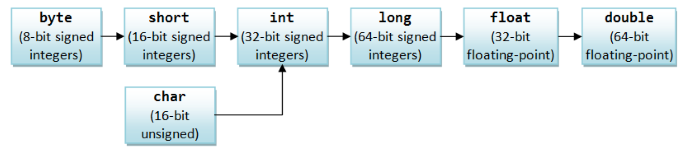

# type


# Java的类

## 基础

### 写法

Java中并不会使用`public:`这种方式决定类中内容的访问权限，而是将`protected`，`public`，`private`（和`default`）放在每一个方法、变量声明的位置

Java中的类本身具有访问权限问题，这个与`package`这个概念有关，在后面会专门提及，在提及之前暂时不用管访问权限问题

在使用的时候，一定要注意：在C++中`Base ba;`会直接调用`Base`的默认构造函数，但是在Java中`Base ba;`意味着`ba`是`null`，必须写`Base ba=new Base();`


### 构造器

下面比较下C++构造函数和Java构造器的不同

#### C++

回顾一下，在C++中，构造函数在写的时候允许使用“初始化列表”的方式，这是因为C++里面类成员在构造函数中被使用之前必须被合适地构造过，所以必须在进入函数体之前完成构造功能。如果一个成员没有在初始化列表中被提及，其会**被等于类内初始值(基础类型且有类内初始值)** 或 默认初始化(基础类型且没有类内初始值) 或 调用默认构造函数初始化(非基础类型)。注意，对于基础类型来说，默认初始化方式与对象所在位置有关；对于非基础类型，没有类内初始值的说法
(C++的类内初始值是C++11之后才提出来的，在学校C++课程中可能不会提及甚至说被认为是错误的，老版本编译器可能通不过编译)

另外，在C++中，如果没有写默认构造函数，IDE会生成一个无参的构造函数，我们称之为合成默认构造函数。合成默认构造函数基本可以理解成一个函数体为空的默认构造函数，如下

```C++
struct tes{
    ...;
    tes(){} // 合成默认构造函数大概的样子，初始化列表为空，所以每个成员都是按照上面提到的不在初始化列表中的情况初始化
}
```

> 如果只有基础类型和指针之类的，可能就没有合成构造函数。。。当然这是C++知识，这里不谈


#### Java

#### 一般方法

Java构造器与C++构造函数最大的不同在于：所有成员都可以有类内初始值、没有初始化列表、没有类内初始值时基础类型会被赋初始值`0`而非基础类型会被赋初值`null`

1. 非基础类也有类内初始值，如下：

   ```java
   // in tes.java
   class tes {
       int num;
       Stack<Integer>st=new Stack<Integer>();
       public tes(){
           System.out.println("public tes()");
       }
   }
   ```

   这里的类内初始值可以看作进入构造函数之前的赋值

   这里有一个小点：不同`tes`对象的`st`指向是相同的吗？也就是如果有`tes tt1=new tes();tes tt2=new tes();`，`tt1.st==tt2.st`的值应该是多少呢？答案是不同`tes`对象的`st`指向并不一样，`tt1.st==tt2.st`为`false`

   另外如果一个类成员没有类内初始值，并且在构造中也没有赋值，那么在构造结束之后其就是`null`（因为进构造器的时候是`null`并且没被改变）

2. Java没有初始化列表：纯粹的语言特性，就像在C++中如果有一个成员是指针你也一般不会在初始化列表就给初始化了，一般会让它默认初始化之后再在构造函数的body内赋值，Java中的成员同理。不过如果真的说类内初始值就是一个初始化列表，只不过是所有构造起公用的初始化列表

3. 基础类型没有类内初始值，会被`0`初始化；非基础类型没有类内初始值，会被`null`初始化；

**也就是说，Java里的类数据成员在构造之前也是会被赋初始值的！这和C++的类在构造之前一定会构造类成员、基类成员是一样的！Java和C++不同的地方在于怎么构造这些成员的**

我们可以统称上面三点为“初始化过程”

与C++一样，如果没有写任何构造函数，Java也会提供一个合成默认构造函数，并且成员和构造函数在类内的出现顺序不会影响到其初始化。Java的合成默认构造函数满足：对于某个成员如果有类内初始值的话就用类内初始值，否则用0或`null`


提一句，C++中还会提供合成赋值运算符，不过既然Java压根就没有重载，且Java中类使用`=`的等于是指针层面的等于，也就不用考虑合成赋值运算符的存在了


#### 构造器调用构造器

另外，Java支持构造器调用构造器，比如

```java
class Base {
    int x;
    public Base() {
        /*
        这里不允许任何语句，和super一样
         */
        this(1);
    }

    public Base(int x) {
        this.x = x;
    }
}
class Derived extends Base{
    int y;
    public Derived(int y){
        super();
        this.y=y;
    }
    public Derived(){
        this(2);
       /*
        super();this(2);
        和
        this(2);super();
        都不行
        */
    }
}

```

但是据我所知，C++并没有这样的支持

#### `{}`初始化

再还有一个特例：Java支持使用`{}`来初始化

```java
public class Tes {
    int x=0;
    { // 初始化的时候会执行
        x++;
        System.out.println(x);
        fun();
    }
    Tes(){
        System.out.println("Tes : Tes [] [] -> []");
    }
    public static void main(String[] args) {
        Tes tes=new Tes();
        tes=new Tes();
    }
    void fun(){
        ...;
    }

}
```

这里的执行顺序：类内初始值最先，然后`{}`，然后调用构造器（但是有一个问题，由于`{}`里面可以调用方法，所以应该保证调用方法的时候不会因为变量还没有经过构造器处理而导致错误。比如如果你写了个`AVLTree`，而且有一个变量`root`必须经过构造器内部初始化，那么在`{}`初始化的时候就不可以要求`root`非空的`insert`方法）

输出：

```java
1
Tes : Tes [] [] -> []
1
Tes : Tes [] [] -> []
```


这一般用在构造的时候传一个`{}`进去，可以简化代码：

```java
Map<Character,Integer>t=new TreeMap<>(){
    {
        // 相当于构造了t之后执行下面的语句
        for(char ch:cin.next().toCharArray()){
            put(ch,getOrDefault(ch,0)+1);
        }
    }
};
```

这里相当于把`{}`里面的东西全部传进去，所以在初始化的时候会执行传进去的语句


### `.finalize()`

在C++中有一个专门的析构函数，甚至如果你不写析构函数IDE还会帮你生成一个。C++中析构函数是在对象消亡时自动被调用的，对象消亡有可能发生在被`delete`时或者生存周期结束时，由于`delete`的指针类型和实际类型可以不匹配（也就是多态），C++的析构函数还需要是虚函数

但是要注意，在Java中并没有一个对应的概念。Java中，如果你的对象获得了一块特殊的内存区域，由于垃圾回收器只知道释放那些经由`new`分配的内存，所以它不知道该如何释放该对象的这块特殊的内存。为了应对这种情况，Java允许了`.finalize()`这个方法。`.finalize()`的工作原理是这样的：

一旦垃圾回收器准备好释放对象占用的存储空间，将首先调用其`.finalize()`方法，并且在下一次垃圾回收动作发生时，才会真正回收对象占用的内存。所以如果你打算用`.finalize()`，就能在垃圾回收时刻做一些重要的清理工作。这实际上是很苛刻的情况，大多数情况下不会涉及到

需要注意的是，和C++不同

1. 对象可能不被垃圾回收
2. 垃圾回收并不等于析构。你在不需要某个对象之前必须执行的工作必须自己手动去做
3. 垃圾回收只与内存有关

实际山，在Java中，如果JVM并未面临内存耗尽的情形，其甚至不会浪费时间去执行垃圾回收。这就是栗老师说过的：Java的内存占用是无法预测的

另外在《Java编程思想》中提到，不要过多的使用`.finalize()`，以及《Effective Java》中提到：“终结函数无法预料，常常是危险的，总之是多余的”，这些都提示我们，或许我们不应该在编程中把精力过多地放在`.finalize()`上

关于Java的内存回收和JVM的内存处理方式，可以翻阅《Java编程思想》P87\~91的内容了解更多


### 方法重载

这点Java和C++基本没有区别，就不说了

补充一句：下面两个方法不能正确重载：

```java
public static void fun(String... strs){ // 传入的会是一个数组，这种写法允许fun(str1,str2)这样的调用

}
public static void fun(String [] strs){

}
```


下面两个方法可以正常重载，而且如果使用`fun("123","123")`会调用下面那个

```java
public static void fun(String... strs){}
public static void fun(String str1,String str2){}
```


### `this`

Java也有`this`关键字，但是Java的`this`和C++唯一的不同是Java中`this`使用点运算符，而C++的需要用`->`

和C++一样，`static`的方法没有`this`


## 访问权限

### `package`和`import`

对于一个.java文件来说，其至多有一个`public`的类，且这个类必须与文件名（去除拓展名部分）同名。除了`public`的这个外也可以有其他类，但是其他类不能是`public`的，在包外也不可见（无论通过什么方式）。我们可以通过在文件的除注释第一句加上`package`语句表示归于什么包，如果不加的话文件会被归入默认包中。另外，同一个包的文件需要被放在同一个同名文件夹中（甚至同一个包文件里每个文件都应该属于该包），以及包可以包含包

我们可以用`import`语句使用`package`的内容，`import`的原理和之后的效果有点复杂，在《Java编程思想》的P112~113有部分提及，下面简单说说


假设我们的文件架构如上图这样。如果我们想用`algo`包中的`TreeArray`的话，第一种方法是使用全称`algo.TreeArray ta=new TreeArray();`；第二种是将整个包引入，即`import algo.*;`之后直接使用名字`TreeArray ta=new TreeArray();`；第三种是引入部分内容，如`import algo.TreeArray;`

第二种方法会面临重名的问题，在Java中如果同时全部引入`algo`和`algo2`，是不会有任何错误的（相应的，在C++中由于`include`本质是直接插入，同名类一定会出现问题），但是不能再直接使用名字声明了，即`TreeArray ta=new TreeArray();`会导致报错，此时只能使用全称的方式

另外，引入包之后这个包里面的包内容并不会被展开，比如`import algo.*;`之后是不能直接`rng rg=new rng();`的，必须要再`import algo.subalgo.*;`才行

总结下就是：`import`整个包会让你可以直接使用类名使用类，但是也可以`import`部分内容。可以使用的类名出现重复不会直接导致报错，但是在类名重复的情况下还不使用全称就会导致错误。在任何时候都可以使用类全称。

顺便一提，还有一种叫内部类，就是类内部的类，这种类在编译的时候会被拉出来单独编译成.class文件，使用上也和C++很像（C++里使用域作用符`::`，Java里改成`.`）。我们后面会简单提到内部类


关于Java编译器是怎么找到类的，《Java编程思想》介绍是Java自身有一个环境变量`CLASSPATH`，这里包括多个文件夹路径，Java就是在这些文件夹路径里找类的，比如`algo.subalgo.rng`在编译器那里就会变成逐一尝试`CLASSPATH`里的一个路径path下的`path/algo/subalgo/rng.java`是否存在，直到找到


### 类中内容访问权限

类的访问控制和类里的内容的访问控制不是同一个概念，下面先介绍的是类中内容的访问权限。有时会使用简称访问权限，根据上下文判断下就行

简单来说，访问权限控制的等级从大到小是：`public`、`protected`、包访问权限和`private`，其中：

#### `public`

指可以被所有人都是可用的，特别的，可以跨包使用

比如每个别人可能用到的类都应该至少有一个构造函数是`public`的，这样别人使用的时候才能构造出来（这么说其实是不准确的，还有其他方式，比如写一个`static`的函数返回对象，如`public static tes maketes(){return new tes();}`）


#### 包访问权限

包访问权限的类和方法不需要加任何关键字，比如`class Tes{}`这个就表示`Tes`是包访问权限

在Java中增加了包这种组织类的方式，所以权限控制方面相对C++也有所改变。一个内容（包括成员和方法）的包访问权限是指只有同一个包内的成员可以访问它，对于包外它是`private`的（这里的包外包括了类所在包的子包，也就是包访问权限只提供给与自身在同一个包下内的所有类，在文件组织上这些类的文件夹和本类在同一个文件夹）。但是我们知道下面的语句是可以执行的

```java
// in Main.java
import java.util.*;

public class Main {
    public static void main(String[] args) throws IOException {
        Scanner cin = new Scanner(System.in);
		tes t=new tes(); // 调用了包访问权限的内容
    }
}
// in tes.java
public class tes{
    private int num=1;
    tes(){num=2;} // 这个构造函数是默认访问权限，也就是包访问权限
}
```

这是因为没有指明所在包（并且不在包文件夹下）的类会被归入“默认包”中，这样来会方便很多


#### `private`

和C++一样，`private`意味着除了包含该成员的类之外，其他任何类都无法访问这个成员

补充几点：`private`的内容是无法被继承类看到的，这点很重要；但是可以存在`public`的引用指向某个类`private`的内容

```java
class Base {
    int x;
    public Base() {
        x=1;
    }
}

class Outer{
    private Base ba=new Base();
    Base getBa(){
        return ba;
    }
}

public class Main {
    public static void main(String[] args) throws IOException {
        Scanner cin = new Scanner(System.in);
        Outer o=new Outer();
        Base bp=o.getBa(); // 没有任何问题，bp指向了o的private的内容

    }
}
```


#### `protected`

Java的`protected`和C++的很不一样。C++中`protected`表示某内容从类外看是`private`的但是仍然可以被继承类访问到，但是Java中`protected`某内容表示从类外看是“具有包访问权限“的但是仍然可以被继承类访问到

实际上，如果你继承了另一个包的一个基类（称作继承类），那么继承类能够访问的就是基类的`public`内容和`protected`内容

在继承部分会继续谈到`protected`


### 类访问权限

对于类来说，只有两种访问权限可供选择：`public`或者包访问权限（在《Java编程思想》的第十章提到的内部类不在这里讨论）

同时，对于一个文件最多有一个`public`的类（且其名字和去除拓展名的文件名相同），其他类一定是包访问权限的。理论上允许一个文件里所有类都是包访问权限的，不过一般不这么做


## `static`

在UML图中，`static`使用下划线修饰

一个需要记住的名词：在考试的时候，类变量就是静态变量（有毒）


### `static`简介

Java的`static`和C++的（实际上对应的是C++里类的）`static`基本一样，除了初始化和调用方法上。这里先介绍初始化上区别

我们知道C++的`static`成员初始化是非常麻烦的，基本是要在.hpp文件声明，然后在.cpp文件里专门赋值。而在Java里由于类内初始值的存在，`static`的变量直接使用赋类内初始值的方式就行，不需要再在外部写

所以C++和Java的单件类设计模式的写法分别如下：

```c++
// in tes.hpp
class tes{
private:
    int x;
    tes(int _x):x(_x){}
    static tes _onlytes;
//    static int cnt=0; // 错误的！static不能使用类内初始值
public:
    static tes & access(void){
        return _onlytes;
    }
    tes & print(void){
        cout<<x<<endl;
        return *this;
    }
};
// in tes.cpp
tes tes::_onlytes(10);
// in main.cpp main
tes::access().print(); // print 10
```

可以看出还是有点麻烦的。另外注意即使是基础类型，只要它是`static`的就不能使用类内初始值

```java
// in Main.java
import java.util.*;

class Oneclass{
    private int x=10;
    private static Oneclass One=new Oneclass();
    public static Oneclass access(){
        return One;
    }
    public Oneclass print(){
        System.out.println(x);
        return this;
    }
}

public class Main {
    public static void main(String[] args) throws IOException {
        Oneclass.access().print(); // print 10
    }
}
```

可以看出由于Java全面支持类内初始值所以方便了很多


### C++与Java在访问/调用`static`成员的区别

#### 对于函数/方法

在C++中支持一个实例使用点作用符调用`static`的函数和变量，比如下面的代码

```c++
// in main.cpp
class Base{
public:
    static int CntBase; // 为了能在main.cpp初始化
    Base(){
        ++CntBase;
    }
    static int getCntBase(void){
        return CntBase;
    }
};
int Base::CntBase=0;
int main(){
    Derived der;
    der.getCntBase();
    return 0;
}
```

这个是可以跑过去的，但是Java限制了这种行为，相似的代码在Java中是通不过编译的，如下

```java
// in Base.java
package Test;

public class Base {
    static int CntBase=0;
    public Base(){
        ++CntBase;
    }
    public static int getCntBase() {
        return CntBase;
    }
    public static void main(String[] args) {
        Base ba;
		System.out.println(ba.getCntBase()); // wrong
        System.out.println(ba.CntBase); // right
        System.out.println(Base.getCntBase()); // right
    }
}
```

只能通过类名的点作用符执行`static`方法，即`Base.getCntBase()`


#### 对于成员变量

对于变量，Java虽然可以使用实例的点作用符访问，比如下面的例子

```java
class Base {
    int x;
    static double PI=Math.PI;
    Base(int x) {
        this.x = x;
    }
}
class Derived extends Base{
    double r;
    Derived(double r){
        super(1);
        System.out.println(super.PI); // 可以，但是报Warining
        this.r=r;
    }
    static double getArea(double r){
//        return r*r*super.pi; // 不行，因为static没有super
        return Base.PI*r*r; // 可以
    }
}
public class Main {
    public static void main(String[] args) throws IOException {
        Scanner cin = new Scanner(System.in);
        Base ba=new Base(1);
        System.err.print("ba.PI: " + ba.PI + " "); // 在IDEA里面会直接报warning，也就是警告，并且建议使用`Base.PI`来找
//        System.err.println("Derived.super.PI: " + Derived.super.PI + " ");
//        这里的报错语句：'Derived' is not an enclosing class。。。
    }
}
```

但是可以看出限制很多，比如不能在类内使用`.super.PI`、类外使用`ba.PI`会报warning

所以，对于`static`，全部使用类名的`.`作用符，反正Java单继承很容易知道父类是啥


### 无论是C++还是Java都支持在非`static`函数/方法内直接访问/调用`static`内容

下面的代码在C++中是完全跑的通的

```c++
class Base{
public:
    static int cnt;
    Base(){
        ++cnt;
    }
    Base(int cnt){
        ++Base::cnt;
    }
};
```

也就是C++中非`static`函数可以访问`static`的内容，如果出现了命名冲突可以使用域作用符解决

在Java中对应的代码是下面这样的，和C++的表现基本上一样

```java
public class Tes {
    static int cnt=0;
    Tes(){
        ++cnt;
    }
    Tes(int cnt){
        ++Tes.cnt;
    }
}
```


### 每个类都可以有一个`static`的`main`方法

在编程上有一个技巧：我们可以给每一个类设置一个`public static void main(String[] args)`的方法，如下


这时候可以点击左边的箭头或者快捷键直接运行某一个类的`main`了，不需要在`Main.main()`里面调试。这点比C++好，C++调试的类很多的话有时候必须单独写函数然后放在`main`里执行。另外命令行执行的时候也会直接执行所选类的`main`方法


### Java并不支持在方法内放一个`static`的变量

在C++中我们可以在函数中放一个`static`变量，但是Java不支持这种行为。其实想想也能理解，C++支持这种行为是因为函数可能是一个单独的部分，如果需要一个函数保存的量直接使用`static`修饰并放在函数体里肯定是比较方便的。但是Java已经把所有函数变成方法放在类里了，直接使用类的变量就行了

```c++
// in main.cpp
double exp(double x){ // return exp(x^cnt)
    static int cnt=0; // 记录这个函数调用了几次，但是在Java中直接放在类里面就行，不用这么弄
    ++cnt;
    return pow(exp(1),cnt);
}
```


### 静态代码段

```java
public class Tes{
    static{ // 在加载类的时候执行（且只执行这一次），加载的概念见后
        number=88;
        System.out.println("Loaded class Tes");
    }
}
```


### `static`修饰`nested`类

见“内部类”的介绍


# Java的继承

在这里讲继承的时候我会顺便讲多态中的动态类型(向上转型)的概念，不然很多东西会被分裂开不好讲

顺便，在后面的讨论的时候，`Derived`就是继承自`Base`的一个类(如果是C++的话就是`public`继承的)，不再说明了

## 向上转型/动态类型

在C++中我们已经知道了可以声明一个`Base`的指针但是指向的是一个`Derived`类，也就是真实类型和指针类型是不一样的，比如`Base * pb=new Derived(); `；在Java中也有这种特质，而由于Java的变量本质是一个指针，所以直接`Base pb=new Derived();`就行

这种基类指针指向派生类对象的情况，我们称为向上转型或者动态类型，这是多态的基础（由于多态是建立在继承之上的，所以向上转型也是继承的重要内容）

我们在继承里会简单讨论到向上转型，向上转型实际上最常见在多态中

> 这里有一个点，实际上我们可以`Object o=new Derived();`，然后`Base pb=o;`，这个也算一种向上转型，因为对于真实类型来说，`Derived`向`Base`还是“向上”了，但是`Object`向`Base`确实是向下的。。。不过问题不大


## 继承的写法

**Java只支持单继承，也没有继承方式**，所以没有C++的继承列表这种东西，使用`extends`代之

比如如果有基类`Graph`，新写一个继承类`Circle`就是`public class Circle extends Graph`

在C++中，如果想访问基类的内容，我们需要使用域作用符，这可以应付多继承的情况；但是对于Java来说，Java没有域作用符，所以在访问基类内容的时候就有了太多限制。Java通过`super`这个关键字来操控基类，在某一个非`static`的方法内访问基类内容可以使用`super.XXX;`，但是在非`static`方法外就不能使用`Graph.super.XXX;`了，这时候只能单独写一个方法来访问`super.XXX`。这很重要，我们会在方法和成员的继承中看到这一点


## 继承类的构造

我们分析以下部分代码

```java
// in Graph.java
package CGraph;

public class Graph {
    protected String name="Graph";
    public Graph(){
        System.out.println("public Graph()");
    }
    public static void main(String[] args) {
        Graph g=new Graph();
    }
}

// in Circle.java
package CGraph;

import java.math.*;
import java.lang.*;

public class Circle extends Graph {
    protected double radius;
    public Circle(double radius) {
        // 这里如果没在函数第一行写super构造函数，则会在进来之前调用super的无参构造函数
        // 如果下面没有写super的构造，并且super没有无参构造的话，会报错
        super();
        System.out.println("public Circle(double radius)");
        super.name = new String("Circle");
        this.radius = radius;  // 同名的情况下可以用这种方式控制域
    }

    public static void main(String[] args) {
        Circle c = new Circle(2);
    }
}

```

我们在前面说类的构造器的时候说到过：**Java里的类数据成员在构造之前也是会被赋初始值的！这和C++的类在构造之前一定会构造类成员、基类是一样的！**我们知道，C++通过类内初始值、默认构造和初始化列表保证基类/成员类一定被构造过。Java中，成员类的构造已经介绍过，那基类怎么构造？可以看上面`public Circle(double radius)`部分：

如果想使用`super`的某一个构造函数，只需要在派生类的构造函数==开头==写上`super(...);`这个构造函数的形式就行。如果没有写`super`构造方法，IDE会自动帮你使用默认构造方法构造`super`。如果没有写`super`构造方法而且`super`没有可用的默认构造方法，那就会报错；如果`super(...);`没有写在第一行也会报错

顺便，很明显构造函数无法被继承，无论有没有后面提到的`final`控制


## 继承的核心

### 继承类可以调用基类的函数

在没有`virtual`限制、访问控制的限制等等后，继承类是可以访问基类的函数的，相当于基类开放了一些接口给继承类

比如C++中

```c++
class Base{
    void fun(){}
};
class Dervived: public Base{
};
// in main.cpp main
Dervived der;
der.fun(); // 调用了Base的fun函数
```

Java道理一样


### 两个方法具有“相同形式”的定义

对于两个方法(实际上包括C++的函数)，"相同形式"指<相同函数名、相同形参列表、相同的`throws`列表>三者相同

注意的是，这里并不包括访问控制（但是对继承类不可见的方法不会被继承）、返回值


### 在C++中区分重载、覆盖和隐藏

后面会出现三个关键字，分别是重载、覆盖和隐藏，这三个是很不同的，下面会在继承和==类外( 特指非static方法外 )==的语境下讨论这三者
（黄色重点很重要，因为在Java中非`static`方法内和非`static`方法外访问/调用基类的内容是有很大不同的，对于非`static`类内访问/调用我们会单独讨论）

这里会先主要从C++的角度区分这几个概念，之后会拓展到Java中

先定义下，`Derived der=new Derived();`，`Base ba=new Base();`


#### 重载

对于函数/方法的重载意味着多了一个函数/方法并且原来的函数/方法还能被调用。比如C++里如果我们在`Base`中有一个函数`int fun(int)`，而在`Derived`中写一个`int fun(char)`函数，之后我们是可以使用`der.fun(1)`和`der.fun('a')`分别调用两种方法的


#### 覆盖/覆写

后文的覆盖和覆写基本上是一个意思。。。实际上如果真说的话，覆写很明显更符合原意

在多态中，我们一个基类指针调用一个函数时调用的实际上是指针指向类型的对应函数，那就说**真实类型的函数把基类的对应函数覆盖了**
（要求基类和派生类对应的两个函数有"相同形式"<相同函数名、相同形参列表、相同的`throws`列表>。这个定义不考虑多重继承了，知道意思就行）

在C++中可以看作`virtual`函数的继承

比如

```c++
// in Base.hpp Base
public:
	virtual int fun(int){}
// in Derived.hpp Dervied
public:
	virtual int fun(int){}
```

如果有`Base * pd=new Derived();`，那么`pd->fun(1);`执行的就会是`Derived`的函数。稍后会介绍类似机制在Java中怎么实现

补充一句，C++里面构造函数是不能覆写的

#### 隐藏

一个派生类实例使用点作用符调用函数调用的就是派生类的，但是在多态中，如果一个指向派生类的基类指针调用一个函数时调用的仍然是基类的函数，那就说派生类的函数只是把基类的对应函数隐藏了，并没有实现覆写
（要求基类和派生类对应的两个函数有"相同形式"<相同函数名、相同形参列表、相同的`throws`列表>。这个定义不考虑多重继承了，知道意思就行）

比如

```c++
class Base{  
public:
    int fun(int x){
        return x;
    }
};
class Derived : public Base{
public:
    int fun(int x){
        return -x;
    }
};

int main(){
    Derived der;
    Base * pd=new Derived();
    cout<<der.fun(1)<<endl; // -1
    cout<<der.Base::fun(1)<<endl; // 1
    cout<<pd->fun(1)<<endl; // 1
    return 0;
}
```

通过派生类对象调用`fun`确实调用了派生类的`fun`，但是如果使用指针调用的话调用的还是基类的，这就是隐藏

如果在两个`fun`前加上`virtual`关键字就是覆写的情况了，也就是**C++是通过`virtual`关键字来区分函数的覆写和隐藏的**

隐藏的写法在Java和C++中有很大的不一样，C++这里即使给两个函数加上了关键字`virtual`，在类外使用`der.Base::fun(1)`还是可以调用到基类的函数的，但是Java中就没有这么好的事了


#### 非静态函数之外的成员变量只能隐藏

如果基类有一个对派生类可见的变量，派生类是可以直接访问到那个对象的，比如

```c++
class Base{
public:
    int num=10;
};
class Derived : public Base{
public:
    void fun(void){
        ++num; // 可执行，访问的是Base的
    }
};
int main(){
    Derived der;der.fun();
    cout<<der.num<<endl; // 11
    return 0;
}
```

由于 “ 'virtual' can only appear on non-static member functions” （**`virtual`只能用于非静态的成员函数**），再结合“C++使用`virtual`区分覆写和隐藏”的结论，我们可以得到：**只有非静态`virtual`修饰的成员函数才覆写，对于变量、静态函数、非静态没`virtual`修饰的函数等只能实现隐藏**。下面用成员变量举例

```c++
class Base{
public:
    int num=10; // 不可能加修饰virtual
    virtual void ff(int){}
};
class Derived : public Base{
public:
    int num=1;
    virtual void ff(int){} // 为了实现多态化让dynamic_cast可以正常使用
    void fun(void){
        ++num; // 访问的是Derived的
    }
    void funBase(void){
        ++Base::num; // 访问的是Base的
    }
};
int main(){
    Base * pb=new Derived();
    Derived * pd;
    if( (pd=dynamic_cast<Derived*>(pb))!=nullptr ){
        pd->fun(); // 让derived的++
        cout<<pb->num<<endl; // 访问的是Base的
        cout<<pd->num<<endl; // 访问的是Derived的
    }
    return 0;
}
```

这里可以看到`pb->num`访问的就是`Base`的，并不能访问到`Derived`的，也就是这里不是覆写；使用`pd`访问到的是`Derived`的`num`，也就是`Base`的被隐藏了

实际上即使是隐藏的内容也可以使用域作用符访问到，比如`pd->Base::num`，但是Java中没有这种好事了


### Java的重载、覆盖和隐藏

那么事情在Java是怎么样的呢？我们通过下面的代码来看

```java
// in Base.java
package Test;

public class Base {
    public int tes(int i){
        System.out.println("Base : tes [int] [i] -> int");
        return i;
    }
    public double tes(double d){
        System.out.println("Base : tes [double] [d] -> double");
        return d;
    }
    public String tes(String str){
        System.out.println("Base : tes [java.lang.String] [str] -> java.lang.String");
        return str;
    }
    public char tes(char ch){
        System.out.println("Base : tes [char] [ch] -> char");
        return ch;
    }
    public static void main(String[] args) {

    }
}
// in Derived.java
package Test;

public class Derived extends Base {
    public boolean tes(boolean b) {
        System.out.println("Derived : tes [boolean] [b] -> boolean");
        return b;
    }

    @Override
    public int tes(int i) {
        System.out.println("Derived : tes [int] [i] -> int");
        return super.tes(i);
    }

    public byte tes(byte b){
        return b;
    }

    public static void main(String[] args) {
        Derived der=new Derived();
        System.out.println(der.tes(true));
        System.out.println(der.tes(3.14));
//        System.out.println(der.super.tes(3.14));
        System.out.println(der.tes(2));
    }
}
```

* 与C++一样的是，如果继承类中没有和某一个基类方法相同形式的方法，那这个基类方法可以被继承类直接通过点作用符调用

* **与C++使用`virtual`区分覆写和隐藏不同，Java中和基类相同形式的继承类方法就是在覆写基类的那个方法**，也就是**Java通过“相同形式”这一指标直接区分覆写和隐藏**
  （**"相同形式"定义：有相同的函数/方法名，有相同的参数列表<不要求参数名一样>，有相同的返回值，有相同的`throws`列表，不要求访问控制种类一样**）

  并且Java支持一种标识`@override`，表示这个方法是覆写的基类(实际上也有可能是基类的基类，也就是继承链上其他类)的方法，如果实际上这个并没有覆写到某个方法的话，Java编译器就会报错（但是注意，如果实际上是覆写但是没有加`@Override`的话并不会导致报错）。在C++中其实也支持这么一种标识只是一般很少看人用

  补充一句，Java里面构造器是不能覆写的，虽然在IDEA里面打`@Override`出现的一个可选项里面会加上构造器，但是如果在继承类构造器前加上`@Override`会直接报错

* 和C++一样，**只有非`static`的方法才能被覆写，其他的“相同形式“的东西只会导致隐藏**

Java的“相同形式”和C++的`virtual`功能相似，也就是Java中一旦写了相同形式的基类方法就相当于C++里给两个方法加了`virtual`关键字。Java中的类`virtual`关键字`abstract`和抽象类有关，如果用`abstract`修饰类或者修饰某一个方法就会让类变成抽象类。补充一点就是，在C++中如果想要抽象类需要专门写一个纯虚函数，并不存在一个关键字修饰抽象类


### 对继承类不可见的内容不能覆写

上面所有的例子的访问控制都选择了`public`，但是实际上还有别的类。我们只需要记住的是：继承类不能覆写基类中对继承类不可见的内容。如果真的说的话，“在继承类写一个 继承类看不见的基类的形式相同的 方法”在表现上更像是隐藏

比如如果`Base`里面有一个`private`的`int fun(int)`，`Derived`的`int fun(int)`只能“隐藏”了`Base`的`fun`（这里打引号是因为实际上`Base`的`fun`本身就是被`private`的，不需要别的东西隐藏它），并没有覆写，也就是`Base der=new Derived();`然后`der.fun`调用的是`Base`的：

```java
class Base{
	private void fun(){
		System.out.println("Base : fun [] [] -> [void]");
	}
	
	public static void main(String[] args) {
		Base ba=new Derived();
		ba.fun();
	}
}
class Derived extends Base{
	void fun(){
		System.out.println("Derived : fun [] [] -> [void]");
	}
}
```

输出：`Base : fun [] [] -> [void]`


### 非`static`方法/函数内的访问/调用

#### C++中

先补充一句，C++允许在非`static`类外通过域作用符直接访问/调用基类的内容，这给了C++程序员很大的灵活性

```c++
class Base{
public:
    int num=10;
    virtual int fun(int x){
        return x;
    }
};
class Derived : public Base{
public:
    int num=-10;
    virtual int fun(int x){
        return -x;
    }
};

int main(){
    Derived der;
    Base * pb=new Derived();
    cout<<der.fun(1)<<endl; // -1，调用的Derived的
    cout<<der.Base::fun(1)<<endl; // 1，调用的Base的，使用域作用符控制的
    cout<<pb->fun(1)<<endl; // -1，调用的Derived的，因为fun实现了覆写
    cout<<pb->Base::fun(1)<<endl; // 1，调用的Base的，使用域作用符控制的
    cout<<der.num<<endl; // -10，调用的Derived的，Base的被隐藏了
    cout<<pb->num<<endl; // 10，调用的Base的，因为Base的num只是在Derived中隐藏了
//    cout<<pd->Derived::num<<endl; // 必须使用dynamic_cast转换成Derived指针之后再调用
    cout<<der.Base::num<<endl; // 10，调用的是Base里被隐藏的num
    return 0;
}

```

可以看到，无论是被隐藏还是被覆写，C++中继承类都可以通过域作用符访问/调用基类的内容

在非`static`类内的访问/调用方法是一样的，这里就不再写一遍了


#### Java中

**Java的继承类在非`static`方法外没有任何办法直接访问基类被隐藏/覆写的内容，因为Java不支持域作用符**

但是在非`static`方法内，Java可以通过`super`关键字访问/调用基类的内容，比如

```java
// in Base.java
package Test;

public class Base {
    int num=10;
    int getnum(){
        return num;
    }
    public static void main(String[] args) {
        Base ba=new Base();
        System.out.println(ba.getnum());
    }

}
// in Derived.java
package Test;

public class Derived extends Base {
    int num=-10;

    @Override
    int getnum() {
        return num;
    }

    int getBasenum() {
        return super.getnum();
//        return super.num;
    }
    public static void main(String[] args) {
        Derived der=new Derived();
        System.out.println(der.getnum());
        System.out.println(der.getBasenum());
    }
}
```

所以说Java中如果想通过继承类访问/调用一个基类被覆写/隐藏的内容必须单独写一个方法，就像上面的`getBasenum`（或者使用向上转型，这个会在多态中看到怎么实现的）


## `super`

在Java中，对于基类的访问不是使用`::`，而是`super`（毕竟单继承）

实际上`super`可以看作一个对象，只不过这个对象支持一些奇怪的写法，比如`super(argvs)`

另外：类外不允许使用`super`，不允许使用类名跟`.super`（比如`Derived.super.XXX`），`static`里没有`super`


## `final`

### `final`成员

在`final`用于修饰类的成员变量的时候，可以看作一个`const`，但是相比C++的`const`，`final`又多了很多限制，下面简单对比一下：

在C++中，`const`分成了底层和顶层的，对于一个指针：底层`const`意味着指针指向的内容不可更改，比如`node const * p=new node(...);`，这里的`const`就是底层`const`，这时`p`只能访问`node`中非`const`的成员；顶层`const`意味着指针本身不可更改，比如`const node * p=new node(...);`，这里的`const`就是顶层`const`，`p`将无法指向新的`node`

但是在Java中，`final`只能看作一个顶层`const`，`final`成员是不能改变的，但是指向的内容可以改变（比如一个`list`调用`add`方法），而且事实上Java是没有一个合适的措施保证某一个方法不会改变数据成员，而C++可以使用函数后的`const`保证某个函数不会改变数据成员


在`final`/`const`成员的初始化上，Java和C++有相似的地方

对于`static`的`final`量，Java要求必须指定类内初始值。Java同时也可能会对`static final`的量做优化，比如如果这个量使用的是一个数学表达式赋值的，编译器就有可能在编译期就把它算出来。但是注意这种优化不是一定会做的，比如`static final int RANDVAL=rand.nextInt(20);`就不可能在编译器算出来，但是`RANDVAL`却确实是赋值后不可改变的量

对于非`static`的`final`量（也称`blank final`），也就是一般的类数据成员，C++要求在初始化列表中初始化，这样可以保证在进入构造函数体的Body之后其值已经被确定。但是Java喜闻乐见地没有初始化列表，所以编译器只是要求这种`blank final`必须有类内初始值或者在构造器中被赋值，否则就不给过编译


### `final`参数

Java允许在方法的参数列表上限定某一个量为`final`，这个`final`实际上就可以看作一个顶层`const`，没有其他不同

这个`final`实际上保证的是：基础类型在方法内不会改变，本质是指针的实例对象在方法内不会被指向其他地方(这还是很重要的)


### `final`方法

根据《Java编程思想》，`final`在之前还被赋予类似C++中`inline`的优化方法的职责，但是现在已经不推荐这么做了，所以略过去不介绍

`final`方法最重要的地方在于，它将方法锁定，以防任何继承类修改它的含义，这保证了在继承中使方法行为保持不变，并且不会被覆盖。如下：

```java
// in Base.java
package Test;

public class Base {
    public final int ffun(){
        return 1;
    }
    
}
// in Derived.java
package Test;

public class Derived extends Base {
    @Override // 这里加不加都是过不了编译的
    public int ffun(){
        return 2;
    }
    public static void main(String[] args) {
        Derived der=new Derived();
        System.out.println(der.ffun()); // 无法通过编译
    }
}
```

由于**Java通过相同形式这一标准区分隐藏和覆写**，而上面代码中`Derived`的`ffun`加不加`@Override`都是会导致覆写的，而`final`修饰的方法不能被覆写，所以这里加不加`@Override`都会导致编译过不去

在《Java编程思想》中提到，所有的`private`方法都会被指定为`final`的，也就是继承类无法修改它，但是是可以重写一个的，见下

```java
// in Base.java
package Test;

public class Base {
    private int pfun(){
        return -2;
    }
    
}
// in Derived.java
package Test;

public class Derived extends Base {
    @Override // 这里加了就过不了编译
    private int pfun(){
        return -1;
    }
    public static void main(String[] args) {
        Derived der=new Derived();
        System.out.println(der.pfun());
    }
}
```

注意，我上面用的是重写，不是覆盖（和隐藏很像，不过也不是隐藏，毕竟对于继承类来说`private`的内容本身就是隐藏），加`@Override`就过不了编译说明了这一点

`final`在多态中会更深入提及，到时候再仔细研究


### `final`类

当你使用`final`修饰一个类的时候，你不希望任何人（包括你自己）继承该类。一个`final`类中所有的方法都会被隐式指定成`final`的（但是成员变量不会被限定成`final`的，因为成员变量的`final`和方法的`final`本来就不是一个作用）


## `abstract`

### `static`不能`virtual`/`abstract`

在C++中，`virtual`区分了覆写和隐藏，由于`static`的内容不能被覆写，所以不能被修饰成`virtual`的

在Java中，`static`的内容也不能被覆写只能被隐藏，而抽象的方法一定是要在继承类被覆写的，所以`static`的内容不能被修饰成`abstract`的


### C++中的纯虚函数和抽象类

在C++中如果要实现一个抽象类必须有一个纯虚函数存在，我记得我曾经为了将一个类设置成抽象的专门写了一个`virtual void setVirtual(void)=0;`，这样如果继承下去到某一个类不应该是抽象的就实现这个函数。下面是C++纯虚函数和抽象类声明方法：

```c++
class VBase{ // 这里这是一个抽象类
private:
    virtual void setVirtual(void)=0; // 纯虚函数
};
```


### Java中的抽象方法和抽象类

和C++不同，Java中一旦有一个用`abstract`修饰的方法，这个类就会变成抽象类，并且必须使用`abstrac`修饰这个类。继承一个抽象类后，如果继承类没有全部给出抽象方法的实现，也会被视为抽象类，给出了就会被认成正常类

和C++一样，`abstract`的方法不能有默认实现（这点和后面的接口可以有默认实现区分开）

和C++一样，抽象类可以有数据（也就是成员变量）

和C++一样，抽象类不允许有实例，但是可以有构造器（方便继承类对抽象基类构造）

后面会涉及到 “接口” 这种东西，它和抽象类有一点像，不过抽象类不能有成员变量，到时候会解释


顺便一提，Java中如果一个方法基类没有`abstract`关键字，在覆写的时候是可以加上`abstract`关键字的，这会让对应继承类（再次）成为抽象类


## 初始化和类的加载

Java中的文件只在需要使用程序代码时才会被加载，一般来说，可以说“类的代码在初次使用时才加载”。这通常指加载发生于创建类的第一个对象时，但是当访问`static`域或`static`方法时，也会发生加载

和C++一样，`static`的对象/代码段会在加载时按照程序中的顺序依次初始化

Java中构造过程的构造函数调用顺序按构造器中的顺序，也就是`super`一定第一个被调用（无论显隐），然后按照程序句段的顺序初始化（使用类内初始值或者0/`null`），最后执行构造器Body内的内容

Java中还有类的加载的概念，当需要执行某个类的方法(包括静态的)/构造器时才会加载那个类，特别的，在继承类被加载前会加载基类

```java
package testLoad;

public class NumberGenerator {
    static {System.out.println("NumberGenerator");} // 这里可以在类第一次被加载时执行
    {
        // 这个是初始化的时候会执行的。。。
    }
    static int cnt = 0; // 这就是之前说的Java不需要函数中static的原因

    static int gen() {
        ++cnt;
//        System.out.println("gen : " + cnt);
        return cnt;
    }
}

class Class1 {
    static int num = NumberGenerator.gen();
}

class Class2 extends Class1 {
    static int num = NumberGenerator.gen();
}

class Class4 {
    static int num = NumberGenerator.gen();
}

class Class3 extends Class1 {
    Class2 cl2; // Class2 cl2=new Class2(); // 这两个语句会产生不同的效果
    Class4 cl4 = new Class4();
    static int num = NumberGenerator.gen();
}

class Main {
    public static void main(String[] args) {
        Class3 cl3 = new Class3();
        System.err.println("Class1.num: " + Class1.num + " ");
        System.err.println("Class2.num: " + Class2.num + " ");
        System.err.println("Class3.num: " + Class3.num + " ");
        System.err.println("Class4.num: " + Class4.num + " ");
        System.out.println(NumberGenerator.cnt);
    }
}
```

如果感兴趣的话，可以把上面代码运行下试试


## 类访问控制总结

我们把一个类之外的部分可以分成：包外继承类、类外包内(无论继承与否)、包外非继承类 三种，下面的表格表示了可见性不同

| 控制词      | 类外包内可见性 | 包外继承类可见性 | 包外非继承类可见性 |
| ----------- | -------------- | ---------------- | ------------------ |
| `private`   | $\times$       | $\times$         | $\times$           |
| 包访问权限  | $\checkmark$   | $\times$         | $\times$           |
| `protected` | $\checkmark$   | $\checkmark$     | $\times$           |
| `public`    | $\checkmark$   | $\checkmark$     | $\checkmark$       |

那么应该怎么使用四种控制呢？下面有一个标准

* 如果是一个任何类都应该可以访问到的成员(比如`Math.PI`)，就使用`public`
* 如果是一个应该可以被包外继承类对象看到/覆盖的成员，就使用`protected`
* 如果是一个不希望被包外继承看到但是包内其他类（包括包内继承类）应该看到的成员，就使用包访问权限
* 如果是一个不应该被任何其他类看到的成员，就使用`private`

注意`final`其实也算一种控制符，如果一个方法不应该被覆写那就使用`final`修饰


## `Object`类

部分来自[java基础之Object类解析(一) - jackMan的文章 - 知乎](https://zhuanlan.zhihu.com/p/55584118)

经过上面的内容，我们已经有足够的能力研究`Object`这个类了

Java所有的“基类”都隐式地继承自Object类，而对于Object类，它有下面的方法：

```java
public Object() {}
public final native Class<?> getClass();
public native int hashCode();
public boolean equals(Object obj) {
	return (this == obj);
}
protected native Object clone() throws CloneNotSupportedException;
public String toString() {
	return getClass().getName() + "@" + Integer.toHexString(hashCode());
}
public final native void notify();
public final native void notifyAll();
public final void wait() throws InterruptedException {
	wait(0L);
}
public final void wait(long timeoutMillis, int nanos) throws InterruptedException {
	...
}
protected void finalize() throws Throwable { }
```

`native`：Java中带有`native`关键字的方法都是原生方法, 是由JVM底层的C来实现, 这种方式称为JNI(java native interface)

倒数2~5个方法都和线程有关，这里先不管

假设有类`tes`和其一个对象`t`

* `public Object()`：构造函数，很明显构造函数不能被继承

* `public final native Class<?> getClass()`：获得运行时的实例类型，是`final`的所以不能被继承，以保证子类调用和父类调用的都是Object类的实现，可以使用`t.getClass().`来获得类的一些信息

  比如我们可以写出一个丧心病狂的语句：`if(_t.getClass().equals(str.getClass()){...}`，这个语句用来表示两个对象运行时类型是不是一样

* `public native int hashCode()`：获得哈希码，这个可以被继承，而且继承时一般会使用`Objects.hash()`函数

  `hashCode`在继承重写的时候有几个约定：

  * 在Java程序执行过程中，在一个对象没有被改变的前提下，无论这个对象被调用多少次，`hashCode`方法都会返回相同的`int`值。这个`int`值可在不同的程序中不同
  * 如果两个对象使用`equals`方法进行比较并且相同的话，那么这两个对象的`hashCode`方法的值也必须相等
  * 如果根据`equals`方法，得到两个对象不相等，那么这两个对象的`hashCode`值可以不相同也可以相同；但是，不相等的对象的`hashCode`值不同的话可以提高哈希表的性能

  一般认为`hashCode`的存在主要是用于查找的快捷性，可以看成哈希表的散列函数

  `Object`的`hashCode`的实现是返回地址

* `public boolean equals(Object obj)`：判断两个类是不是相等。在Java中两个类的对象的`==`判断的实质上是指针的相等性。对它继承可以方便地判断两个类是不是相等，`equals`方法可以重写，并且重写也有一些约定：

  * 自反性：对于任何一个非空对象`x`，`x.equals(x)`的结果必定为`true`
  * 对称性：对于非空对象`x`和`y`，`x.equals(y)`的结果与`y.equals(x)`的结果相同
  * 传递性：对于非空对象`x,y,z`，如果`x.equals(y) == true , y.equals(z) == true`，那么`x.equals(z)`的结果必定是`true`
  * 一致性：对于非空对象`x,y`，在`x`和`y`都没做修改的前提下, 多次调用`x.equals(y)`的结果应是一致的
  * 对于非空对象`x`，`x.equals(null)`的结果必定为`false`

  `equals`有一套固定的写法，见下：（为`TreeArray`类的`equals`）

  ```java
  @Override
  public boolean equals(Object o) {
      // 这里必须要Object，第一是为了满足Override，第二是你并不知道输入的是什么类，所以必须写Object
      if (this == o) return true; // 自反性检查
      if (!(o instanceof TreeArray)) return false; // instanceof 的用法见后
      TreeArray treeArray = (TreeArray) o;
      return MAXN == treeArray.MAXN && Arrays.equals(ta, treeArray.ta); // 各个变量相等
  }
  ```

  `Object`的`equals`比较的是两个`Object`地址是否相等

* `protected native Object clone()`：克隆对象。我们知道Java不支持运算符(`==`)重载，两个对象的相等实质上是指针的相等，所以需要重载这个对象来实现正确的复制。`clone`方法是可被子类继承的, 但是直接调用会抛异常

  默认实现的`clone`是“进行复制的浅复制”，我们需要覆写来实现深复制（[CSDN一个老哥的测试](https://blog.csdn.net/zhangjg_blog/article/details/18369201)）

  注意下，`Object.clone()`是复制了一个对象的，只不过是浅复制！

  ```java
  public class TestClone implements Cloneable { // 不实现Cloneable下面#会抛出错误
  	Stack<Integer> st = new Stack<>();
  	int x = 0;
  	
  	public static void main(String[] args) {
  		TestClone testClone = new TestClone();
  		TestClone testClone1 = null;
  		try {
  			testClone1 = (TestClone) testClone.clone(); // #
  		} catch (CloneNotSupportedException e) {
  			e.printStackTrace();
  		}
  		System.out.println(testClone.hashCode()); // 240650537
  		assert testClone1 != null;
  		System.out.println(testClone1.hashCode()); // 483422889
  		System.out.println(testClone.st == testClone1.st); // true
  	}
  }
  ```

  还有一个坑，实现了`clone()`方法、并且`clone()`方法里调用了`Object.clone()`的话，一定要`implements Cloneable`（`Cloneable`是一个tagging接口），否则会RTE（有毒）

* `public String toString()`：这是一个大坑，在字符相关部分已经讲过。`toString`是支持覆写的

  `Object`的默认实现是`getClass().getName() + "@" + Integer.toHexString(hashCode());`


## 嵌套类

先给个网址：[nested-classes的介绍](http://tutorials.jenkov.com/java/nested-classes.html)

实际上类里面声明类是“嵌套类”(Nested Classes)，这和一般认为的“内部类”是父子关系

按照上面的文章，嵌套类有：

* Static nested classes
* Non-static nested classes
* Local classes
* Anonymous classes

嵌套类是非常复杂的东西，这里只是简单介绍下可能需要了解的特性，有很多内容没有涉及。我们讨论的主要包括：

1. 访问范围（即可以内部类可以访问的数据有哪些）
2. 可见性（即哪些位置可以使用`new`创建这个内部类）


### Static nested classes

静态嵌套类的声明方式如下：

```java
public class Outer {
	private int X;
	static private int Y;
	
	public static class Inner { // 这里也可以是static class Inner，对应不同的可见性
		int X;
		static int Y;
		
		void fun(int Y) {
			Outer.Y = Y; // 可以使用Outer的private static内容
			Outer.Y = Inner.Y; // 产生命名冲突的时候使用Inner.Y的方式
		}
		
		void gen(Outer outer, int X) {
			outer.X = X; // 也可以使用某个实例Outer的private内容
		}
	}
	
	public static void main(String[] args) {
		Inner inner = new Inner(); // 在类内可以直接使用名字
		inner.fun(-1);
		// Outer.Inner nes=new Outer.Inner(); // 如果要在类外需要使用这种方式
	}
}
```

这种静态嵌套类本质就是一个新的类，它可以继承自其他类、可以实现接口，不过在声明的时候需要使用`Outer.Inner`的方式

1. 访问范围：

   `static`的`Inner`类是可以访问`Outer`的`static private`内容，也可以通过`Outer`实例访问非`static`的`private`内容

2. 可见性：

   经过测试，如果`Inner`访问权限声明的是`default`（也就是写的是`static class Inner`）可以在同包下的其他文件`new`一个`Inner`，但是不能在包外`new`

   ```java
   Outer.Inner inner=new Outer.Inner(); // 在Outer同一个包内使用这种方式new，在包外则不行
   ```

   如果`Inner`访问权限声明的是`public`（也就是写的是`public static class Inner`，就像上面的代码那样）就没有这种限制

实际上一定程度上可以将`static`的`Inner`类看作可以访问`Outer`的`private`内容、和`Outer`在一个`.java`文件的新类


### Non-static Nested Classes

需要注意，`non-static nested`的内部类`Inner`有这么一个性质：每一个`Inner`实例都需要和一个`Outer`的实例绑定。具体来说，`Inner`内部有一个指针（对程序员不透明）专门指向其绑定的`Outer`。看代码理解部分内容

```java
public class Outer {
	private int X = 1;
	static private int Y = 2;
	
	public class Inner { // 这里也可以是class Inner甚至private class Inner
		private int X = -1;
		private int Y = -2;
		
		Inner(int X) {
			Outer.this.X = X; 
            // 发生命名冲突时可以使用Outer.this.X的方式访问外部内容
            // 改变的是this的Outer部分的内容！
		}
		
//		static private int Y=-2; // WRONG! non-static的Inner不能有static的非final数据
		static private final int sY=-2; // 不过可以有static final的数据
//		static void staitcFun(){} // WRONG! static的方法也不能有
		
		void funY(int Y) {
			Outer.Y = Y; // 仍然有static private的访问权限
		}
		
		void funX(Outer outer, int X) {
			outer.X = X; // 仍然有private的访问权限
			this.X = X; // 产生命名冲突的时候使用Inner.X的方式
		}
	}
	
	public static void main(String[] args) {
		Outer outer = new Outer();
//		Inner inner=new Inner(); // WRONG! non-static的内部类需要绑定到一个outer上
		Inner inner1 = outer.new Inner(3); // 新的inner绑定到outer
		System.out.println(outer.X); // 3
		Inner inner2 = outer.new Inner(4); // 一个outer可以被多个inner绑定
		System.out.println(outer.X); // 4
	}
}
```

这种静态嵌套类本质就是一个新的类，它可以继承自其他类、可以实现接口，不过`new`的时候需要使用`outer.new Inner()`的方式，表示将新`new`的`inner`绑定到`outer`上，此时：

1. 访问范围：

   `static`的`Inner`类是可以访问`Outer`的`static private`内容，也可以通过`Outer`实例访问非`static`的`private`内容

   但是进一步的是，`inner`也可以通过`Outer.this`访问其绑定的`outer`的内容

2. 可见性：

   和`static`的差不多

3. 有一个不一样的点：这种`Inner`只能有`static final`的数据，不能有非`final`的`static`数据，也不能有`static`的方法


### Local classes

局部类指在方法/语句内部声明的类，它的声明格式和`Inner`一样的，但是访问上有些不同

先把前述的tutorial的内容翻译过来：

1. 局部类只能访问它定义处的方法内或语句块内的内容

2. 局部类内部可以访问`Outer`的内容，这和内部类是一样的

3. From Java 8 local classes can also access local variables and parameters of the method the local class is declared in. The parameter will have to be declared `final` or be *effectually final*. Effectually final means that the variable is never changed after it is initialized. Method parameters are often effectually final.

   Java8开始，局部类可以访问“实际`final`”（实际`final`的介绍见lambda部分）的局部数据

4. 局部类可以在静态方法中被声明，这时它只能访问`Outer`的静态内容；`Local`不能有静态内容。这两点和`non-static`的`Inner`是一样的

建议直接翻《Java核心技术 卷I》的P264

### Anonymous classes

大致形式：

```java
// in method
MyInterface instance = new MyInterface() {
    public void doIt() {
        System.out.println("Anonymous class doIt()");
    }
};
instance.doIt();
```

实际上经常用。。。在需要传递一个接口的场合，我们都会直接写`new MyInterface(){...}`，不需要写其他的


## 生存周期问题

Java的`class`的生存周期是不确定的，这点学了Java的人应该都知道

但是注意的是，基础类型的生存周期就是`{}`决定，这和类对象是不一样的


# 多态

由于我们在“继承的核心”那一块非常详细地介绍过了向上转型的一些知识，所以这里实际上需要讲的并不多，整体只需要明白RTT和动态转换就行


## `instanceof`

部分内容来自[前人写的tutorials](http://tutorials.jenkov.com/java/instanceof.html)

对于`obj instanceof classname`，它的结果有下面几种讨论情况

1. 如果`obj`是`null`，结果一定是`false`
2. 如果`obj`实际指向的内容是`classname`的继承链上的一个子类，那么就返回`true`（包括`obj`的类继承自`classname`，`classname`是一个接口）

`instanceof`主要用于类型转换，如果`instanceof`返回了`true`，那就说明`classname cobj=(classname)obj;`这个语句不会有任何问题，所以一般会在强制类型转换（尤其是对于向下转型的时候）使用`instanceof`来规避问题

（从这个角度看，`instanceof`和C++的`dynamic_cast`是一样的。。。）


## 向下转型

先定义下，对于一个基类指针，其指向内容的真实类型被称为Runtime-Type，后面会简写成RTT；对于一个指针，将其类型从基类转成真实的派生类就是向下转型

> 从十几周之后来看，这个话是有问题的。。。不过我也不想管了

我们知道，在C++中，一个指向某个继承类的基类指针，是不能在编译期知道自己指向对象的RTT的，必须先判断。见下

```c++
class Base{
public:
    int typ=0;
    virtual int gettyp(void){
        return typ;
    }
};
class DerivedA : public Base{
public:
    int typ=1;
    virtual int gettyp(void){
        return typ;
    }
    char funA(void){ // DerivedA这个继承类拥有的函数
        return 'A';
    }
};
class DerivedB : public Base{
public:
    int typ=2;
    virtual int gettyp(void){
        return typ;
    }
    char funB(void){ // DerivedB这个继承类拥有的函数
        return 'B';
    }
};
int main(){
    Base * pb=new DerivedA();
    cout<<pb->gettyp()<<endl; // 实现了覆写的函数还是可以正确执行的，顺便，这种执行方式叫动态绑定
//    cout<<pb->funA()<<endl; // RTT的函数就不能愉快地直接执行了
    DerivedA * pda;DerivedB * pdb;
    if((pda=dynamic_cast<DerivedA*>(pb))!=nullptr){ // 必须通过这种语句来判断RTT后再执行RTT的内容
        cout<<pda->funA()<<endl;
    }else if((pdb=dynamic_cast<DerivedB*>(pb))!=nullptr){
        cout<<pdb->funB()<<endl;
    }
    return 0;
}
```


那么在Java中怎么实现`dynamic_cast`这个功能呢？答案是之前使用过的`instanceof`判断之后再显式强制类型转换

```java
package TestPolymorphic; // 同一个包内还有DerivedA extends Base和DerivedB extends Base，分别有funA和funB

import java.util.Random;

public class Base {
    static int cnt=0;

    public static void main(String[] args) {
        Random r=new Random(System.currentTimeMillis());
        int cnt=10;
        Base [] vecB=new Base[cnt]; // 注意这里每一个vecB[i]都是null
        for(int i=0;i<cnt;++i){
            if(r.nextBoolean()){
                vecB[i]=new DerivedA();
            }else{
                vecB[i]=new DerivedB();
            }
        }
        int cntA=0,cntB=0;
        DerivedA derA;DerivedB derB;
        for(int i=0;i<cnt;++i){
            if(vecB[i] instanceof DerivedA){
                derA=(DerivedA)vecB[i];
                derA.funA();
                ++cntA;
            }else if(vecB[i] instanceof DerivedB){
                derB=(DerivedB)vecB[i];
                derB.funB();
                ++cntB;
            }
        }
        System.out.println("cntA : "+cntA);
        System.out.println("cntB : "+cntB);
    }
}

```


实际上还有使用`Class`类的方法（见《Java编程思想》P313第十四章），但是这种方法相对很麻烦，还会涉及到类的加载问题，这里就不提及了


> 注意下，这里只说了向RTT转换的情况，如果`Object o=new Derived();`然后`Base pb=o;`的话，虽然继承树上`Object`向`Base`是向下，但是这里的RTT是`Derived`，相对于`Base`还是在下面，所以这里也算一种“向上转型”


## 拓展向上转型和向下转型

实际上如果真的说的话这个应该分成基础类型的转型和类的转型，但是两者确实有相似之处，所以放在这里讲也挺方便的，就在这讲了

我们知道一个继承类可以直接赋值给基类(引用)，而且不用显式类型转换，简单说就是向上转型可以隐式强制类型转换

前面的“向下转型”里面我们看到，C++需要使用`dynamic_cast`而Java需要`instanceof`检查之后使用显式强制类型转换

而讲实际上在Java中基础类型上也有相同的特征。在Java里`int MAXN=1e5+10;`是通不过编译的，必须写成`int MAXN=(int)1e5+10;`，但是`double x=3;`就完全没问题，也就是`double`会被看作比`int`更高的类型

整个类型的级别链见下



实际上到此Java的类及其继承、多态就已经讲完了，后面会讲接口，这个C++中完全没有的特性


## 类型转换的问题和异常

虽然实际上不应该在多态说，但是这里涉及类型讨论比较多，就在这写了


在类型转换上，总共就两个问题：类型转换、赋值

其中转换有显式和隐式的，如果有一个赋值表达式的右值（等号右边的值）和左值（等号左边的值）类型不匹配、并且没有办法隐式类型转换、并且你没写显式类型转换，那么编译器就会查出来并在编译期报错：

```java
int ia2[][];
int []ia1={1,2,3};Object o=ia1;
ia2=new int[3][3];
ia2[0]=o; // 过不了编译，o是Object和ia2[0]的int[]不匹配、Object不能隐式向int[]转换、没写显式强制类型转换
```

如果想让这段语句过编译可以写成：

```java
ia2[0]=(int[])o; // 显式强制类型转换
```


编译器可以在编译期查出上述类型原因导致的无法赋值，并且也会尽可能查出不能进行的强制类型转换：

```java
ia2=(int[][])ia1; // 过不了编译，编译器查出来了ia1这个int[]不能转化成int[][]
```

但是也有无能为力的情况：

```java
ia2=(int[][])o; // 正常过了编译，但是运行时抛出ClassCastException，即类型转换错误，因为实际上o不能转化成int[][]
```


