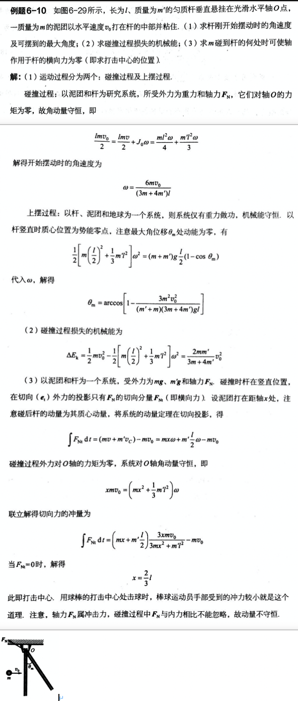
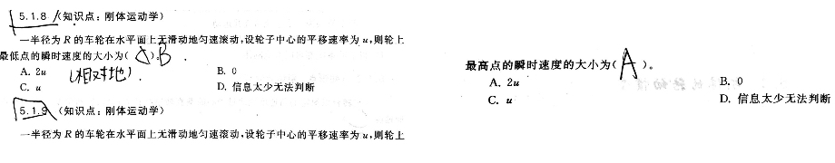

# 角动量和刚体力学

## 常用公式

角速度的计算式

角速度也是有方向的，定义：$\vec v= \vec w\times\vec r$

角动量的定义

来源为开二定律：太阳到行星的位矢单位时间扫过的面积(掠面速度)相同，公式表达：$\frac{\mathrm{d}\vec S}{\mathrm{d}t}=\frac 1 2 (v\sin\theta)r=\frac 1 2 |\vec r\times\vec v|$

动量为$\vec p$、位矢为$\vec r$的点对$O$点的角动量为$\vec L=\vec r\times \vec p$，由公式可见，只有描述物体转动特征的横向动量才对角动量有贡献

如果使用行列式的形式表示，则$\vec L=\vec r\times\vec p=\left|\begin{array}{cccc} \vec i & \vec j & \vec k \\ x & y & z \\ p_x & p_y & p_z \end{array}\right|$

$\vec L$在$z$轴方向的投影分量称为质点对$z$轴的角动量，为$L_z=\vec k\cdot\vec L=xp_y-yp_x$，这里也可以理解成先求出角动量再投影

对于质点系，$\vec L=\sum\vec {r_i}\times\vec {p_i}$

 

转动惯量

对于单个质点，$L_z=m(x\frac{\mathrm{d}y}{\mathrm{d}t}-y\frac{\mathrm{d}x}{\mathrm{d}t})=mr^2\frac{\mathrm{d}\theta}{\mathrm{d}t}=J\omega$，也就是转动惯量$J=mr^2$

对于体系，可以推导出$J=\sum m_ir_i^2$，对于连续的物体就可以得出：$J=\int r^2\mathrm{d}m$

力矩定义式和计算式

定义式：$\vec M=\frac{\mathrm{d}\vec L}{\mathrm{d}t}$

计算式：$\vec M=\vec r\times \vec F$

易知对于两个孤立互相作用的质点：$\vec M_{21}=-\vec M_{12}$，也就是质点间的“作用力与反作用力相等“，也即一对力矩的矢量和为零

角动量定理

$\vec {M_合}=\frac{\mathrm{d}\vec L}{\mathrm{d}t}$，这是一个瞬时作用，$\vec M$和$\vec L$针对的是同一个参考点，类比$\vec F=\frac{\mathrm{d}\vec p}{\mathrm{d}t}$理解

角冲量

$\int_{t_1}^{t_2}\vec {M_{合}}\mathrm{d}t=\vec {L_2}-\vec{L_1}$

质点系的角动量定理

$\vec{M_外}=\frac{\mathrm{d}\vec L}{\mathrm{d}t}$，质点系对某点的角动量对时间的变化率等于作用于该质点系上所有外力对该点的力矩的矢量和，也等于质点系对质心的角动量对时间的导数

质点系所受重力矩之和等于其合重力在质心产生的力矩

开二表达式

$\frac 1 2 L=\frac {\mathrm{d}S}{\mathrm{d}t}=\frac 1 2 r^2\omega=\frac {\pi ab}{T}$，后者对应的是椭圆

角量

$\omega=\frac{\mathrm{d}\vec{\theta}}{\mathrm{d}t},\vec \alpha=\frac {\mathrm{d}\vec \omega}{\mathrm{d}t}$

转动惯量

$J=\int r^2\mathrm{d}m$，这个值与是否转动无关，转动惯量是对轴而言的，决定于刚体对轴的总质量及对轴的质量分布，同一刚体对不同的轴，转动惯量一般是不相同的

$J=J_C+md^2$，其中$J_C$为通过质心的轴的转动惯量

转动惯量是可以直接相加的，即$J=J_1+J_2$

刚体的转动定理

$M_z=J_z\alpha$

刚体转动的功和能量

刚体转动的时候拥有的动能：$E_k=\frac{1}{2}J\omega^2$

外力对刚体做功时的元功：$\mathrm{d}A_i=M_{iz}\mathrm{d}\phi$

整个刚体的重力势能：$E_p=mgh_c$，其中$h_c$是质心的高度

## 常用结论

* 几种典型的匀质刚体的转动惯量

  

  一般考试的时候都会给，如果不给就求一下（见经典题目）

## 经典题目

### 角动量讨论的要素

> 老师课件

这题看看就行。。。

### 行星运动中角动量定理的使用

> 老师课件

注意也可以使用$\frac 1 2L=\frac{\mathrm{d}S}{\mathrm{d}t}=\frac{\pi ab}{T}$来求解

解法二纯逗比，不管它。。。

### 微元法求体系所受力矩：直棒、圆盘转动时的摩擦力力矩

> 老师课件

本题主要就是怎么将力矩和角动量联系起来$M=\frac{\mathrm{d}L}{\mathrm{d}t}$

也可以使用刚体力学做

> 老师课件

### 对轴的力矩的理解

> 进阶式-P44-4.2.8

因为重力和绳拉力的合力始终垂直于A点，所以对A的角动量守恒

### 冲量作用于杆的问题

> 老师课件

利用$F=\frac{I}{t}$做的，假设时间是极小时间$\tau$，力是均匀的

### 杆自由摆动和球自由摆动问题

> 老师课件

这题也可以使用能量守恒做

### 自由下摆的速度计算

> 老师课件

本质：求出$M(\theta)$之后利用$M=J\alpha$转换出$\alpha=\frac{\mathrm{d}\omega}{\mathrm{d}t}=\frac{\mathrm{d}\theta}{\mathrm{d}t}\cdot\frac{\mathrm{d}\omega}{\mathrm{d}\theta}=\omega\frac{\mathrm{d}\omega}{\mathrm{d}\theta}$

### 滑轮有质量的定滑轮双物品问题

一般方法下面已写，按照一般方法做即可

### 双滑轮问题

> 老师课件

### 物体与刚体碰撞类型：插入圆盘

> 老师课件

子弹最后留在原盘内，转动惯量上升，所以角速度下降

### 物体与刚体碰撞类型：插入直棒

> KB-P118-例题6-10

这题主要是最后一问不知道干嘛的。。。

### 转动惯量变化的问题

> 老师课件

本质：$M=J\alpha $的改变：$M=\frac{\mathrm{d}J}{{\mathrm{d}t}}\omega$

应该不会考这种题。。。

### 转动能的运用：斜坡滚柱体问题

> 老师课件

列式：$\begin{cases}\frac{1}{2}J\omega^2+\frac{1}{2}mv^2=mgh \\ \omega=\frac{v}{r} \end{cases}$即可

### 几种动量/角动量/机械能守恒判断题型

#### 转盘上跑人

> 来自各个地方，主要都是考虑轴的力的作用

平台可以绕竖直轴自由转动，平台上一个人在跑动，平台和人构成的系统动量不守恒，对竖直轴角动量守恒，机械能不守恒（静止到有动能）

#### 子弹射杆

> 老师课件

还是要考虑轴的力

#### 两个转盘

> 老师课件

#### 锥形转动杆

> 进阶式-P63-5.6.3

### 转动的基础问题

#### 相对转动问题

> 进阶式-P49-5.1.8,5.1.9

#### 转动分解问题

> 进阶式-P49-5.1.5.12

$\frac{1}{\sin\theta}=\frac{OO'}{r},-\frac{\cos\theta}{\sin^2\theta}\frac{\mathrm{d}\theta}{\mathrm{d}t}=-\frac{u}{r}$，得到$\omega=\frac{\mathrm{d}\theta}{\mathrm{d}t}=\frac{u}{r}\frac{\sin^2\theta}{\cos\theta}$

#### 转动阻力

> 进阶式-P56-5.3.14

这里是阻力。。。相当于在“某时刻”给了一个初速度

#### 转动方法

> mooc测验

这里记住既有平动也有转动

