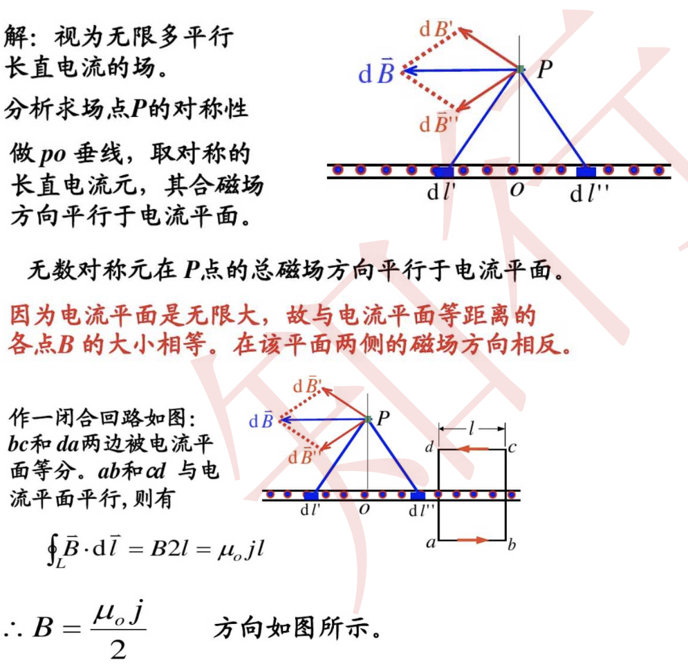
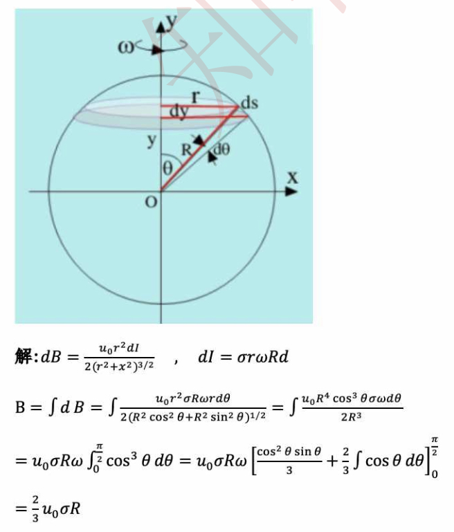

# 静磁

## 常用公式

电流的基础定义

设在$\mathrm{d}t$时间内通过导体某一截面的电量为$\mathrm{d}q$，则通过该截面的电流定义为单位时间内通过它的电荷量，即$I=\frac{\mathrm{d}q}{\mathrm{d}t}$

电阻的实验式

$R=\rho \frac{l}{S}$，其中$\rho$称为电阻率，$\sigma=\frac{1}{\rho}$称为电导率

电阻率和温度的关系：$\rho=\rho_0(1+\alpha T)$，其中$\alpha$为电阻率系数

电流密度矢量

方向是空间某点处正电荷的运动方向，大小等于单位时间内该点附近与$\vec j$方向垂直的单位截面上所通过的电量

$\vec j=nq\vec u$，其中$n$为载流子数密度，$\vec u$为流速

即$I=\iint_S\vec j\cdot\mathrm{d}\vec S=\frac{\mathrm{d}q}{\mathrm{d}t}$

电动势

定义：$\mathscr{E}=\int_-^+\vec {E_k}\cdot\mathrm{d}\vec l$

电源的功和功率：$A=\mathscr{E}It,P=I\mathscr{E}$

电荷产生的磁场

$\vec B=\frac{\mu_0}{4\pi}\frac{qv\times\vec{e_r}}{r^2}$，这里注意分母那个是$\vec{e_r}$，单位向量！

磁场的高斯定理

$\oint_S \vec B\cdot\mathrm{d}\vec S=0$，证明磁场是无源场

毕奥-萨法尔定律

$\mathrm{d}\vec B=\frac{\mu_0}{4\pi}\frac{I\mathrm{d}\vec l\times\vec r}{r^3}$，这里的$\mathrm{d}\vec l$指的在恒定电流$I$的导线上沿电流密度方向取的长度为$\mathrm{d}l$的矢量线元

安培环路定理

磁感应强度$\vec B$沿任一闭合回路的积分等于$\mu_0$乘以该闭合回路所包围的电流的代数和，即$\oint_L\vec B\cdot\mathrm{d}\vec l=\mu_0\sum I_{内}$

这里的正负是根据右手定则规定的

带电粒子在磁场中的运动

由$\vec F=q\vec v\times \vec B$

$\begin{cases}R=\frac{mv}{qB} \\ T=\frac{2\pi m}{qB} \\ \vec \omega=-\frac{q}{m}\vec B\end{cases}$

对于$\vec v$不垂直于又不平行于磁场$\vec B$的情况，有螺距$h=v_{//}T=\frac{2\pi m}{qB}v_{//}$，圆周半径$R=\frac{mv_{\perp}}{qB}$

==负电荷反向！==

磁矩

由$\vec F= I \vec l\times \vec B$

定义：$\vec m=IS\vec{e_n}$，方向由右手定则确定

注意这里需要乘匝数$N$，但是不是简单地乘$N$，需要根据方向逐个加减

磁力矩

定义：$\vec M=\vec m\times\vec B$，可以看出，力矩的作用是力试图使磁矩$\vec m$转向外磁场$\vec B$的方向

当$\vec m$和$\vec B$平行时，磁力向外使线圈绷紧成圆形

磁化强度定义

$\vec M=\frac{\sum\vec{P_m}+\sum{\Delta\vec{P_m}}}{\Delta V}$，是单位体积内分子固有磁矩与附加磁矩的矢量和，单位$\mathrm{A}/\mathrm{m}$

磁介质中的安培环路定理

定义磁场强度：$\vec H=\frac{\vec B}{\mu_0}-\vec M$，在有介质的时候$\oint\vec B\mathrm{d}\vec l=\mu_0\sum(I_c+I_m)$

于是有：$\oint_L\vec H\cdot\mathrm{d}\vec l=\sum I_{传导}$

下讨论$\vec B=\mu_0(\vec H+\vec M)$

对于各项同性的磁介质有$\vec M=\chi_m\vec H$，其中$\chi_m$是磁介质的磁化率，是一个无量纲的常数

于是：$\vec B=\mu_0(1+\chi_m)\vec H$

引入相对磁导率$\mu_r=1+\chi_m$，有$\vec B=\mu_0\mu_r\vec H=\mu \vec H$，其中$\mu$称为介质的磁导率，易知$\mu=\frac{B}{B_0}$

基尔霍夫电路方程

节点定律：$\sum I_i=0$

回路定律：$\sum\mathscr{E}_i-\sum{I_iR_i}=0$，回路有方向，可以从某一个点开始，遇到电阻$-IR$，遇到电源$\pm\mathscr{E}$

全电路欧姆定律：$U_b=U_a-IR-IR_i+\mathscr{E}$，可以理解为$U_a$经过升降到$U_b$，总之千万不要搞错正负

## 常用结论

### 磁感应强度相关的结论

* 无限长的直导线对于距离为$a$的位置磁感应$B=\frac{\mu_0 I}{2\pi a}$

  
  
  半无限长的导线则为$B=\frac{\mu_0I}{4\pi a}$
  
* 环形电路对轴线的磁感应强度

  

  在圆心处$B=\frac{\mu_0I}{2R}$

  其他处$B=\frac{\mu_0IR^2}{2(R^2+x^2)^{3/2}}$

* 无限长的螺线管轴线的磁场$B=\mu_0nI$，这里的$n$指的是单位长匝数

  

* 电流密度$j$的无穷大平面的磁场大小$B=\frac{\mu_0j}{2}$

  

### 霍尔元件

对于如图所示的霍尔元件

* 霍尔电势差：$\Delta U=U_z-U_{z_0}=-vBh$

  如果设载流子数密度$n$，电荷$q$，则电流$I=qnvhd$

  则得到霍尔电势差：$\Delta U=k\frac{IB}{d}$，其中$k=\frac {1}{qn}$，如果载流子正负即$k$的正负

* 霍尔电场$\vec{E_H}=-\vec v\times\vec B$，这个方向与$q$的电性无关

### 电流受磁场力

* 任何一个恒定闭合电流在均匀的磁场中受力为零

## 经典题目

### 特殊电流的磁感应强度求解

#### 螺线管磁感应强度

> KB-P243-例题10-15

#### 整个平面的电流（利用载流体）

> mooc测验

主要在于电流密度$j$的无穷大平面的磁场大小问题，见下：

### 运流电路的磁感应强度求解

#### 带电圆盘转动

> KB-P242-例题10-14

#### 球体的转动

> KB-P262-10.17

这个答案貌似有点问题

$\mathrm{d}I=\frac{Q}{T}=\frac{\sigma\mathrm{d}S}{\frac{2\pi}{\omega}}=\frac{\sigma\omega\mathrm{d}S}{2\pi}$

$\mathrm{d}B=\frac{\mu_0\mathrm{d}I(x^2+y^2)}{2R^3}$（利用结论）

所以$B=\iint_\Sigma \mathrm{d}B$再曲面积分即可

### 电流受磁场力的计算

#### 基础类型：连续导线受力

> KB-P251-例题10-19

这里注意的是积分方法。。。考试时候遇到直接套用即可

#### 基础类型：圆周导线受直导线磁场力

> KB-P252-例题10-20

## 一些常量、单位换算

* 真空磁导率$\mu_0$：$\mu_0=4\pi\times 10^{-7}\mathbf{N\cdot A^{-2}}$
* 