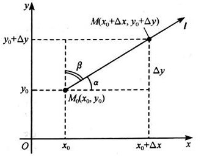

##### 

# 常见几何图形和图像

## 二维图形

### 双纽线

$(x^2+y^2)^2=a^2(x^2-y^2)\\ \rho^2=a^2\cos2\theta$

### 摆线

$\begin{cases}x=a(t-\sin t) \\ y=a(1-\cos t) \end{cases}$

### 心脏线

$r=a(1+\cos \theta)$

心脏线还有很多种，可以通过画特殊点(如$\theta=\pi/2,\pi\cdots$)来判断形状

### 星形线

$x^{\frac 2 3}+y^{\frac 2 3}=a^{\frac 2 3} \\ \begin{cases} x=a\cos^3t\\y=a\sin^3t \end{cases}$

### 三叶玫瑰线

$\rho = a \sin 3\theta$

注意$\theta$的范围，也就是切线

## 三维立体

### 椭球面

$\frac{x^2}{a^2}+\frac{y^2}{b^2}+\frac{z^2}{c^2}=1$

就不画图了。。。

在点$(x_0,y_0,z_0)$的切平面方程$\frac{x_0x}{a^2}+\frac{y_0y}{b^2}+\frac{z_0z}{c^2}=1$

### 单叶双曲面

$\frac{x^2}{a^2}+\frac{y^2}{b^2}-\frac{z^2}{c^2}=1$

### 双叶双曲面

$\frac{x^2}{a^2}+\frac{y^2}{b^2}-\frac{z^2}{c^2}=-1$

### 椭圆抛物面

$\frac{x^2}{a^2}+\frac{y^2}{b^2}=2cz$

### 马鞍面

$\frac{x^2}{a^2}-\frac{y^2}{b^2}=2cz$

### $x+y+z=0$

# 部分上学期知识

## 特殊形式函数

## 三角函数拓展

## 常见求导公式

## 常见等价无穷小判断、不定积分表、奇异的导数

补充一下不等式：

$\begin{array}{cccc}\frac{n}{\sum\limits_{i=1}\limits^{n}\frac{1}{x_i}} &\le& \sqrt[n]{\prod\limits_{i=1}\limits^{n}x_i} &\le& \frac{\sum\limits_{i=1}\limits^{n}x_i}{n} &\le& \sqrt{\frac{\sum\limits_{i=1}\limits^{n}x_i^2}{n}} \\ 调和& & 几何 & & 算术 & & 平方\end{array}$

# 多元函数微分学

## 多元函数连续、可导、可微性

### 三者关系

这里注意一下逆否命题的应用：如果函数不连续，就可以直接断定不可微

### 连续性定义证明

设二元函数$f(x,y)$的定义域$D$，$P_0(x_0,y_0,)$为$D$的聚点，且$P_0\in D$，如果$\lim\limits_{(x,y)\to(x_0,y_0)}f(x,y)=f(x_0,y_0)$则$f(x,y)$在$P_0$连续

这里唯一要注意的是$(x,y)\to(x_0,y_0)$是指以任何方式趋近，一般如果想要讨论全部方式的话可以用$\begin{cases} x=r\cos \theta \\ y=r\sin \theta \end{cases}$代换，然后让$r\to0$看是不是$\to0$即可

一元函数在映射到多元函数的时候仍然是连续的，以及还有连续多元函数复合、四则运算等的时候得到的仍然是连续多元函数

注意等价无穷小也是对应的，比如$\lim\limits_{x,y\to 0}\frac{\sin xy}{y}=\lim\limits_{x,y\to0}x=0$，实际上只有洛必达法则不能对应过来

证明不连续的时候一般使用$y=kx^a$，不过也看情况

### 可微性定义证明

* 判断$f_x(x,y),f_y(x,y)$是否存在，及在$(x_0,y_0)$是否连续，如果连续的话可以直接把值代进去

* 如果偏导不连续的话，就不能使用充分条件了，于是使用定义：$\lim\limits_{\rho\to0}\frac{\Delta z-f_x(x_0,y_0)\Delta x-f_y(x_0,y_0)\Delta y}{\rho}==0?\begin{cases}TRUE&:可微分\\FALSE&:不可微\end{cases}$

其中$\begin{cases}\rho=\sqrt{\Delta x^2+\Delta y^2} \\ \Delta z=f(x_0+\Delta x,y_0+\Delta y)\end{cases}$

==如果函数不连续，就一定不可微，就没必要再证明一遍了==

### 偏导连续性应用

只有一点需要注意：如果混合偏导$f_{xy}(x,y),f_{yx}(x,y)$在$P_0(x_0,y_0)$连续，则必然相等

高阶混合偏导在偏导数连续的条件下与求导次序无关（充分不必要）

## 全微分方程

### 全微分方程四等价

设$D$是**单连通域**，函数$P(x,y),Q(x,y)$在$D$内**具有一阶连续偏导数**，则下面四个条件等价

* 沿$D$中任意光滑的闭曲线$L$，有$\oint P\rm{dx}+Q\rm{dy}=0$
* 对$D$中任一分段光滑曲线$L$，曲线积分$\oint P\rm{dx}+Q\rm{dy}$与路径无关，只与起止点有关
* $ P\rm{dx}+Q\rm{dy}$在$D$内是某一函数$u(x,y)$的全微分，即$\rm{d\ u(x,y)}=P\rm{dx}+Q\rm{dy}$
* 在$D$内每一点都有$\frac{\partial P}{\partial y}=\frac{\partial Q}{\partial x}$

注：前三个条件对复连通域也适用，但是第四个必须在单连通域上

## 求全微分
==一定要注意，使用之前先判断是否存在（当然大多数时候不用管这个问题。。。）==

==求某个固定点的全微分的时候先带值进去！==

如$f(x,y)=\sqrt{|xy|},f_x(0,0)=0,f_y(0,0)=0$，但是通过求$\lim\limits_{\rho\to 0} \frac{\sqrt{|\Delta x\Delta y|}}{\rho}$可以知道其实并不可微

## 多元函数求导

### 偏导定义法

以对$x$在$(x_0,y_0)$点的偏导为例：设函数$z=f(x,y)$在点$(x_0,y_0)$的某领域内有定义，当$y$固定在$y_0$而$x$在$x_0$处有增量$\Delta x$时，有$\lim\limits_{\Delta x\to 0}\frac{f(x_0+\Delta x,y_0)-f(x_0,y_0)}{\Delta x}$存在，则称之为函数在$(x_0,y_0)$对$x$的偏导数

一定注意当遇到不连续点的时候使用定义求偏导数

### 直接求导法

==一定要记得链式法则！==

## 隐函数求导

### 全微分法

对于$F(x,y,z)=0$这个函数，直接对$x,y,z$求导数，再利用全微分的样子就行

同样，对于方程组的情况也同样，每个方程全微分再解方程(这里是指$\rm{dx},\rm{dy},\rm{dz}$组成的含$x,y,z$的方程组)就可以了

## 几何运用

### 空间曲线的切线和法平面

#### 对于参数方程情形

设空间曲线$L$的参数方程$\begin{cases}x=x(t) \\ y=y(t) \\ z=z(t)\end{cases}$期中$x'(t),y'(t),z'(t)$都存在，点$M_0(x_0,y_0,z_0)$对应参数$t_0$

则曲线$L$在点$M_0$的切线方程$\frac{x-x_0}{x'(t_0)}=\frac{y-y_0}{y'(t_0)}=\frac{z-z_0}{z'(t_0)}$，法平面方程$x'(t_0)(x-x_0)+y'(t_0)(y-y_0)+z'(t_0)(z-z_0)=0$

#### 对于平面交线情形

可以把某一个变量当作参数，再对两个方程求全微分/链式求导，解方程得到(如果选取$x$作为参数的话)$\frac{\rm{dy}}{\rm{dx}},\frac{\rm{dz}}{\rm{dx}}$，切线即$\{1,\frac{dy}{dx}|_{(x_0,y_0,z_0)},\frac{\rm{dz}}{\rm{dx}}\}|_{(x_0,y_0,z_0)}$

也有公式：对于$\begin{cases}F(x,y,z)=0 \\ G(x,y,z)=0\end{cases}$，对应的切线则为：$\frac{x-x_0}{\left|\begin{array}{}F_y & F_z \\G_y & G_z\end{array}\right|}=\frac{y-y_0}{\left|\begin{array}{}F_z & F_x \\G_z & G_x\end{array}\right|}=\frac{z-z_0}{\left|\begin{array}{}F_x & F_y \\G_x & G_y\end{array}\right|}$

其实还有一种方法，先求两个面方程对应的法向量$\vec {n_1}$和$\vec {n_2}$，再求$\vec{n_1}\times \vec {n_2}$即为方向向量

### 曲面的切平面和法线

设曲面$S$的方程$F(x,y,z)=0$，$M_0(x_0,y_0,z_0)$是曲面$S$上一点，假定$F(x,y,z)$可微，且$F_x,F_y,F_z$在点$M_0$处不全为$0$

则曲面$S$在点$M_0$处的

法向量$\vec n=\{F_x(x_0,y_0,z_0),F_y(x_0,y_0,z_0),F_z(x_0,y_0,z_0),\}$

切平面方程$F_x(x_0,y_0,z_0)(x-x_0)+F_y(x_0,y_0,z_0)(y-y_0)+F_z(x_0,y_0,z_0)(z-z_0)=0$

法线方程$\frac{x-x_0}{F_x(x_0,y_0,z_0)}=\frac{y-y_0}{F_y(x_0,y_0,z_0)}=\frac{z-z_0}{F_z(x_0,y_0,z_0)}$

特别的，对于$z=f(x,y)$的情形，可以转化成$F=f-z$的形式讨论

## 方向导数和梯度

### 方向导数定义和求法

方向导数定义：设函数$z=f(x,y)$在点$M_0（x_0，y_0）$的某领域$S(M_0,\delta)$内有定义，$\vec l$是过$M_0$的$\forall$确定方向。在$\vec l$上任取一点$M(x_0+\Delta x,y_0+\Delta y)$，使$M\in S(M_0,\delta)$，点$MM_0$之间的距离$\rho=|MM_0|=\sqrt{(\Delta x)^2+(\Delta y)^2}$，于是得到函数$f(x,y)$在点$M_0$处沿方向$\vec l$的平均变化率$\frac{\Delta z}{\rho}=\frac{f(x_0+\Delta x,y_0+\Delta y)-f(x_0,y_0)}{\rho}$

如果在$M$以$\vec l$趋近于点$M_0$，则称此极限为函数沿$\vec l$的方向导数

求法：若函数$z=f(x,y)$在点$M_0(x_0,y_0)$处可微，则$f(x,y)$在该点处沿任意方向$\vec l$的方向导数存在，且$\frac{\partial z}{\partial \vec l}|_{M_0}=\frac{\partial f}{\partial x}|_{M_0}\cos\alpha+\frac{\partial f}{\partial y}|_{M_0}\sin\beta$

关于$\cos \alpha$和$\cos \beta$的定义：

### 梯度

定义：设函数$u=f(x,y,z)$，它在点$M_0(x_0,y_0,z_0)$处的梯度是这样一个向量，其方向是函数**增加**最快的方向，其大小是函数的最大增长率（即方向导数的最大值）。函数$u$在点$M_0$处的梯度记作$\textbf{grad} \ u|_{M_0} $，在直角坐标下，它的表达式为$\textbf{grad}\ u|_{M_0}=\{\frac{\partial f}{\partial x},\frac{\partial f}{\partial y},\frac{\partial f}{\partial z}\}|_{M_0}$

注意有的题目问沿某个方向下降最快，此时最好将结果化规称单位向量

## 多元函数极值

### 定义

函数$f(x,y)$在点$P_0(x_0,y_0)$的某邻域内有定义，若在此邻域内对异于$P_0$的点恒有$f(x,y)<f(x_0,y_0)$或$f(x,y)>f(x_0,y_0)$，则称$f(P_0)$是函数的一个极大（极小）值，$P_0$即为极大（极小）值点

### 极值点的必要条件

若函数$f(x,y)$在点$P_0(x_0,y_0)$处达到极值，且$f_x(x_0,y_0)$和$f_y(x_0,y_0)$存在，则$f_x(x_0,y_0)=0,f_y(x_0,y_0)=0$

偏导数都为$0$的称点为函数的稳定点或者驻点

### 极值的充分条件

函数$f(x,y)$在点$P_0(x_0,y_0)$的某邻域内有连续的二阶偏导数，且$f_x(x_0,y_0)=0,f_y(x_0,y_0)=0$，记$\begin{cases}f_{x^2}(x_0,y_0)=A \\ f_{xy}(x_0,y_0)=B \\ f_{y^2}(x_0,y_0)=C\end{cases}$

则有：

* 当$AC-B^2>0 $且$A>0$（或$C>0$）时，$f(x_0,y_0)$为极小值
* 当$AC-B^2>0 $且$A<0$（或$C<0$）时，$f(x_0,y_0)$为极大值
* 当$AC-B^2<0 $时，$f(x,y)$在$(x_0,y_0)$没有极值
* 当$AC-B^2=0$时可能有极值，也可能没有极值，需要再讨论

### 求最大值和最小值的一般方法

将函数$f(x,y)$在$D$内的所有驻点处的函数值(极值的充分条件)及在$D$的边界上的最大值和最小值(拉格朗日乘子法)相互比较，最大的就是最大值，最小的就是最小值

如果函数$f(x,y)$的最大值(最小值)一定在$D$的内部取得，而函数在$D$内只有一个驻点，那么可以肯定该驻点处的函数值一定就是函数$f(x,y)$在$D$上的最大值(最小值)

如果函数$f(x,y)$的最大值(最小值)一定在边界上取得，也是同上理

### 条件极值和拉格朗日乘子法

原理不介绍了，直接说方法

如果有约束条件$\phi (x,y,z)=0$（注意约束条件必须是一个等式，比如“在$x^2+y^2\le 1$内取值“就不属于约束条件），要求目标函数$f(x,y,z)$的最大（最小值），设$F(x,y,z,\lambda)=f(x,y,z)+\lambda\phi(x,y,z)$

有方程组$\begin{cases} F_x=f_x+\lambda\phi_x=0 \\ F_y=f_y+\lambda\phi_y=0 \\ F_z=f_z+\lambda\phi_z=0 \\ F_{\lambda}=\phi(x,y,z)=0\end{cases}$

从上式解出$x,y,z,\lambda$之后，$(x,y,z)$就是条件极值问题的稳定点，如果直观上能够判断条件极值点是存在的，而从上面方程中解出的稳定点又只有一个，那么这个稳定点就是条件极值点

如果有两个约束方程，分别为$\phi(x,y,z)=0,\psi(x,y,z)=0$，设$F(x,y,z,\lambda_1,\lambda_2)$，那么方程可以列成：

$\begin{cases} F_x=f_x+\lambda_1\phi_x+\lambda_2\psi_x=0 \\ F_y=f_y+\lambda_1\phi_y+\lambda_2\psi_y=0 \\ F_z=f_z+\lambda_1\phi_z+\lambda_2\psi_z=0 \\ F_{\lambda_1}=\phi(x,y,z)=0 \\ F_{\lambda_2}=\psi(x,y,z)=0 \end{cases}$

后续过程一致

如果是讨论二元函数$z=f(x,y)$满足约束方程$\phi(x,y)=0$的条件极值，那么设$F(x,y,\lambda)=f(x,y)+\lambda \phi(x,y)$

方程组为$\begin{cases} F_x=f_x+\lambda\phi_x=0 \\ F_y=f_y+\lambda\phi_y=0 \\ F_{\lambda}=\phi(x,y)=0 \end{cases}$

后续过程一致

# 各种积分的特殊情况

## 二重积分和三重积分的变量代换

主要是雅可比行列式

设函数$f(x,y)$在有界闭区域$D$上连续，作变换$T$：$x=x(u,v),y=y(u,v)$，使

1. 把$uv$平面上的区域$D'$一一对应在$xy$平面的区域$D$
2. 变换函数$x(u,v),y(u,v)$在$D'$上连续，且有连续的一阶偏导数
3. 雅可比行列式在$D'$上处处不为0，即$J(u,v)=\frac{\partial (x,y)}{\partial (u,v)}\not= 0,(u,v)\in D'$

则有$\iint_Df(x,y)\rm{dxdy}=\iint_{D'}f[x(u,v),y(u,v)]|J(u,v)|\rm{dudv}$

实际上对于三重积分也有同样的性质，只需要知道雅可比行列式的形式就行

二重积分下$J(u,v)=\frac{\partial(x,y)}{\partial(u,v)}=\left|\begin{array}{cccc} \frac{\partial x}{\partial u} & \frac{\partial x}{\partial v} \\ \frac{\partial y}{\partial u} & \frac{\partial y}{\partial v}\end{array}\right| $

三重积分下$J(u,v,w)=\frac{\partial(x,y,z)}{\partial(u,v,w)}=\left|\begin{array}{cccc} \frac{\partial x}{\partial u} & \frac{\partial x}{\partial v} & \frac{\partial x}{\partial w} \\ \frac{\partial y}{\partial u} & \frac{\partial y}{\partial v} & \frac{\partial z}{\partial w} \\ \frac{\partial z}{\partial u} & \frac{\partial z}{\partial v} & \frac{\partial z}{\partial w}\end{array}\right|$

实际上雅可比行列式有其他含义，具体就参考[知乎：雅可比矩阵和雅可比行列式](https://zhuanlan.zhihu.com/p/39762178)

# 不同积分之间的转换

## 一型曲线=>利用参数方程的一重积分

如果$\begin{cases}x=x(t)\\y=y(t)\end{cases}\alpha\le t \le \beta$

$\int_{L}f(x,y)\rm{ds}=\int_{\beta}^{\alpha}f[x(t),y(t)]\sqrt{[x'(t)]^2+[y'(t)]^2}\rm{dt}$

注意一定要$\alpha<\beta$

对于使用极坐标代换$r=r(\theta),\begin{cases}x=r(\theta)cos\theta\\y=r(\theta)sin\theta\end{cases}$的情况

可以使用更简单的公式
$\int_{L}f(x,y)\rm{ds}=\int_{\beta}^{\alpha}f[r(\theta)cos\theta,r(\theta)sin\theta]\sqrt{[r'(\theta)]^2+[r(\theta)]^2}\rm{d\theta}$

## 二型曲线=>利用参数方程的一重积分

对于$\begin{cases}x=x(t)\\y=y(t)\\z=z(t)\end{cases},\alpha\le t\le \beta$这类的曲线

$\ \ \ \int_{\mathop{AB}\limits^{\frown}}P\rm{dx}+Q\rm{dy}+R\rm{dz}\\=\int_{\alpha}^{\beta}\{P[x(t),y(t),z(t)]x'(t)+Q[x(t),y(t),z(t)]y'(t)+R[x(t),y(t),z(t)]z'(t)\}\rm{dt}$

## 一型曲线<=>二型曲线

$\{cos\alpha,cos\beta,cos\gamma\}$是曲线方向向量

$\int_{\mathop{AB}\limits^{\frown}}P\rm{dx}+Q\rm{dy}+R\rm{dz}=\int_{\mathop{AB}\limits^{\frown}}(Pcos\alpha+Qcos\beta+Rcos\gamma)\rm{ds}$

可以理解成向三个坐标投影

## 二型曲线=>二重积分（格林公式）

$\oint_{L^+}P\rm{dx}+Q\rm{dy}=\iint_{D}(\frac{\partial Q}{\partial x}-\frac{\partial P}{\partial y})\rm{dxdy}=\iint_{D}\left|\begin{array}{cccc}\frac{\partial }{\partial x} & \frac{\partial }{\partial y} \\ P & Q \end{array}\right|\rm{dxdy}$

注意这里要求==$L$闭合==、==正向曲线==以及==P、Q在D上有连续的一阶偏导==，这里的$L^+$是指区域$D$永远在$L$左边

## 一型曲面=>二重积分

$\iint_Sf(x,y,z)\rm{dS}=\iint_{D_{xy}}f(x,y,z(x,y))\sqrt{1+z_x^2+z_y^2}\rm{dxdy}$

对于另外两个平面投影同理

## 二型曲面=>一型曲面

$\iint_S\vec F \cdot\vec{n_0}\rm{dS}=\iint_SP\rm{dydz}+Q\rm{dydz}+R\rm{dzdy}=\iint_{S}(Pcos(\alpha)+Qcos(\beta)+Rcos(\gamma))\rm{dS}$

主要应用在有些化简之后很简单的题目上，$\cos \alpha,\cos \beta,\cos \gamma$是曲面$S$的法向方向向量

## 二型曲面=>投影到一个坐标面二重积分

本身由二型推一型，之后利用一型换二重的方法推导来，一般口诀：一投二代三定号

$\iint_{S^+}\vec F \cdot\vec{n_0}\rm{dS}=\iint_{S^+}P\rm{dydz}+Q\rm{dydz}+R\rm{dzdy}=\iint_{S}(Pcos(\alpha)+Qcos(\beta)+Rcos(\gamma))\rm{dS}\\=\pm \iint_{D_{xy}}\{P[x,y,z(x,y)](-z_x)+Q[x,y,z(x,y)](-z_y)+R(x,y,z(x,y))\}\rm{dxdy}$

注意要记得定号，这里的号是积分平面正法向的符号，一般根据投影面对应的轴（上式中是指和$z$轴的方向）来决定

如果不是用$z$代换的话，可以先采取一样的办法：得到想要变换的未知数和另外两个的关系后，求导、代入，最后类似方法判断方向

## 二型曲面直接=>分别投影坐标面二重积分算法

本身可以通过二型=>二重的过程中得出来

$\iint_SP(x,y,z)\rm{dydz}=\iint P[x,y,z(x,y)]\rm{dydz}$

即$Q=0,R=0$时向$xoy$平面投影，一般用在单个计算也不麻烦的时候

## 一型/二型曲面=>三重积分（高斯公式）

千万别忘了需要考虑到==全部闭合==平面，以及使用要求“$P,Q,R$各分量在$\Omega$及$S$上有连续的一阶偏导数”

$\begin{align}	&\ \ \ \ \ \iint_{S^+}[Pcos(\alpha)+Qcos(\beta)+Rcos(\gamma)]\rm{dS}\\&=\iint_{S^+}P\rm{dydz}+Q\rm{dzdx}+R\rm{dxdy}\\&=\iiint_{\Omega}(\frac{\partial P}{\partial x}+\frac{\partial Q}{\partial y}+\frac{\partial R}{\partial z})\rm{dV}\end{align}$

一定要注意所需曲面是==全部的闭合曲面==

## 二型曲线=>一型/二型曲面（斯托克斯公式）

$\begin{align}\oint_{\Gamma} P\rm{dx}+Q\rm{dy}+R\rm{dz}&=\iint_{S}\left|\begin{array}{cccc} cos\alpha & cos\beta & cos\gamma \\ \frac{\partial }{\partial x} & \frac{\partial }{\partial y} & \frac{\partial }{\partial z} \\ P & Q & R \end{array}\right|\rm{dS}\\&=\iint_S\left|\begin{array}{cccc}\rm{dydz} & \rm{dzdx} & \rm{dxdy}\\\frac{\partial }{\partial x} & \frac{\partial }{\partial y} & \frac{\partial }{\partial z} \\ P & Q & R \end{array}\right|\end{align}$

其实格林公式是$R=0,cos\gamma=0$的斯托克斯公式的特例，注意这里$\{cos\alpha,cos\beta,cos\gamma\}$是$\Gamma$的右手定义的正向法向的单位向量

# 各种物理量的计算公式

*如重心之类的*

## 空间几何

### 点到平面距离

平面：$Ax+By+Cz+D=0$，点：$(x_0,y_0,z_0)$，则距离：$d=\frac{|Ax_0+By_0+Cz_0+D|}{\sqrt{A^2+B^2+C^2}}$

### 平行平面之间的距离

对于平面$Ax+By+Cz+D_1=0$和平面$Ax+By+Cz+D_2=0$，其间距为：$d=\frac{|D_1-D_2|}{\sqrt{A^2+B^2+C^2}}$

### 面与平面之间的距离

这里的面之间的距离指的是一个曲面上到另一个平面的最小距离，使用的方法是拉格朗日乘子法，比如有一个曲面$f(x,y,z)=0$，它与平面$Ax+By+Cz+D=0$之间的距离可以构造$F(x,y,z,\lambda)=g(x,y,z)+\lambda f(x,y,z)$再求，这里的$g(x,y,z)$是一个和$(x,y,z)$与平面间距离等价的函数

## 质心

设薄板占据平面区域$D$，面密度$\mu(x,y,z)$，则质心坐标：$\begin{cases}\overline{x}=\frac{\iiint_\Omega x\mu(x,y,z)\rm{dV}}{\iiint_{\Omega}\mu(x,y,z)\rm{dV}} \\ \overline{y}=\frac{\iiint_\Omega y\mu(x,y,z)\rm{dV}}{\iiint_{\Omega}\mu(x,y,z)\rm{dV}} \\ \overline{z}=\frac{\iiint_\Omega z\mu(x,y,z)\rm{dV}}{\iiint_{\Omega}\mu(x,y,z)\rm{dV}}\end{cases}$

本质就是求矩/质量，所以如果给的是线密度$\tau (x,y,z)$，将上述的分子变成$\int_S{x\tau (x,y,z) }\rm{ds}$即可

## 转动惯量

转动惯量的物理定义是：$J_z=\int_m r^2\rm{dm}$，下面的公式本质就是通过$\rm{dm}=f(x,y,z)\rm{dV}$这种代换出来的

二维情形：设薄片占区域$D$，面密度为$\mu(x,y)$，则对于$x,y$轴的转动惯量为：$\begin{cases}J_x=\iint_D y^2\mu(x,y)\rm{d\sigma} \\ J_y=\iint_Dx^2\mu(x,y)\rm{d\sigma}\end{cases}$

三维情形：设薄片占空间有界闭区域$\Omega$，在点$(x,y,z)$处的密度是$\rho(x,y,z)$ 则对于三轴的转动惯量：$\begin{cases}J_x=\iiint_{\Omega}(y^2+z^2)\rho(x,y,z)\rm{dV} \\ J_y=\iiint_{\Omega}(z^2+x^2)\rho(x,y,z)\rm{dV} \\ J_z=\iiint_{\Omega}(x^2+y^2)\rho(x,y,z)\rm{dV}\end{cases}$

## 引力

设物体占据空间区域$\Omega$，其体密度为$\mu(x,y,z)$，区域$\Omega$外有一质量为$m_0$的质点$A \ (a,b,c)$，求物质$\Omega$对质点$A$的引力$\textbf{F}$

本质使用的定理：$\rm{d}\textbf{F}=G\frac{m_0 \rm{dm}}{r^2}\textbf{n}_0=Gm_0\frac{\mu(x,y,z)\rm{dV}}{r^2}\textbf{n}_0$

得到$F$的三个分量$\begin{cases} F_x=Gm\iiint_{\Omega}\frac{x-a}{r^3}\mu(x,y,z)\rm{dV} \\ F_y=Gm\iiint_{\Omega}\frac{y-b}{r^3}\mu(x,y,z)\rm{dV} \\ F_z=Gm\iiint_{\Omega}\frac{z-c}{r^3}\mu(x,y,z)\rm{dV} \end{cases}$

## 散度公式

$div\  \textbf{A}=\nabla\cdot \textbf{A}=\frac{\partial P}{\partial x}+\frac{\partial Q}{\partial y}+\frac{\partial R}{\partial z}$

## 旋度公式

$rot\ \textbf{A}=\nabla\times \textbf{A}=\left|\begin{array}{cccc}\textbf{i} & \textbf{j} & \textbf{k} \\\frac{\partial }{\partial x} & \frac{\partial }{\partial y} & \frac{\partial }{\partial z} \\ P & Q & R\end{array}\right|$

## 环流量公式

对于$\oint_{\Gamma}\vec {A}\cdot\vec {\tau}\ \rm{ds}$

环流量可以表达为$\oint_{\Gamma}\vec A\cdot \vec{\tau}\rm{ds}=\oint_{\Gamma}P\rm{dx}+Q\rm{dy}+R\rm{dz}$

其中$\vec\tau$是$\Gamma$在点$(x,y,z)$点的单位切向量

即是$\vec A$对$\Gamma$曲线的二型积分

斯托克斯公式也可以表示成$\iint_{\Sigma}rot\vec A \cdot \vec n \rm{dS}=\oint_{\Gamma}\vec A \cdot \vec \tau \rm{ds}$

这里的$\vec n$是$\Gamma$曲线右手系的向量

# 级数

## 常数项级数的审敛性

==必要条件==：$\lim\limits_{n\to \infty}u_n=0$

### 正项级数的判断方法

$\begin{cases}u_n\_v_n & 比较法 \\ \lim\limits_{n\to \infty}\frac{u_n}{v_n} & 互比法（一般找同阶的比较）\\ \frac{u_{n+1}}{u_n},\sqrt[n]{u_n} & 两种自比 \\ \int_{1}^{\infty}f(x)\rm{dx} & 柯西积分法\end{cases}$

注意是否充要

实际上还有一种直接展开法。。。比如如果知道$\sum\limits_{n=1}\limits^{\infty}u_n=S$，那么可以直接通过展开得到$\sum\limits_{n=1}\limits^{\infty}(u_n+u_{n+1})=2S-u_1$

### 正负级数的判断方法

$\begin{cases} \sum |u_n| & 判断绝对收敛 \\ 莱布尼兹法 \\ \left|\frac{u_{n+1}}{u_n}\right| & 绝对值自比 \end{cases}$

一般来说绝对值自比是万能的，如果结果大于$1$则级数发散，如果小于$1$则绝对收敛

## 幂级数

泰勒公式：$f(x)=f(x_0)+f'(x_0)\cdot(x-x_0)+\frac{f''(x_0)}{2!}(x-x_0)^2+\cdots+\frac{f^{(n)}(x_0)}{n!}\cdot (x-x_0)^n+R_n(x)$

拉格朗日余项：$R_n(x)=\frac{f^{(n+1)}(\epsilon)}{(n+1)!}(x-x_0)^{n+1}$

### 幂级数能够展开的必要条件

$\lim\limits_{n\to\infty}R_n(x)=0$

### 常见函数展开幂级数

（以下均对$x=0$展开）

$\begin{array}{cccc}\frac 1 {1-x}=\sum\limits_{n=0}\limits^{\infty}x^n &-1 < x <1   \\ \frac 1 {1+x}=\sum\limits_{n=0}\limits^{\infty}(-1)^{n}x^n & -1<x<1 \\  \frac 1 {1+x^2}=\sum\limits_{n=0}\limits^{\infty}(-1)^nx^{2n} & -1<x<1  \\   \frac a {1-x^2}=\sum\limits_{n=0}\limits^{\infty}ax^{2n} & -1< x <1   \\  (1+x)^m=1+mx+\frac{m(m-1)}{2!}x^2+\dots+\frac{m(m-1)\cdots(m-n+1)}{n!}x^n\cdots  & -1<x<1  \\ \sqrt{x+1}=1 + \frac 1 2 x+\sum\limits_{k=2}\limits^{\infty}(-1)^{k-1}\frac{(2k-3)!!}{(2k)!!}x^k &-1\le x\le 1 \\  \frac 1 {\sqrt{x+1}}=1 +\sum\limits_{k=1}\limits^{\infty}(-1)^{k}\frac{(2k-1)!!}{(2k)!!}x^k &-1< x\le 1  \\  \sin(x)=\sum\limits_{n=1}\limits^{\infty}(-1)^{n-1}\frac{x^{2n-1}}{(2n-1)!} & x\in R  \\  \cos(x)=\sum\limits_{n=0}\limits^{\infty}(-1)^{n}\frac{x^{2n}}{(2n)!} & x\in R   \\  \ln(1+x)=\sum\limits_{n=0}\limits^{\infty}(-1)^n\frac{x^{n+1}}{n+1} & -1< x\le1 \\  \ln(1+x)=\sum\limits_{n=1}\limits^{\infty}(-1)^{n+1}\frac{x^n}{n}  &  -1<x\le 1\\ \ln(x)= \\     e^x=\sum\limits_{n=0}\limits^{\infty}\frac{x^n}{n!}, &1 \le x \le 1 \end{array}$

这里有两个$\ln(x+1)$的展开，主要是因为可以转求和起点，实际上$\sin(x)$也可以使用类似方法变成从$n=0$开始，特别是需要和$\cos(x)$的级数求和的时候

对于$\frac{1}{ax+b}$型，可以采用间接法：$\frac{1}{ax+b}=\frac 1 b \frac {1}{\frac{a}{b}x+1}$再使用$\frac 1 {1+x}$（用$\frac 1 {1-x}$推导）的展开式间接代换即可

### 间接法

可以借助以下方法得到一些不好求的幂级数

* 求导法

  已知$sin(x)$的展开式，求$cos(x)$的展开式可以直接将$sin(x)$的两边求导即可

* 积分法

  已知$\frac 1 {1+x^2}$的展开式，左右对$x:0\to x$积分即可，但是一定要记得形式是$S(x)-S(0)=\sum\limits_{n=0}\limits^{\infty}\int_0 ^x  f(n,x)\rm{dx}$，==千万不要少了0！==

* 代换法

  已知$\frac 1 {1+x}$的展开式，可以用$x^2$代入式子获得$\frac 1 {1+x^2}$的表达式
  
* 乘积法

  已知$ln(1+x)$的展开式，可以直接乘上$(1+x)$获得$(1+x)ln(1+x)$的表达式

* 级数作差法

  $sin(3x)-sin(x)$可以直接将级数作差得出

* 移位法

  $\sum\limits_{n=1}\limits^{\infty}(-1)^{n-1}\frac{x^{n+1}}{n}=\sum\limits_{n=2}\limits^{\infty}(-1)^n\frac{x^n}{n-1}$，这个主要用来合并同$\sum$项

## 傅立叶级数

### 傅立叶级数的参数计算公式

如果$f(x)=\frac{a_0}{2}+\sum\limits_{n=1}\limits^{\infty}(a_n cos(nx)+b_n sin(nx)) \ \ \ x\in C$

则有$ \begin{cases}a_n=\frac 1 \pi \int_{-\pi}^{\pi}f(x)cos(nx)\rm{dx} & n=0,1,2,\cdots\\ b_n=\frac 1 \pi \int_{-\pi}^{\pi}f(x)sin(nx)\rm{dx} & n=1,2,\cdots \\ C=\{x|f(x)=\frac 1 2 [f(x^-)+f(x^+)]\}\end{cases}$

如果$f(x)$是偶函数，则是余弦级数；如果是奇函数，则是正弦级数（注：正弦级数即$\sum\limits_{n=1}\limits^{\infty}b_nsin(nx)$，余弦级数即$\frac{a_0}{2}+\sum\limits_{n=1}\limits^{\infty}a_ncos(nx)$）

注意求范围$C$的时候要去间断点和间断端点（指展开后左右不连续），以及标注和原函数类似的范围

### 狄利克雷条件

1. 一个周期内连续/只有有限个第一类间断点（即左右极限存在）
2. 一个周期内至多有有限个极值点（防止震荡函数，如$sin(\frac 1 x)$）

最终和函数等于（即收敛于）$\begin{cases}f(x)&x连续\\ \frac 1 2[f(x^-)+f(x^+)]& x 间断/在端点\end{cases}$

### 任意周期的傅立叶级数
如果$f(x)=\frac{a_0}{2}+\sum\limits_{n=1}\limits^{\infty}(a_n cos(\frac{n\pi x}{l})+b_n sin(\frac{n\pi x}{l})) \ \ \ x\in C$

则有$ \begin{cases}a_n=\frac 1 l \int_{-l}^{l}f(x)cos(\frac{n\pi x}{l})\rm{dx} & n=0,1,2,\cdots\\ b_n=\frac 1 l \int_{-l}^{l}f(x)sin(\frac{n\pi x}{l})\rm{dx} & n=1,2,\cdots \\ C=\{x|f(x)=\frac 1 2 [f(x^-)+f(x^+)]\}\end{cases}$

同上，注意求范围$C$的时候要去间断点和间断端点（指展开后左右不连续），以及标注和原函数类似的范围

