# 一些声明和规律

## 声明

尽管我可以自负地说这份资料绝对是很全的，甚至涉及到了很多老师没有涉及到的点，但是肯定无法做到完全覆盖考试内容，也有很多内容可能都没有涉及到，所以，本资料仅供参考

另外，如果发现错误和我联系(19211332@bjtu.edu.cn)

## 符号约定

* 对于二进制，定义成$F_2F_1F_0$，其中$F_i$称为第$i$位

## 编码器和解码器的定义

* 编码器：

  多组输入（理论）对应唯一输出，或者对称解码器定义：一个端输入电平对应一组输出

  如编码十进制数$i$（表示为$ I_i$有效）的时候可以将$i $转化成二进制数$F$，比如$I_5$对应$F_2=1,F_2=0,F_0=1$

* 解码器：

  一组输入对应唯一一个端输出电平

  比如输入二进制数$F_2=1,F_1=0,F_0=1$，对应$I_5$输出电平（可能是低电平有效）

* 数据选择器和数据分配器

  

  这两图解释地很清楚了（~~图有点歪了~~）

* 数值比较器：

  对于两个二进制数$A_nA_{n-1}\cdots A_1A_0$和$B_nB_{n-1}\cdots B_1B_0$判断大小的器件

* 算数运算电路：

  半加器和全加器，它可以进行二进制的加法运算

  另外有一个点可以补充，实际上异或运算$a\oplus b$可以看作一个没有进制的加法，即$1+1=10$，但是没有进位$1$，所以得到$0$

## 一些技巧

有的输入被取了反，比如$\overline I$这种东西，这表示的是输入低电平有效，在画波形图如果标注了$\overline{I}$这种东西，也直接对应了输入是什么，不需要再进行转换，也就是说讲取反的符号看成一种记号就行

比如下图，第一个就是$\overline{CP}$，也就是某个输入的波形图，它的下降沿就是图中画虚线的部分

再举个例子，如果是编码器单线输入5到$\overline{I_i}$中的话，那么应该是$\overline{I_5}=0$，因为是低位有效。如果用$\overline {F_i}$输出5的二进制编码101的话，应该是$\overline{F_0}=0,\overline{F_1}=1,\overline{F_2}=0$，也就是按位取反了，因为是低位有效

# 编码器

## 3位二进制编码器

### 器件图

### 解释

输入是（理论上）单有效电平$I_i$，之后输出$i$对应的二进制数$F_2F_1F_0$

如果多输入信号就会出错，所以需要优先编码器，即$I$端多输入的时候只会转换一个信号

## 74LS148 8线-3线优先编码器

是一个**8线-3线优先编码器**

### 器件图

### 解释

总共有8个输入，和一个$S$使能端。由于所有的输入都会被取反，所以**这个器件每一个口都是低电平有效**

输出的是输入优先级最高的$I_i$（$i$越大优先级越高，比如如果$I_7$是低电平也就是有效的话剩下的是否有效都不影响了），转换出来的是二进制的数$F_2F_1F_0$，注意这里依然是低电平有效，所以如果$\overline{I_5}$有有效输入，输出中有效的实际上是$\overline {F_2}$和$\overline {F_0}$

另外两个端口的作用见下。注意我是将其输出当成一个bool值看待的，解释的都是有效时的含义

* $\overline {F_S}$有效表示使能端有有效输入，但是$\forall \overline{I_i}$都没有有效输入
* $\overline{F_{EX}}$有效表示电路正常工作，即存在$i$，$\overline{I_i}$有有效输入，并且使能端有有效输入

这两个和电路状态的关系可以见下图：

$\overline{F_{EX}}$和$\overline{F_S}$一般用于电路拓展，可以参考下面的编码器组合过程

## CD4532 8线-3线优先编码器

是一个**8线-3线优先编码器**，可以改造成**16线-4线优先编码器**

### 器件图

### 解释

一样是八个输入，一个使能端。这里的输出是不会被取反的，所以高电平时有效的

输入输出和上一个一样的，不再解释。对于$EO$和$GS$解释如下

* $EO$有效表示使能端有有效输入，但是$\forall I_i$都没有有效输入
* $GS$有效表示电路正常工作，即存在$i$，$I_i$有有效输入，并且使能端有有效输入

可以看出这两个用于拓展的端口和上面定义是一样的。这里借着8线-3线转16线-4线的过程讨论拓展端口的作用

### 拓展电路

由于优先编码的优先体现在高位压低位，所以如果包括$A_8\sim A_{15}$的板子（对应图中的板子1）有有效输入，那就不应该让低位的板子工作，以免干扰；反过来，如果板子1的$A_i$没有有效输入，那么就应该让低位板子工作。所以我们将$EO_1$端和的$EI_0$端连接，因为如果$EO_1$无效那么就可以说明要么1的使能端没有输入，要么使能端有输入但是$I_i$端口没有有效的输入，这两种情况下$0$板子都不应该工作；如果板子1受到了使能端驱动但是没有有效输入，就可以通过$EO_1$（此时为1）和$EI_0$让板子0工作

整个组合板，其正常工作就说明两个板至少有一个正常工作，所以将$GS=GS_1+GS_0 $。另外实际上整个组合板不会出现两个板子都正常工作的情况

端口$EO_0$在$EI_1$有使能输入但是没有$I$端口输入时有效

对于输出的二进制数$G_3G_2G_1G_0$，如果板子1正常工作那么$G_3$应该为1，所以$G_3$接$GS_1$，此外，由于低位对应是一样的，即$A_i$和$A_{i+8}$在后三位是一样的，所以$G_2$、$G_1$、$G_0$是由两个板子的$Y_i$取或得到的

## 74LS148改 10线-8421BCD4线编码器

是一个由8线-3线拓展的10线-4线优先编码器，这里的输入和前面一样，但是是10线的，而输出4线是一个8421BCD编码而不是二进制码

### 器件图

### 解释

由于每一个十进制数都可以分别独立编码，不需要拓展编码位数（比如将8-3拓展成16-4这种事），所以不设置拓展的使能端

这里举个例子：如果优先处理后的有效输入的是$5$，即$101$，对应输入是$\overline{I_5}=0$，并且对于$i>5$，$\overline{I_i}=1$，对应的有效输出是$\overline{F_0}$和$\overline{F_2}$，无效的是$\overline{F_1}$，也就是$\overline{F_0}=0,\overline{F_1}=1,\overline{F_2}=0$，经过$G$的作用后变成了$Z_0=1,Z_1=0,Z_2=1$，也就是说这种编码器可以直接将十进制优先单线输入转换成8421BCD码$Z_3Z_2Z_1Z_0$

# 译码器

## 74LS138 3线-8线译码器

### 器件图

### 解释

这里的输入是一个三线的编码，表示的是一个二进制数，输出的是解码之后的二进制数，比如如果输入是$A_2=1,A_1=1,A_0=0$，那么输出就是仅$\overline {F_6}$有效

$S_1,\overline{S_2},\overline{S_3}$是三个使能端，只有三个使能端都有效时才会正常工作。三个使能端是为了可以拓展更多的电路

### 拓展电路

可以拓展成4线-16线的译码器，这样可以处理4位的二进制了

两个板子，1板子对应的是$0\sim 7$的输出，此时输入最高位（或者说第三位）一定是0，而2板子对应的是$8\sim 15$的输出，此时输入最高位（或者说第三位）一定是1，所以将$A_3$连在板子1的$\overline{S_2}$上：如果$A_3$有效那么板子1的$\overline{S_2}$无效，也就是板子1不工作；将$A_3$连在板子2的$S_1$上：如果$A_3$有效那么板子2的$S_1$有效。另外仍然需要一个使能端控制整个电路的工作状态，即两个板子应该选择一起正常工作/不工作，由于2板子的使能端只剩下$\overline{S}$的形式的了，所以选择将使能信号$\overline{E}$（注意这里应该写成$\overline{E}$的形式）连接入上图中的三个位置

另外板子1的另一个使能端$S_1$用不上，直接输入高电平就行

### 电路应用

#### 转换逻辑函数

使用这种译码器可以转换逻辑函数$F(A,B,C)$，比如课本中的例子$F(A,B,C)=AB+BC+CA$

这种就是先转换成最小项，比如上式就是$F=\overline{A}BC+A\overline{B}C+AB\overline{C}+ABC=\sum(m_3,m_5,m_6,m_7)$。这样我们就可以理解成：只有输入是这四项中的一个时才能有输出，而输入$m_i$对应的又是$\overline{F_i}$有效，也就是$\overline{F_i}=0$，所以$F=\overline{\overline{F_3}}+\overline{\overline{F_5}}+\overline{\overline{F_6}}+\overline{\overline{F_7}}=\overline{\overline{F_3}\cdot\overline{F_5}\cdot{\overline{F_6}}\cdot\overline{F_7}}$

对应的电路图如下：

一定要注意：**使能端要有接线，输入的ABC顺序一定不可以接错了**

遇到译码器转逻辑函数的最好都套用这个模版。。。毕竟老师改卷的时候可能并不能看出来其他连法对不对

#### 构造1线-8线数据分配器（基于74LS138）

假设输出与输入的关系$D_i=D$（实际上其他关系也可以直接改造出来）

数据分配器：分为三个部分：地址选择码、输入数据、多路输出。使用下图可以很容易理解，这里的输出为$D_j=D$，其中$j$是$n$位地址选择信号转换的十进制码

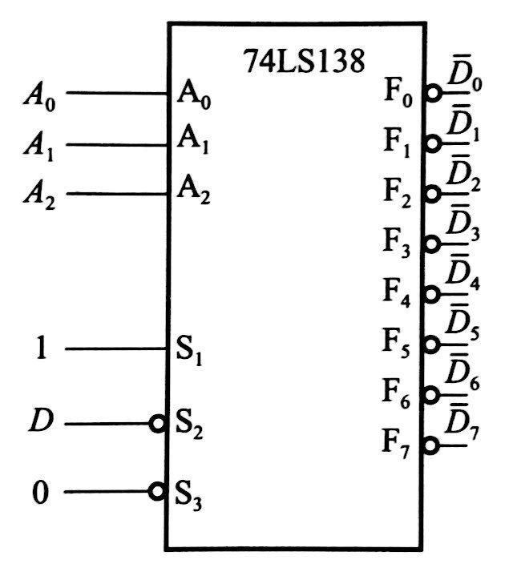

原理：为了有选择作用，应当是$n$位地址选择器接在$A_2A_1A_0$上，$D$接在使能端，而如果选择的是$3$，那么输入$A_2=0,A_1=1,A_0=1$，输出应该和$D$有关，根据要求的结果，如果$D=1$那么$\overline{F_3}=1$，如果$D=0$，那么$\overline{F_3}=0$，故$D$应该接在低电平有效的使能端，也就是$D$是低电平的时候电路工作，此时$\overline{F_3}$在$A_i$的作用下有效为0，否则$D=1$那么$\overline{F_3}$必无效，输出1

## 74LS42 8421BCD4线-10线译码器

### 器件图

### 解释

就是10线转四线的反过来

注意输入是高电平有效，输出是低电平有效。比如输入$A_3=0,A_2=1,A_1=1,A_0=0$，对应的是十进制的$6$，所以输出应该是只有$\overline{F_6}$有效

## 74LS47 8421BCD转显示电路译码器

### 器件图

最左边的输入是一个二进制数

### 应用

主要用在数字电路显示上，输入是8421BCD码，输出数字对应的LED开关信号

# 数据选择器

两个定义：

* 数据分配器：一对多

  

* 数据选择器：多对一

  

上图很容易理解工作的原理

## 74LS153 4选1数据选择器

### 器件图

### 解释

其中$A_0,A_1$是地址选择端，$D_i$是输入端，两个$S$都是使能端，分别驱动一个4选1输入，$D_{1i}$和$D_{2i}$，但是有效电平不同。$F_1$、$F_2$分别对应一个4选1的输出

根据$A_1A_0$的数值选择输出

### 构造逻辑函数

这个是书上的例题，比较神奇

使用上述的4选1数据选择器构造$F=\overline{A}\overline{B}\overline{C}+AB+AC+BC$

$F=\overline{A}\overline{B}\overline{C}+\overline{A}BC+A\overline{B}C+AB$

可以看成$AB$选择之后$C$再输入。。。反正挺神奇的

## 74LS151 8选1数据选择器

### 器件图

### 解释

这个器件输出什么的和上面的一样，主要麻烦在怎么利用数据选择器构造逻辑函数上

### 拓展电路

这里构造的是16选1

简单分析一下

和上面若干拓展的思路一样，如果需要选择到$1000\sim1111$范围的数字，那么就要需要通过$A_3$让控制$D_8\sim D_{15}$的板子正常工作，让控制$D_0\sim D_7$的板子无法工作，所以在上图中，$A_3$输入1的时候板子2的$\overline{S}=0$，有效，所以板子2工作，而板子1的$\overline{S}=1$，无效，所以板子1不工作。$A_3$输入0的时候同理

由于这里的$F_{1/2}$在电路不工作的时候输出的是0，所以必须使用或门让$F=F_1+F_2$以实现一个输出0时不影响结果。另外由于$\overline{F}=\overline{F_1+F_2}=\overline{F_1}\cdot\overline{F_2}$，所以$\overline{F_1}$和$\overline{F_2}$应当使用与门

### 构造逻辑函数

以$F=AB+BC+AC$为例

$F=\overline{A}BC+A\overline{B}C+AB\overline{C}+ABC=\sum(m_3+m_5+m_6+m_7)$，也就是只有在$ABC$取到左边的四个值的时候才能输出1，~~很容易想到~~应该让$ABC$连接地址选择端，而四个值的输入端（$I_3,I_5,I_6,I_7$）都恒定为有效，其他的全部无效，这样只有输入了上述四个值才可能产生有效输出

具体的逻辑电路如下

还是很容易理解的

另外这种数据选择器构造逻辑函数可以用一种通法解释：$\color{red}{F=\sum m_iD_i}$，$m_i$表示的是选择端输入，$D_i$就是对应的输入端，这样下次遇到一个逻辑函数直接套就行

# 数值比较器

## 1位和2位数值比较器

这个更像是一个原理介绍

### 原理表达式和原理图

1位：

$\begin{cases} F_{A>B}=A\overline{B} \\ F_{A<B}=\overline{A}B \\ F_{A=B}=A\odot B \end{cases}$

2位

$\begin{cases}F_{A>B}=A_1\overline{B_1}+(A_1\odot B_1)A_0\overline{B_0}=F_{A_1>B_1}+F_{A_1=B_1}\cdot F_{A_0>B_0} \\ F_{A<B}=F_{A_1<B_1}+F_{A_1=B_1}\cdot F_{A_0<B_0} \\ F_{A=B}=F_{A_1=B_1}\cdot F_{A_0=B_0}\end{cases}$

两个的原理都很简单粗暴，就是一位位比较

## 74LS85集成4位数值比较器

### 器件图

### 解释

很容易理解，里面三个$I$是上一级的结果用于拓展，$A$和$B$是这一级的输入，表示的是两个数

如果$I_{A>B}$、$I_{A<B}$已经有有效输入，直接输出$F_{A>B}$、$F_{A<B}$

### 拓展电路 串联式

很直观的一种方法，从高往低比较，但是这样的效率会非常低

### 拓展电路 并联式

这里将$A$和$B$变成两个四位数$A'$和$B'$，其中$A'_i=bool(A_{3i\sim3i+3}>B_{3i\sim3i+3})$，$B'_i=bool(A_{3i\sim3i+3}<B_{3i\sim3i+3})$，然后逐位比较$A'$和$B'$即可

如果某一位$A_i'=1$而$B_i'=0$，说明$A_{3i\sim3i+3}>B_{3i\sim3i+3}$，因此可以判断出大小了。$A_i'=0,B_i'=1$同理

# 算数运算电路

## 半加器

### 原理和符号

$\begin{cases}S=A\oplus B \\ C=AB\end{cases}$

半加器没有上一位的进位输入

## 全加器

$\begin{cases} S=A\oplus B\oplus C_i \\ C_0=AB+(A\oplus B)C_i \end{cases}$

全加器会有上一位的进位输入，如果想要实现多位加法直接串联全加器就行

另外，全加器的进位输出可以这么理解：如果本位是两个$1$相加那么应该进$1$，对应$AB$项；如果上一位有进位并且本位有一个$1$那么应该进$1$，对应$(A\oplus B)C_i$

## 74283集成加法器

### 器件图

使用方法其实和全加器一样，但是是4位一起输入，如果想要高位运算也是直接串联就行

# 触发器

## 一些解释

* 触发：在触发器中经常听到一个概念叫“上升沿”或者“下降沿”，指的是只有时钟信号CP出现某种特定信号的时候**触发器**的输出才会改变，而且新的状态次态$Q_{i,n+1}$与之前的状态$Q_{i,n}$以及输入是有关的

* 但是注意，这里的是**触发器的新的状态**$Q_n$和CP有关，不是输出与CP有关！有的输出是可以在CP没有发生变化的时候变化的，比如下图

  

  这里$Y=AQ_{0,n}Q_{1,n}$，与输入直接相连，如果$A$改变$Y$完全可以改变，没必要等CP的信号

* 一般如果CP连接了一个取反符号，那么就是下降沿改变信号

* 状态图可以看作一种自动机，每一次输入都可以让自动机的状态（也就是图上的圈）转移，利用这个可以简化思考，至少我看来看状态图是比计算逻辑函数方便的

* 如果出现不定态，在波形图上可以画成两条曲线（见书P104），在特征表上可以画一个$\times$

* 自启动：数字电路中的状态机（可以看作状态图）在上电时，无论它处于什么初始状态，都会自动经过有限次的跳变后，最终进入设定的状态中。具有这种功能的电路，就叫做自启动电路

## 说明

* 由于状态图可以通过特征表导出，而且贼难记忆，所以这里器件介绍里不会给出状态图

## RS锁存器

### 器件图

### 解释

R-reset，即置0

S-set，即置1

低电平有效，并且：

* 如果输入是$\overline{R_D}$有效，而$\overline{S_D}$无效，那么$Q_{n+1}=0$
* 如果输入是$\overline{S_D}$有效，而$\overline{R_D}$无效，那么$Q_{n+1}=1$
* 如果输入同时无效，那么$Q_{n+1}=Q_{n}$
* 如果输入同时有效，那么会出现错误，因为此时$\overline{Q_{n+1}}=Q_{n+1}=1$（见逻辑图）

原理图如下

特征方程$\begin{cases} Q_{n+1}=S_D+\overline{R_D}Q_n \\ \overline{R_D}+\overline{S_D}=1\end{cases}$

上面的是工作的方程，可以很容易通过上面的描述得出

下面的是约束方程，即不能两个同时有效。另外还要注意这种RS触发器输入的是$\overline{S_D}$而不是${S_D}$，因此上式的$S_D$不是实际输入

这种触发器可以用来构建防颤开关，具体见书P102

## 同步RS触发器

### 逻辑图和器件图

### 解释

上面的输出会随时收到输入的影响，但是我们希望能够稳定输入，所以加了一个时钟信号CP，只有时钟信号触发（这里是上升沿）时才会改变$Q$

另外这里改成了高电平有效。其他的和上一个基本一样

特征方程：

$\begin{cases}Q_{n+1}=S+\overline{R}Q_{n} \\ SR=0 \end{cases}$

特征方程由一个工作方程和一个约束方程构成。考试的时候如果忘记了工作方程可以列出$Q_{n+1}$和$\overline{R},S,Q_{n}$的卡诺图得到

## D触发器

### 器件图

### 解释

特征方程：$Q_{n+1}=D$

状态表很简单，不贴了

### 实际D触发器图 

课本P106提到的

这里解释一下$\overline{R_D}$和$\overline{S_D}$，也就是**异步**复位/预制端。很明显这个是低电平有效的，而且也是R-reset，S-set，由此：

* $\overline{R_D}$有效，$\overline{S_D}$无效，那么无论什么时候、不需要CP的信号，$Q=0$
* $\overline{S_D}$有效，$\overline{R_D}$无效，那么无论什么时候、不需要CP的信号，$Q=1$
* 两个都无效，那就是一个D触发器
* 两个都有效，应该会出错（~~本来应该问老师的但我怕被老师打~~）

这里需要注意的是，以$\overline{S_D}$为例，如果初始时Q为0，假设$\overline{R_D}$始终无效，如果某一时刻，$\overline{S_D}$有效，那么无论此时CP什么状态，Q都会直接被置为1；之后假设$\overline{S_D}$无效，那么Q仍将保持1，直到CP有输入或者$\overline{R_D}$、$\overline{S_D}$有输入

## JK触发器

~~JK最好看了~~

### 器件图

### 解释

可以理解成：J-set，K-reset。如果JK某个单独有效的话就是set/reset的功能，如果都有效的话就是反转状态，如果都无效的话就是保持

表达式：$Q_{n+1}=J\overline{Q_n}+\overline{K}Q_{n}$

JK触发器也有实际的一种，但是和实际的D触发器原理上是一样的，也就不再写了

## T触发器

### 器件图

### 解释

如果T有效，那么当CP信号来的时候$Q_{n+1}=\overline{Q_n}$，如果T无效，CP信号来的时候无事发生

表达式：$Q_{n+1}=T\oplus Q_{n}$

## T‘触发器

### 器件图

### 解释

只有时钟输入，每次时钟输入都会反制Q

表达式：$Q_{n+1}=\overline{Q_n}$

另外实际上如果画出来波形图的话可以看出这个的周期是CP的两倍

## 触发器的转化

### 基本原理

实际上转化的基本原理就是写出表达式然后根据**次态相同的原则**直接比较、转化输入

另外可以通过借口转换的式子（比如JK、D）代回到原来的式子来判断正误

具体见下

### JK转D

即输入D信号转成JK信号

JK：$Q_{n+1}=J\overline{Q_{n}}+\overline{K}Q_{n}$

D：$Q_{n+1}=D$

联立转化：$Q_{n+1}=D=D(Q_{n}+\overline{Q_{n}})=D\overline{Q_{n}}+DQ_{n}=J\overline{Q_{n}}+\overline{K}Q_{n}$

对比一下，只要$\begin{cases} J=D \\ \overline{K}=D \end{cases}$进行输入转化就行，器件见下：

如果将$\begin{cases} J=D \\ K=\overline{D}\end{cases}$代回$Q_{n+1}=J\overline{Q_{n}}+\overline{K}Q_{n}$，就可以得到$Q_{n+1}=D$，也就是说是对的

### D转JK

即输入JK信号转成D信号

这里和上面有一点不同，对两个式子联立得到：$J\overline{Q_{n}}+\overline{K}Q_{n}=D$

因此此时内部的D触发器应该和$J\overline{Q_{n}}+\overline{K}Q_{n}$连接，这样才能将JK输入转化成D输入

器件图：

### 转T'

直接看书P110即可，和上面的方法都一样

# 时序电路分析

## 备注

其实这里总共有三种：同步、异步、利用集成芯片的电路。最后一个会放在下一节讲，但是下面的一些讨论会有所涉及

对于逻辑方程的罗列来说，前两种是一样的，第三种基本不列方程

对于状态表来说，三者都有很大的不同，同步的最简单，直接一个个画就行；异步的需要考虑时钟信号所以画起来有亿点麻烦；集成的一般写的是进位器这种东西，和前两种完全不是一个画法

对于状态图来说，三者基本一致，都是通过状态表画，除了有一些细节，特别是讨论输出时候，会有一些需要注意的点

对于波形图来说，三者也没什么太大差异，都是通过状态表画，但是对于输出也有特别的考虑

## 方程分析流程

时序逻辑电路的分析（或者说列方程）是可以有一个标准流程的，可以借助这个流程简化思考。下面以一道题为例

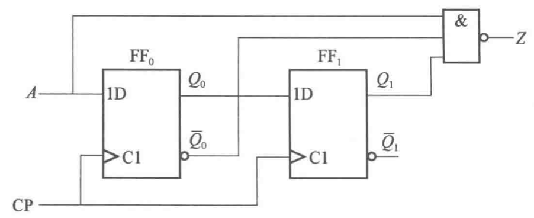

1. 时钟方程

   即电路的工作方式（异步/同步）的方程，这里是：$CP_0=CP,CP_1=CP$

2. 驱动方程

   即触发器的输入方程，这里是两个D触发器，即：$\begin{cases} D_0=A \\ D_1=Q_{0,n} \end{cases}$

   需要注意的是，驱动方程的左端，也就是触发器的输入一般是不带含$n$下标的，但是右边的$Q$会带上，并且一定是$n$，表示的现态

3. 状态方程

   即触发器的工作方程，这里即：$\begin{cases} Q_{0,n+1}=D_{0}=A \\ Q_{1,n+1}=D_{1}=Q_{0,n} \end{cases}$

   和上面一样，等式的右边一定是现态，左边一定是次态，也就是$n+1$

4. 输出方程

   即整个电路的输出，这里就是$Z=\overline{A\overline{Q_{0,n}}Q_{1,n}}$

   同样，左边没有下标，右边下标都是$n$

对于异步的列式其实是同理的，但是一般在状态方程后面标注是哪个时钟信号发生什么过程的时候工作

另外，驱动方程有时候也叫激励方程

## 同步逻辑电路状态表画法

对于同步电路，在状态表上，我们需要依次画出现态、次态和输出

一般现态就是从$000\sim 111$这种，之后根据逻辑方程求出次态和输出。书上说的是假定初态是$000$然后以得到的次态作为下一个初态，但是我觉得可能不是很有必要，现态按顺序写次态和输出套公式就行

另外这里的正确性就很依赖方程的罗列了，所以说方程千万不能列错

## 异步逻辑电路状态表画法

对于异步电路，在画状态表的时候，先列出现态

之后找到时钟信号直接连接的触发器，这些触发器的$Q$最先变化，然后根据这些$Q$的变化看其他触发器的CP端可有变化，列在表上

对于发生了变化的CP输入，判断是不是有效（比如如果连接的是下降沿触发但是来了一个上升沿那就是无效的），如果是有效的，这个触发器的状态也需要改变

## 逻辑电路的状态图

状态图直接通过状态表（甚至逻辑方程）写

画状态图的时候最好标注上图例，比如下图就表示状态使用$Q_1Q_0$的二进制数表示，输入是$A$，输出是$Z$

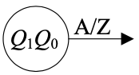

画出状态图之后需要检查自启动能力。把一个状态看成一个点，状态转移看成一条边，如果整个图从任何一个点出发都可以进入工作循环，那么就可以认为是可以自启动的，相反就认为不能自启动。注意有的时候有可能有孤立的状态，也需要画出来（比如$111$与其他的状他都没有转换，也需要画一个$111$）

电路可以是不能自启动的，此时一般通过给一个复位/预制保证电路可以进入工作循环，否则可能因为干扰跳出工作循环之后就回不来了

## 逻辑电路的时序图

也可以叫波形图

对于同步或者异步的电路来说，只要从CP信号拉上升沿/下降沿（有的丧心病狂的异步会同时有CP上升沿和下降沿的触发）下来就行，比如下图，原电路是一个下降沿触发的，那么在CP下降沿拉几根线下来，之后先画$Q$，从做往右，碰到拉下来的线的左边时就停下，把此时的电路当现态，根据这个现态找次态（在状态表中找），然后继续同理画就行

注意，输出的时序图最好特判，因为输出的可能和CP信号完全没关系，比如有一个输出$Z=AQ_{1,n}$，若某CP信号之间的时刻$A=0$了那么$Z$需要立即归0，而只根据状态表画的画可能没有办法合理地画出来这个细节

## 包含异步复位/置位时的处理方式

有的触发器会带上异步复位等功能，这时需要特殊处理，下例来自课本P113-4.3

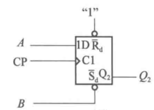

（~~这个图有亿点糊~~）

图中的$\overline{S_d}$和$\overline{R_d}$就是异步置位和异步复位，如果$\overline{S_d}=0$，也就是有效的话那么就会让$Q_2$直接变1，$\overline{R_d}=0$同理

## 同步时序电路的设计方式

总的来说有以下的步骤：

1. 设计状态图

   这里的状态图应该涵盖了电路的工作方式，并且写清楚输入和输出

2. 绘制状态表

   绘制状态表之前应该先确定使用什么样的触发器，这个一般是题目指定的

   确定每一个输入情况下现态到次态是怎么转化的（即从$Q_n$到$Q_{n+1}$怎么变）

   确定输出应该是什么，注意输出应该跟的是现态，比如如果是模4的进位端，那么应该是$Q=11$的时候输出为1

   紧接着得到每一个$Q$对应触发器的激励信号应该是什么，比如如果是D触发器并且$Q_{n}=0$，$Q_{n+1}=1$那么这个转换$D=1$

3. 画卡诺图，设计激励方程

   画**激励信号、输出**根据**现态**和**输入**的卡诺图，之后根据卡诺图写**激励信号、输出**关于**现态**和**输入**的方程

4. 绘制电路

   根据上面写出来的方程直接绘制就行

5. 检查自启动

   只需要说一句能不能自启动就行，如果不能自启动也没有什么关系

具体可以看课本P124的例题，写得很清楚

# 集成时序芯片

## 一些概念和细节

* 注意计数器是可以任意模任意顺序的，比如$10\to 01\to 11\to 00\to 10$完全可以看作一个M=4的计数器的状态

  可以用集成芯片构造任意模计数器，但是**一般情况**下使用异步端的要预留一个瞬时态，使用同步端的不需要

  另外，顺序计数的情况下，$a$和$b$之间(包括$a$和$b$)有$b-a+1$个状态

* 一般写Q的时候从高向低写($Q_3Q_2Q_1Q_0$)，但是分析移位器的时候从低往高写($Q_0Q_1Q_2Q_3$)

* 分频：对于电路中的某一处，如果其电平变化的频率是输入信号（比如CP信号）的$\frac{1}{N}$，即$f'=\frac{f}{N}$，就说是N分频

  在后面还会专门讨论分频

## 同步计数器

以下三个均为同步计数，模16的二进制，上升沿触发

| 型号  | 逻辑方式       | 预制方式 | 复位方式 |
| ----- | -------------- | -------- | -------- |
| 74161 | 加法           | 同步     | 异步     |
| 74163 | 加法           | 同步     | 同步     |
| 74193 | 双时钟，加/减  | 异步     | 异步     |
| 74290 | 双时钟，模2或5 | 异步置9  | 异步     |

这里的预制方式/复位方式里面的同步和异步指的是：

同步：来了一个时钟信号之后产生效果

异步：没有时钟信号的要求，立即产生效果

下面的讨论中，$Q$表示的是$Q_DQ_CQ_BQ_A$或$Q_3Q_2Q_1Q_0$，$D$同理

### 74LS161

#### 电路图

引脚功能：（结合课本P130的表5.5.3理解）

优先级最高的是异步复位端，若$\overline{R}=0$，也就是复位端有效，立即让$Q=0$

次高的是同步置位端，在复位端无无效的时候，若$\overline{LD}=0$，也就是置位端有效，时钟信号来的时候$Q=D$

优先级最低的是计数端。$CT_T$和$CT_P$都可以理解成是能端，两个都有效的时候才能用CP计数，并且是+1模16的计数器

另外$CO=CT_T \cdot Q_3Q_2Q_1Q_0$，与$CT_T$有关！在画输出的波形图/分析电路的时候一定要注意

#### 串联应用

（图里的两个$\overline{LD}$应该均为1）

可以将两个74LS161串联，让第一个的CO输出端连接到第二个的$CT_T$端（注意不是$CP$端！），这样第一个为1111有进位的时候，第二个使能端都有效，来CP信号后两个都会进位，之后第一个的CO=0，右边的也就不再工作了

#### 构造任意模的计数器

一般有两种方式：预制和复位

由于74LS161的复位是异步的，所以设计的时候需要考虑瞬时态的问题

比如如果让$\overline{R}=\overline{Q_2Q_0}$，也就是$Q=0101$的时候第一次$\overline{R}=0$，然后会执行复位，注意这时候$Q$是瞬间变成0的，所以$Q=0101$不应该是一个有效状态。这个计数器的状态为：$0000\to 0001\to 0010\to 0011\to 0100\to( 0101 \to )0000$

由于74LS161的预制是同步的，所以设计的时候直接数就行

### 74LS163

和161唯一的区别在于复位是同步的

另外不是很清楚这个计数器预制和复位的优先级，就是$\overline{R},\overline{LD}$同时有效的时候到底是预制还是复位

### 74LS193

#### 电路图

引脚功能：（结合课本P137表5.5.8理解）

优先级最高的是异步复位端，若$R=0$，也就是复位端有效，立即让$Q=0$

次高的是同步置位端，在复位端无无效的时候，若$\overline{LD}=0$，也就是置位端有效，时钟信号来的时候$Q=DCBA$

之后是两个计数端$CP_D$和$CP_U$，分别代表下降(down)和上升(up)的时钟信号，在一个有效，另一个来上升沿就会触发；如果两个都是高电平则为保持；为模16计数

另外$\begin{cases} \overline{CO}=\overline{UP\cdot Q_DQ_CQ_BQ_A} \\ \overline{BO}=\overline{DN\cdot \overline{Q_D}\overline{Q_C}\overline{Q_B}\overline{Q_A}} \end{cases}$，即$UP=1$并且$Q=1111$的时候有进位输出；$DN=1$并且$Q=0000$的时候就有借位输出

#### 串联应用

可以看课本P139图5.5.12来详细理解。需要注意的是进位/借位和时钟信号为什么那么连

其实这里有一个bug：按照上面对进位的逻辑表达式$\overline{CO}=\overline{UP\cdot Q_DQ_CQ_BQ_A}$，在$Q_{3\sim 0}=1111$时，只要$UP=CP$发生了下降沿($1\to 0$)，那么就会让$\overline{CO}_1$从发生上升沿，很明显这里在CP非上升沿的时候发生了变化

比如起始时$Q=0010\ 1111$，那么整个电路的状态是这么变化的$0010\ 1111\stackrel{CP\downarrow}{\longrightarrow} 0011\ 1111\stackrel{CP\uparrow}{\longrightarrow} 0011\ 0000$，当然最后还是在一个上升沿里发生了+1

#### 构造任意模的计数器

由于74LS193的预制和复位都是异步的，所以构造的时候都需要预留瞬时态。其他的没什么不同

另外如果需要模的数字大于16，也就是一个计数器不可能完成(总共就16个状态)，那就先构造串联的模256的计数器再构造计数器

具体可以看书P139图5.5.12

 

## 异步计数器74LS290

即74LS290，说它是异步的原因是它有两种CP信号

### 电路图

这里对引脚做一个注解：

* $R_{0(1)}$和$R_{0(1)}$：可以理解成异步复位端，并且是两个都有效的时候才复位
* $S_{9(1)}$和$S_{9(2)}$：可以理解成异步预制端，并且是两个都有效才有可能预制(有一个优先级的问题，见后)，以及预制的是9，也就是$Q=1001$
* $CP_A$和$CP_B$：$CP_A$是模2计数的CP信号，$CP_B$是模5计数的CP信号

这个计数器是预制优先级更高，并且预制和复位都是**异步的**：

1. 如果$S_{9(1)}=S_{9(2)}=1$，也就是都有效，那么立刻$Q=1001$
2. 如果上面的情况不满足，则如果$R_{0(1)}=R_{0(1)}=1$，立刻让$Q=000$，因此这个器件**复位的优先级是低于预制的**
3. 如果上面两种都不满足，就进行下降沿触发的计数，并且这个计数器的计数很奇怪：
   * $CP_A$控制的是$Q_A$
   * $CP_B$控制的是$Q_DQ_CQ_B$，并且是**模5**的。也就是一旦$Q_DQ_CQ_B=(5)_2=101$，那么下一次时钟信号来了后$Q_DQ_CQ_B=000$

### 构造模10计数器

一个模5一个模2，因此可以构造模10的计数器

有两种方式，一种是CP接$CP_A$，而$Q_A$接$CP_B$，这样可以看作每一次下降沿都让$Q_DQ_CQ_BQ_A$加一；还有一种是CP接$CP_B$，$Q_D$接$CP_A$，这种情况下可以看作每一次下降沿都让$Q_AQ_DQ_CQ_B$加一

### 构造任意模数计数器

一般先构造一个模10的计数器，之后根据状态表连接复位端/预制端，需要注意的是由于复位/预制端都是异步的，所以列状态表的时候会有一个瞬时态

## 数码寄存器74LS175

数码寄存器的作用：存储数据

### 电路图

先看原理图：

很明显，一旦有一个上升沿，$D$里面的数据就会被同步并行载入$Q$

结合前面内容也知道，清零是异步的

结合原理图就可以知道器件引脚的连接意义了

* $V_{CC}$和$GND$分别连接电源和地
* $\overline{CR}$是复位
* $CP$是时钟信号
* $D$是输入，$Q$是保存的信息（和原理图对应）

功能表见课本P143，没有什么特别的

## 移位寄存器

移位寄存器可以满足：每一次有一个CP信号来临后，(如果是右移)让$Q_{i+1,n+1}=Q_{i,n}$，而$Q_0$可以单独输入

举个例子，如果$Q_0Q_1Q_2Q_3=1001$，并且$Q_{0,n+1}=\overline{Q_{0,n}}$，那么$Q_0Q_1Q_2Q_3$的变化就是$0100\to 1010\to 0101\to 1010$

在讨论移位寄存器的时候一般把$Q$按照下标从小到大排列，比如$Q_0Q_1Q_2Q_3$。

### D触发器构成的

由于$Q_{i+1,n+1}=Q_{i,n}$这个式子一看就很D触发器，所以用D触发器构造寄存器就很容易想到了

每一次CP输入都进行右移，并让$Q_{0,n+1}=D_{SI}$

看课本P144获得更好的理解

### 74LS195单向移位寄存器

#### 电路图

简单来说这个器件满足“异步复位，同步送数”

还是按照优先级的顺序理解

优先级最高的是异步复位（实际上总结之前的会发现除了74LS290，其他的复位的优先级都是最高的），所以一旦$\overline{R}$有效，$Q=0000$

没有上升沿的时候状态保持

有上升沿时：送数的优先级高于移位，即如果$\overline{LOAD}$有效，那么让$Q_i=D_i$；如果$\overline{LOAD}$无效并且$\overline{R}$无效，那么就执行移位功能，并且$Q_{0,n+1}=J\overline{Q_{0,n}}+\overline{K}Q_{0,n}$

特别注意，***图上K连接的是$\overline{K}$***，也就是如果K连接的是0表示的是$\overline{K}=0$

看课本P145获得更好的理解

### 74LS194双向移位寄存器

#### 电路图

简单来说：“异步复位，同步送数，A右B左”

优先级最高的是异步复位

对于$M_A$和$M_B$

* $M_A=1,M_B=1$：同步送数
* $M_A=1,M_B=0$：右移，并且让$Q_{0,n+1}=D_{SR}$
* $M_A=0,M_B=1$：左移，并且让$Q_{3,n+1}=D_{SL}$
* $M_A=0,M_B=0$：保持

结合课本P146表5.5.18获得更好理解

### 移位寄存器构造计数器

一般指环形计数器和扭环形计数器

前面说过，计数器计的是状态数量，而环形和扭环形的区别可以通过表感性理解

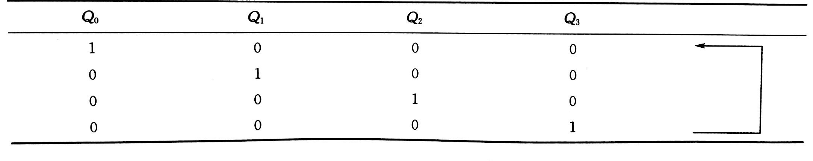

环形

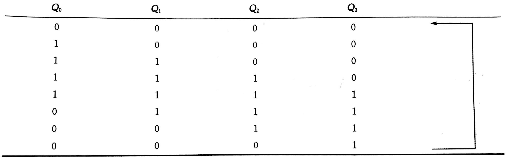

扭环形

另外扭环形计数器的[定义](https://blog.csdn.net/bailuweishuang_/article/details/86592962)是用n位触发器来表示2n个状态的计数器，所以后面的分频器并不一定是扭环计数器

以及这种计数器一般不可以自启动，所以很有可能需要复位来进入工作状态

具体的构造比较简单。。。见课本P147了解

### 移位寄存器构造分频器

复习下分频器的定义：对于电路中的某一处，如果其电平变化的频率是输入信号（比如CP信号）的$\frac{1}{N}$，即$f'=\frac{f}{N}$，就说是N分频，这个器件也叫做N分频器

所以一定要注意考察的是频率(或者说周期)，如果列状态表之后发现输出$Z$的变化是$0\to 0\to 0\to 0\to 1\to 1\cdots$，它仍然是6分频的

# 半导体存储器和可编程逻辑器件

## 概念

* 半导体存储器：用来存储大量二值(0,1)数据信息代码的半导体器件，具有集成度高、体积小、存储信息容量大、工作速度快的特点

* ROM和RAM

  ROM(ReadOnlyMemory )：只读存储器，只能读不能写，断电数据不丢失

  RAM(RamdomAccessMemory)：随机读写存储器，可以读也可以写，断电数据丢失

* 可编程逻辑器件PLD：可编程逻辑器件是一种可以由用户定义和设置逻辑功能的器件。该类器件具有逻辑功能实现灵活、集成度高、处理速度快和可靠性高等特点

* 可编程ROM：有很多，但是主要学的是PROM

* 实际上PROM是PLD的一种，所以两者的表示方法都一样

## ROM阵列

直接上老师PPT

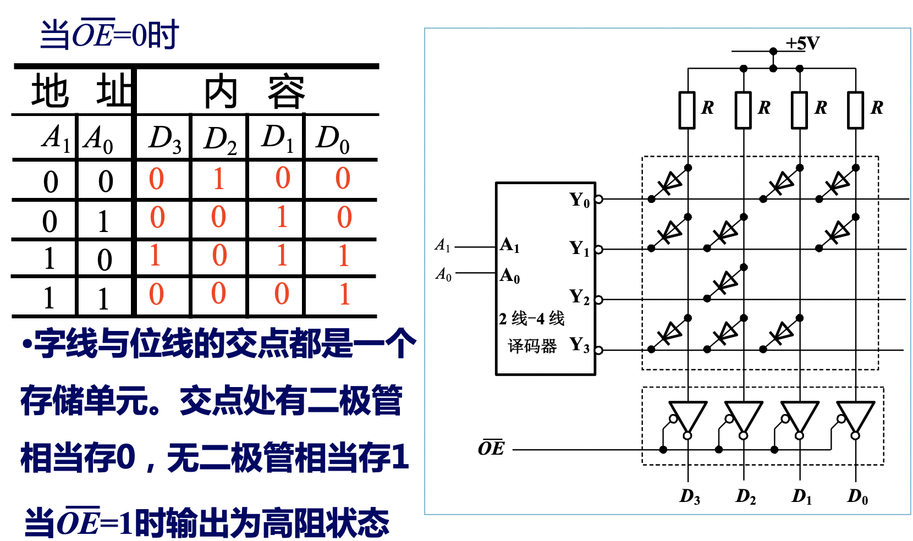

## PROM和PLD阵列

仍旧直接上PPT

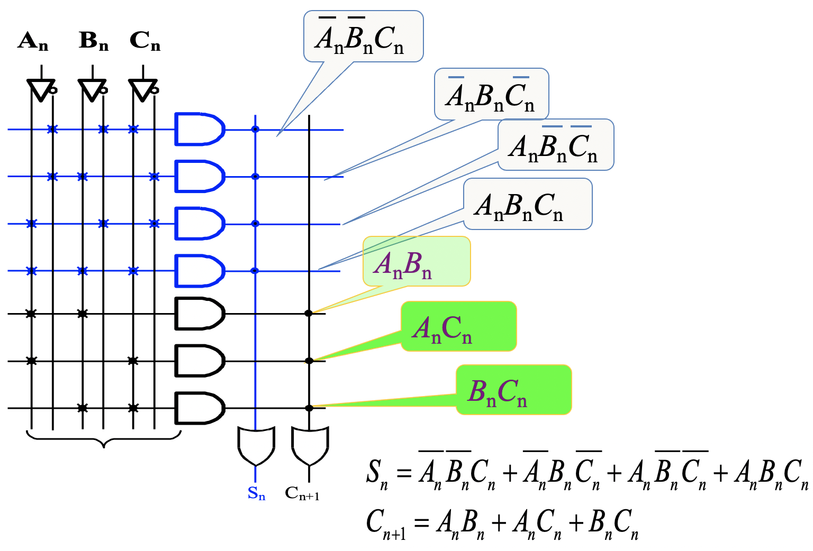

另外，分析PLD/PROM电路的时候**一定要带上电路实现了什么！**

***这部分内容比较散，所以弄得比较少***

# 脉冲波形的变换和产生

## 集成555

$G_2$提高了输出的驱动负载能力，隔离负载对定时器的影响

$C_1,C_2$是电压比较器，由开环运放组成，输入阻抗很高，属于电压控制型器件

### 引脚解释

* $1,8$：接地和电源

* $4$：低电平有效的复位端，如果不用它的话就把它连接到高电平

* $3$：输出端

* $7$：放电端，当$T$导通（此时$OUT$为低电平）时其接地、$T$断开时其相当于悬空导线，因此可以用来放电

* $5$：控制电压端，如果不用需要通过$0.1\mu F$的电容接地以防止干扰窜入

* $6,2$：高/低电平触发端，$TH$高于基准电压触发$C_1$，让$OUT=L$，$\overline{TR}$低于基准电压触发$C_2$，让$OUT=H$

  在$CO$接了电压$V_{CO}$时，基准电压分别为$V_{CO}$和$\frac{V_{CO}}{2}$；$CO$通过电容接地时，基准电压分别为$\frac 2 3 V_{DD}$和 $\frac 1 3 V_{DD}$

### 功能表

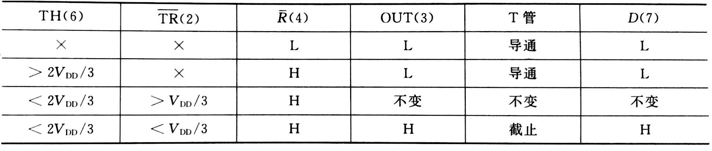

注意的是$TH$的优先级是比$\overline{TR}$高的，也就是如果$TH$和$\overline{TR}$同时满足触发条件，则会满足$TH$的（即图第二行，可以看出$TH>\frac 2 3 V_{DD}$时无论$\overline{TR}$是什么都无所谓）

另外$OUT$为L时T管导通，$OUT$为H时T管截止，这点在后面的内容，特别是使用555构造其他器件的时候会经常用到

## 施密特触发器

### 概念

* $V_{T+}$：输入信号从低电平上升的过程中电路状态转换时对应的输入电平

  $V_{T-}$：输入信号从高电平下降的过程中电路状态转换时对应的输入电平

  具体解释就是，如果$V_{T+}=3V$的话，输入$V_I$从$1V$上升时，只有上升过$3V$时才会发生输出的转换，而在$3V$以下无论怎么变化都不会引起输出的变化（看课本P185获得更好的理解）

  一般情况下$V_{T+}\not=V_{T-}$，回差电压$\Delta V_T=V_{T+}-V_{T-}$

* 输出电平变化很快，所以可以用于将输入整形为矩形波，也可以用于消除高、低电平上的噪声

### 作用

* 波形变换

  施密特触发器可以将一个周期信号变换成矩形波

  

* 信号整形

  通过施密特触发器可以将不规则的信号整形，变成矩形脉冲

  

### 由555触发器构造

注意的是，$v_{O1}$和$v_{O2}$是同步输出的，因为$v_{O1}=1$意味着555中的$T$管断开，此时$v_{O2}=V_D$，也就是为1；$v_{O1}=0$意味着555中的T管导通，此时$v_{O2}$接地

## 单稳态触发器

***这里不讲集成的单稳态触发器（不记得老师提到过）***

### 特点

* 只有一个稳定状态，另一个是暂稳定状态，触发后经过一段时间就会变回稳定状态
* 在外加触发脉冲的作用下，电路从稳态进入暂稳态，经过一段时间后电路状态自动进入稳态
* 暂稳态时间取决于自身参数与外部触发无关

### 由555触发器构造

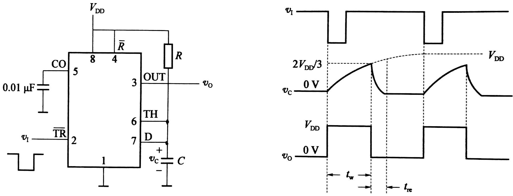

这里就着右图讲一下发生了甚么事

一开始$v_I$都是高电平，假设$v_O$从0开始（实际上如果不是0开始也会被拉回0，见后），则T管导通，D端接地，而$TH$与$D$直接相连，所以是接地为低电平

之后$v_I$变成0，让$V_O=1$，并且让$T$管截止，此时，电容C充电，$v_c$逐渐上升

当$v_c$上升过$V_{T+}$后，$v_O=0$，T管导通，此时电容上端、$TH$都接地，所以迅速放电，让$TH=0$

图里的触发脉冲宽度要小于$t_w$，否则在$t_w$结束的时候$v_c$会一直在$\frac 2 3 V_{DD}$附近（$v_c$一下降过$\frac 2 3 V_{DD}$，$\overline{TR}$就起作用让$v_O=1$，T管截止，$v_{c}$又上升，最后反复横跳）

### 参数

* 输出脉冲宽度$t_{w}=1.1RC$
* 恢复时间$t_{re}=(3\sim5)R'C$，其中$R'$表示放电电阻
* 分辨时间$t_d=t_w+t_{re}$
* 输出脉冲幅度$V_m\approx V_{DD}$

### 作用

见课本P191

* 定时

  通过与门使得只有$A$触发了单稳态触发器之后的一段时间里$F=CP$

  

  波形图

  

* 脉冲延迟

  将一个单稳态的输出接到另一单稳态的输入，就可以获得$t_w$的延迟脉冲

* 脉冲整形

  可以将一个不规则的脉冲作触发脉冲，经单稳态触发器输出的就是一个规则的脉冲波形输出

## 多谐振荡器

简而言之就是直接产生矩形脉冲信号的器件

另外使用门电路和石英的只要会认电路图就行（老师原话）

### 门电路构造

如果一个反相器的反应时间是$t_{pd}$，总共有$n$个($n$为大于1的奇数)反相器那么输出波的周期是$T=2nt_{pd}$

这种多谐振荡器的时间不好控制，所以一般采用下面的带RC的电路

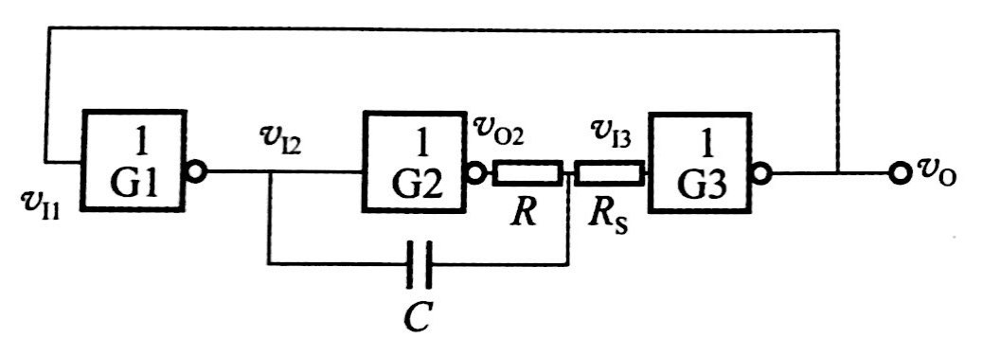

周期$T\approx 2.2RC$

###  石英晶体构造

前述的电路由于电容元件及门电路的阈值电压等随外界条件变化大，其频率稳定度一般很难由于$10^{-3}$

而石英晶体多谢振荡器具有极高的稳定性，频率稳定度可以优于$10^{-9}$

### 555构造

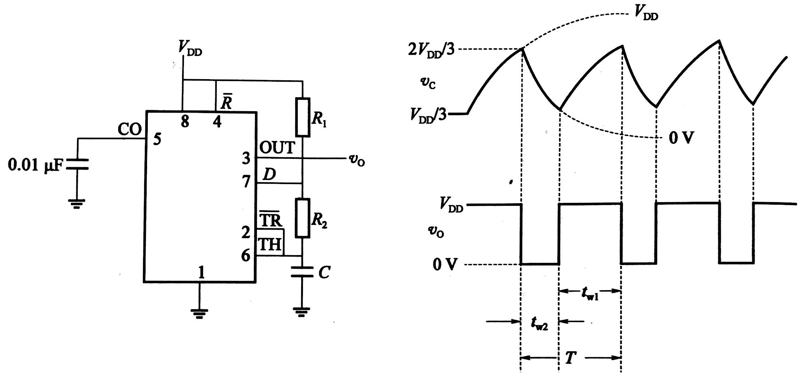

就右图简单介绍下原理

假设一开始$OUT=1$，此时T管截止，电容C上端电平逐渐上升，直到超过$\frac 2 3 V_{DD}$，这时$OUT=0$，T管导通，7接地，电容C放电，放电过$\frac 1 3 V_{DD}$后，$OUT=1$，从而让T管截止，以此循环

振荡器的周期$T=0.7(R_1+2R_2)C$

# 模电补充

## 理想运放电路

### 示意图

### 性质

* 虚断：$i_P=i_N=0$
* 虚短：$u_P=u_N$，利用虚短时，$u_P$和$u_N$两端不能同时接电压电源
* 虚地：若$u_P=0$（接地），利用虚短，$u_N=0$，反向端$u_N$称为虚地

利用这些性质加上物理规律可以推导出运放电路的一些特征

## 积分器和微分器的分析

### 积分器

### 微分器

注意$i_c=i_f$，这是分析的一个条件

## 其他物理定律

### 基尔霍夫第一定律

电路中任一个节点上，在任一时刻，流入节点的电流之和等于流出节点的电流之和

这个在分析电路的时候是必备的，实际分析中一般都会标上电流方向

### 欧姆定律

在**考虑电流方向**时，$I=\frac{U1-U2}{R_1}$（是$U1-U2$！）注意这里的电流可以是负的，表示和图中方向相反

### 导线同电压

~~名字瞎取的~~

根据欧姆定律可以很容易地发现，如果某两点之间没有电阻(或其他电子器件)，那么它们之间的电压差为0，也就是等压

在分析电路的时候，有的点在图上相距很远，但是中间并没有电阻，这种情况下是可以认为两点之间等压的

# 数模与模数转换器

## 一些概念

* A:模拟量

* D:数字量

* D/A转换器分辨率:输出位数为$n$，那么分辨率为$f=\frac{1}{2^n-1}$，这里的位数表示的是二进制的位数，并且分辨率越小越好

* A/D转换器分辨率:最大输入电压$U$，位数$n$，能分辨的最小电压$\frac{U}{2^n}$

* A/D转换器原理：

  模拟量变成数字量有四个步骤：取样、保持、量化、编码，前两个在取样保持电路完成，后两个在A/D转换电路中完成

  

  取样脉冲频率$f_s$必须满足$f_s\ge 2f_{max}$，其中$f_{max}$为输入信号$v_I$频谱的最高频率分量

* 划分量化电平的方法有两种：舍尾取整法和四舍五入法，分别对应的图示如下：

  

  这个图中，最左边一行表示的是输入信号的分级，中间一行表示的编码，右边一行表示的是对应的模拟电压

  

  量化单位$\Delta$是两级之间的电压，左图是$\frac 1 8 V$，右图是$\frac{2}{15}V$

  

  一般模拟电压就是量化单位乘对应二进制代码

  比如使用舍尾取整法，如果输入$\frac{2.5}{8}V$，那么对应的二进制是$010$，对应的模拟电压是$\frac{2}{8}V$

  使用四舍五入法，如果输入$\frac{3.5}{15}V$，那么对应二进制是$010$，对应的模拟电压是$\frac{4}{15}V$

  这两者的区别在于，如果某一个编码$B$对应的输入电压范围是$U_{k}\sim U_{k+1}$，舍尾取整得到的模拟电压$U=U_{k}$，而四舍五入法是$U=\frac{U_{k+1}+U_{k}}{2}$

  

  误差分析：我们定义量化误差$\epsilon$为输入电压和模拟电压差的绝对值，不难看出左图最大的$\epsilon$是$\frac{1}{8}V=\Delta$（比如输入$\frac{2-eps}{8}V$，$eps$是一个很小的数字，那么模拟电压就是$\frac{1}{8}V$，也就是$\epsilon_{max}=\frac{2-eps}{8}V-\frac 1 8 V\approx \frac1 8 V$），右图的是$\frac{1}{15}V=\frac 1 2\Delta$（比如输入$\frac{3-eps}{15}V$，那么模拟电压是$\frac{2}{15}V$，$\epsilon _{max}=\frac{1}{15}V$） 

  也就是说一般四舍五入法最大误差更小，所以我们一般用四舍五入法

## 权电路D/A转换器

这里分析一下电路

虚地：$v_+=v_-=0V$

虚断：$i_-=i_+=0V$

对运放负极的点分析电流$i_\Sigma=\frac{v_--v_O}{R_f}=-\frac{v_O}{R_f}$

而$i_\Sigma=\sum\limits_{i=0}\limits^{4}b_k\frac{V_{REF}-V_-}{2^{3-k}R}=D\frac{V_REF}{2^3R}$，其中$D$为$b$表示的数

所以$D\frac{V_REF}{2^3R}=-\frac{v_O}{R_f}$，所以$v_O=-\frac{V_{REF}}{2^3R}R_fD$

所以可以将$D$这个数字变成一个电压

## 倒T形电阻网络D/A转换器

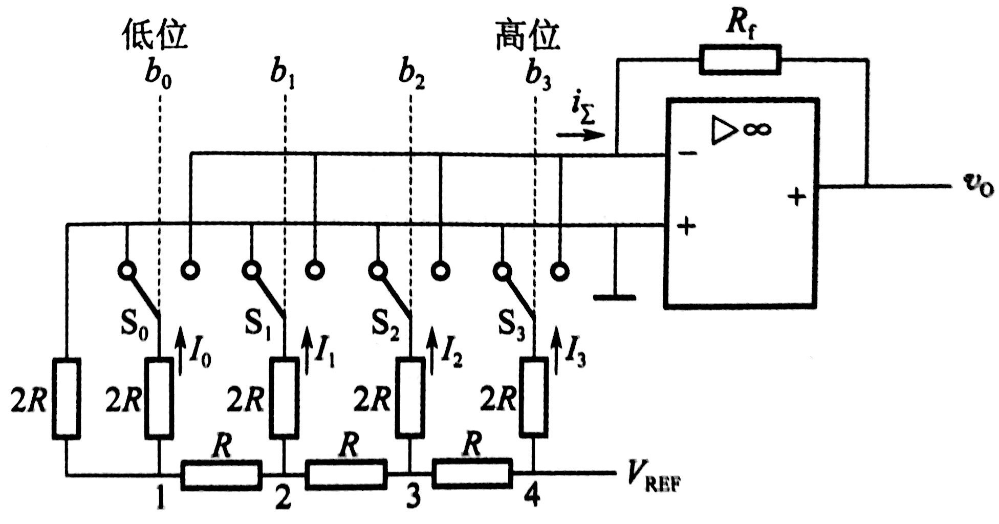

这里的分析最关键的一点是：从1往左和上的分电阻是一样的，都是$2R$，两个$2R$的电阻等效一个$R$的电阻；2往左和上的分电阻是一样的，都是$2R$，两个$2R$的电阻等效一个$R$的电阻，以此类推

也就是$I_{k-1}=\frac 1 2 I_{k}$，并且$I_3=\frac{V_{REF}-0V}{R}*\frac 1 2$，所以$I_k=\frac{V_{REF}}{2^4R}b_k*2^k$

其他的和上一个一样，最终得到$v_O=-i_\Sigma R_f=-\frac{V_{REF}}{2^4R}R_fD$

## 并行比较型A/D电路

使用的是四舍五入法

这个图最好分成三个部分理解。下面以$v_I=\frac {3.5}{15}V_{REF}$为例

一个是左边的比较部分，因为$v_I=\frac {3.5}{15}V_{REF}$，所以$C_7,C_6$都会输出$1$

一个是D触发器部分，这时候一个CP信号(可以看作一个取样信号)来了后，就会让$\overline{I_k}=C_k$，此时$\overline{I_7}=\overline{I_6}=1$，其他都是0

最后是优先编码器。由于输入是低电平有效，所以最高的有效输入是$\overline{I_5}=0$，所以输出的是对5的编码，而且由于输出低电平有效，所以$D_2=0,D_1=1,D_0=0$

课本P211有一个表，但是不建议记，理解了原理很容易推出那个

并行转换器需要的转换时间是最短的，但是随着分辨率提高需要的元件数目也会增加、电路复杂程度增加，一个$n$位的转换器，需要用$2^n-1$个比较器和触发器，

## 逐次比较型A/D转换器

这部分原理在书上P213页前后

这里简述一下A/D比较器的原理

定义$D$为$D_7\sim D_0$表示的二进制数，定义$D_m=1\ 0000\ 0000=256$，假设输入电压为$v_i$，比较器的输入电压$V_{REF}$

一开始时$D_7\sim D_0=0$

每一次比较的时候都会将当前未确定的最高位，假设为$D_i$，置为1，将$v'=\frac D {D_{m}}V_{REF}$与$v_i$比较

如果$v'>v_i$，也就是当前得到的比真实的大，让$D_i=0$；如果$v'<v_i$，也就是当前得到的比真实的还小，让$D_i=1$

这里没必要考虑$v'=v_i$，因为实际测量中因为各种误差扰动，不会出现$v'=v_i$的情况的

最后得到的电压测量值就是$\frac{D}{D_m}V_{REF}$，比如书上$D=10101111=175$，$V_{REF}=10V$，$D_m=256$，则测量值为$\frac{D}{D_m}V_{REF}=6.8359375$

电路图：

逐次比较型A/D转换器完成一次转换所需的时间与其位数$n$和时钟脉冲频率有关，位数越少，时钟频率越高，转换所需时间越短

这种A/D转换器具有转换速度快、精度高的特点

## 双积分型A/D转换器

原理：在某一固定时间内对输入模拟电压求积分，首先将输入电压平均值变换成与之成正比的时间间隔，然后再利用时钟脉冲和计数器测出此时间间隔，得到与输入模拟量对应的数字量输出

计数器所计的数$\lambda=\frac{2^n}{V_{REF}}V_I$与取样时间$T_1$内输入的电压均值$V_I$正比

有很强的抗工频干扰能力，特别是对周期等于$T_1$整数倍的对称干扰信号（在$T_1$期间平均值为零），理论上有无穷大的抑制能力

