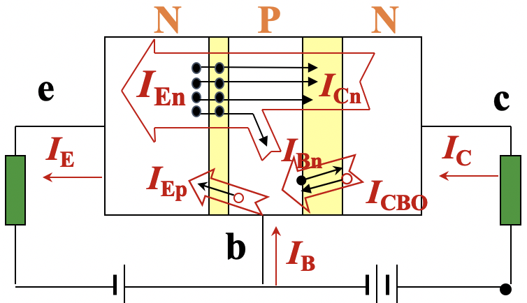
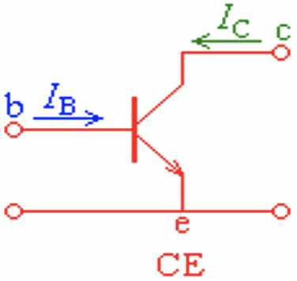

# 三极管的组态和其参数

注意，所有正常工作的三极管内部电流、“一个正偏一个反偏”等性质都是一样的，但是公共电极的不同会导致形成不同的组态，进而有不同的参数和功能。组态的命名采用 “C”+公共极字母 的方式，比如共发射极就是CE

## 三极管性质

这里记录所有三极管都有的性质，但是以NPN型的为例

无论是什么三极管，内部的电流都可以分成五部分，即图中的$\rm I_{En},I_{Cn},I_{Bn},I_{Ep},I_{CBO}$，其中：

* 发射区的多子运动对应$\rm I_{En}=I_{Cn}+I_{Bn}$，并且由于基区很薄，所以电子容易穿过其进入到集电区，所以$\rm I_{Cn}>I_{Bn}$
* 基区的多子运动对应$\rm I_{Ep}$，在上图，基区P的多子就是空穴，其向e极运动
* 集电区和基区的少子运动对应$\rm I_{CBO}$
* 少子运动的强度是远小于多子的，也就是有$\rm I_{CBO}<<I_{En}$等关系
* 之所以只考虑这些是因为：在基极和发射极之间是正偏的（也就是发射结正偏，所以发射结小），此时两部分之间多子扩散运动占主导；在基极和集电极之间是反偏的（也就是集电结反偏，所以集电结大），此时两部分之间少子的漂移运动占主导

而利用电荷守恒，不考虑正偏PN结少子运动和反偏PN结多子的运动之后，可以得到如下的式子：

* 发射区电荷守恒：$\rm I_E=I_{En}+I_{Ep}$
* 集电区电荷守恒：$\rm I_C=I_{Cn}+I_{CBO}$
* 基区电荷守恒：$\rm I_B=I_{Bn}+I_{Ep}-I_{CBO}$
* 整个三极管电荷守恒：$\rm I_E=I_B+I_C$
* 发射区多子运动形成电流的分解：$\rm I_{En}=I_{Bn}+I_{Cn}$

这些式子对所有的三极管都成立，并且是后面推导的重要依据

## 共基(CB)组态接法

这里的b极被两边接，也就是说e和b之间、c和b之间都可以连上输出电压/接收电压

在这种接法下，**发射极电流是输入，集电极电流是输出**

在书上放大系数是直接给出定义再分析性质的，我觉得这么做不是很好，所以这里给出另一个思考方式：

我们需要一个量衡量输出电流和输入电流之间的关系，即：$\rm \overline{\alpha}=\frac{I_C}{I_E}$，利用上面得到的式子进行换算，于是有：$\rm \overline{\alpha}=\frac{I_{Cn}+I_{CBO}}{I_E}$，又$\rm I_{CBO}<<I_{E}$，所以$\rm \overline{\alpha}\approx \frac{I_{Cn}}{I_{E}}$，但是每次都这么说不太方便，于是就直接定义放大系数$\rm \overline{\alpha}=\frac{I_{Cn}}{I_E}$

这样就有了一个参数：共基CB组态直流放大系数。注意放大系数一般在$\rm 0.9\sim 0.99$之间

## 共射(CE)组态接法

注意CE组态还可以外接交流电，这里不讨论它

这里的e极被两边接，也就是说e和b之间、e和c之间都可以连上输出电压/接收电压

在这种接法下，**基极电流是输入，集电极电流是输出**（可以看出CE和CB的集电极都是输出）

还是一样，给出一个放大系数的不同的思考方式：定义放大系数，$\rm \overline{\beta}=\frac{I_{C}}{I_B}$，根据之前的结果$\rm \overline{\beta}=\frac{I_{Cn}+I_{CBO}}{I_{Bn}+I_{Ep}-I_{CBO}}$，一样的，由于$\rm _{CBO}$太小了，所以$\rm \overline{\beta}\approx\frac{I_{Cn}}{I_{Bn}+I_{Ep}}$，这么说明太麻烦，于是直接有：$\rm \overline{\beta}=\frac{I_{Cn}}{I_{Bn}+I_{Ep}}$

于是我们有了另一个参数：共射CE组态直流放大系数。通过简单的代换可以得到$\rm \overline{\beta}=\frac{\overline{\alpha}}{1-\overline{\alpha}}$，这样一来$\rm \overline{\beta}$的数量级也很容易估计。另外温度上升会导致热激发上升，进而让电流的放大倍数上升

另外，如果$\rm I_B=0$，因为$\rm I_C=I_{Cn}+I_{CBO}=\overline{\alpha}I_{E}+I_{CBO}$以及$\rm I_E=I_B+I_C=I_C$，所以$\rm I_C=I_E=\frac{I_{CBO}}{1-\overline{\alpha}}=(1+\overline{\beta})I_{CBO}=I_{CEO}$其中$\rm I_{CEO}$被定义为穿透电流

这里的$\rm O$的意思是第三个电极开路，$\rm I_{CEO}$在$\rm I_{B}=0$的情况下讨论，其实也就是B开路

## 伏安特性曲线

注意这里讨论的都是CE组态接法

$\rm I_b$是输入电流，$\rm U_{be}$是输入电压

$\rm I_c$是输出电流，$\rm U_{ce}$是输出电压

讨论伏安特性曲线的时候，讨论的实际上是下面两个函数：

* 输入特性曲线：$\rm I_b=f(U_{be})|_{U_{ce}=C}$
* 输出特性曲线：$\rm I_C=f(U_{ce})|_{I_b}=C$

### 输入特性曲线

讨论的是$\rm I_{b}$和$\rm U_{be}$的关系

如果$\rm U_{ce}=0V$，相当于c和e短路，此时可以看作b进入的电流直接通过基区进入发射区和集电区

如果$\rm U_{ce}\ge 0V$，随着$\rm U_{ce}$增大，$\rm I_{B}$降低，曲线右移

曲线见下

工作在线性区，此时发射结正偏

### 输出特性曲线

输出特性曲线可以分成三个区域：

| 名称   | 介绍                                                         | PN结情况               | 数值特征                                                     |
| ------ | ------------------------------------------------------------ | :--------------------- | ------------------------------------------------------------ |
| 截至区 | $\rm I_b=0$以下的区域                                        | 发射结正偏，集电结正偏 | $\begin{array}{cccc}\rm U_{be}\le0.5V(Si) \\ \rm U_{be}\le 0.2V(Ge)\end{array}$，$\rm U_{ce}$可以很大 |
| 饱和区 | $\rm I_c$受$\rm U_{ce}$显著控制                              | 发射结反偏，集电结反偏 | 临界饱和时，$\rm U_{ces}\approx0.3V$                         |
| 放大区 | $\rm I_c=\overline{\beta}I_b$，即$\rm I_c$主要受$\rm I_b$控制 | 发射结正偏，集电结反偏 | $\rm U_{be}\approx 0.7V(Si) \\ U_{be}\approx 0.3V(Ge)$       |

注：

1. $\rm U_{ces}$是反向击穿电压
2. CE组态中，在放大区$\rm I_c>I_b$（也就是发生了放大）

总的来说，有如下：

* **放大工作状态**：发射结正偏，集电结反偏，此时受电压控制明显
* **饱和工作状态**：发射结正偏，集电结正偏，此时受另一端电流控制明显
* **截止工作状态**：发射结反偏，集电结反偏，此时不受任何影响，直接罢工

## 其他参数和温度对三极管参数的影响

### 其他参数

集电极最大允许电流$\rm I_{CM}$，当集电极电流增加时，$\rm \beta$就要下降，当$\rm \beta$下降到线性放大区$\rm \beta$的$\rm \frac 2 3$的时候对应的最大集电极电流。当$\rm I_c>I_{CM}$时，并不表示三极管会损坏，只是放大倍数会显著降低

集电结最大允许功率消耗$\rm P_{CM}$，$\rm P_{CM}=I_cU_{cb}$，因为发射结正偏，阻值较低，计算时往往用$\rm U_{ce}$代替$\rm U_{cb}$，即$\rm P_{CM}\approx I_CU_{ce}$

反向击穿电压$\rm U_{XYO}$，表示$\rm XY$之外的电极开路的时候，$\rm XY$之间允许施加的最大反向电压

反向击穿电压$\rm U_{CES}$、$\rm U_{CER}$，分别表示B-E短路(short)的时CE之间允许施加的最大反向电压、基极B加电阻时CE之间允许施加的最大反向电压

温度上升后，$\rm U_{BEO}$（基极门限电压）下降，集电极反向饱和电流$\rm I_{CBO}$上升，放大倍数$\rm \beta$上升

## 一些题目

### 判断三极管种类和电极种类

因为是放大电路，所以$\rm U_{be}\approx0.7V(Si)\  /\ 0.3V(Ge) $，于是VB、VC分别是B、E极中的一个，于是VA是C极。由于放大工作的时候集电结反偏，结合B和E点位关系，确定是PNP型三极管。这样根据发射结正偏就可以分别确定VB、VC是哪个了

答案：PNP、集电极、基极、发射极

这题主要要想到“晶体管放大电路的特点”，也就是$\rm I_c>I_b$，其他的不难

答案：B是基极，C是发射极，$\rm \beta=\frac{I_c}{I_b}=50$

### 判断工作区

