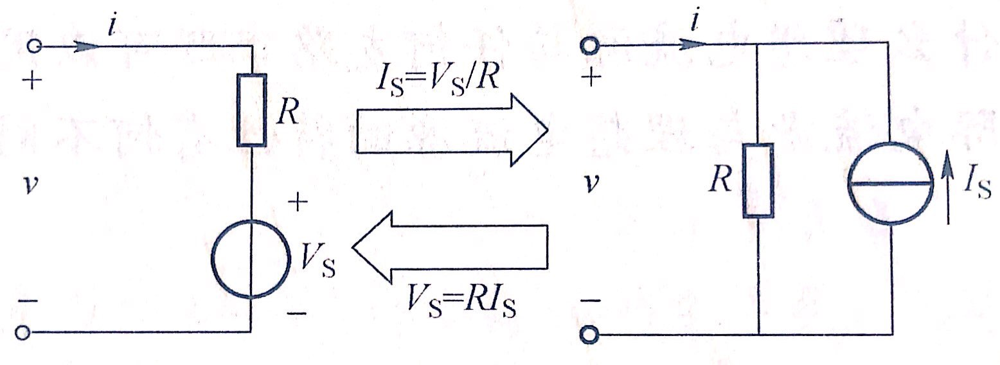

# 线性直流电路

## 电压、电流和关联方向

对于两个点$a,b$间元件的电压，可以直接使用$v_{ab}=v_a-v_b=v_{+}-v_{-}$来表示

电流和电压都有方向，从元件的视角看，如果流经元件的电流从电压的正极去向负极，那么就可以说是关联的方向

## 电压源电流源

电压源的伏安特性可以描述成“电压不随电流改变而改变”

电流源的伏安特性可以描述成“电流不随电压改变而改变”

注意这是后面讨论“等效”的基础

开路的电流一直是0，无论两端电压是多少，所以可以将开路当作零值电流源

短路的电压一直是0，无论经过的电流是多少，所以可以将短路当作零值电压源

真实电压源是理想电压源和电阻的串联

真实电流源是理想电流源和电阻的并联

## 基尔霍夫定律

一直在用的就不讲了。。。

注意，对于$n$个结点$b$个支路的电路，总共可以列$n-1$个KCL方程，$b-n+1$个KVL方程，$b$个元件约束方程

## 电路变换

### 无效伴随

可以证明，某个支路上有元件$N$与电流源串联，这两段电路的特性表现和单独电流源一致，所以可以看作$N$不存在，支路只有电流源

顺便，如果$N$就是一个电流源的话，就会发生错误；如果$N$是电压源的话会对电流源的分压产生影响，但是对外部来说仍然是只有电流源

也可以证明，某个支路上有元件$N$与电压源并联，这两段电路的特性表现和单独电压源一致，所以可以看作$N$不存在，支路只有电压源

顺便，如果$N$就是一个电压源的话，就会发生错误；如果$N$是电流源的话会对电压源分流产生影响，但是对外部来说仍然是只有电压源

### 实际电源模型转换

注意下这里的方向。我们可以这么理解：前面的参考方向是针对元件内部的，这里的方向则针对电源外部，即转换的方向应该是：电流源流出电流的方向为+，电压源+为电流流出方向（对比参考方向：电流“来”的地方为+，去的地方为-）

## 叠加原理

只适用于只包含线性元件和独立源的电路。后面会把电源叫做激励

（独立源的对立是受控源，我们不会遇到受控源的情况）

### 齐次性

简单理解，对于某个只有一个激励的电路，电路中任意电流/电压$y_i$，都满足$\frac {y_i} x=k_i$，其中$k_i$固定，$x$为唯一激励的激励值（电压源的电压/电流源的电流）

### 叠加性

简单理解，对于多个激励电路，电路中任意电流/电压$y_i$，都满足$y_i=\sum x_j k_{j\to i}$，其中$x_jk_{j\to i}$表示的是，当电路中除了$x_j$激励以外，其他的激励全部被置零时，此时的$y_i$值$y_i'$与$x_j$的比值为$k_{j\to i}$

电源置零表示：电流源短路，电压源短路

### 注意

1. 上述的$y_i$只能是电流/电压，不能是功率
2. 零值电源的意义

## 戴维南定理和诺顿定理

### 戴维南

定理内容就不说了

注意戴维南等效电路也可以通过逐步等效得到

说下怎么计算：

1. $+-$端子当作开路
2. 此时的$v_{+-}$就是$V_{OC}$，且$V_{OC}$的方向和$v_{+-}$一致，也就是$V_{OC}$的正端就是$v_{+-}$的正端
3. 独立源置零，此时从$+-$极看过去的$R_{总}$就是$R_0$

### 诺顿

注意诺顿等效电路也可以通过逐步等效得到

说下怎么计算：

1. $+-$端子当作短路
2. 此时的$i_{+-}$就是$I_{SC}$，注意$I_{SC}$方向和$i_{+-}$的一致，即如果电流从$+$流出，那么$I_{SC}$就应该从电流源流向$+$
3. 独立源置零，此时从$+-$极看过去的$R_{总}$就是$R_0$

## 奇奇怪怪的分析方法

### 支路电流法

说白了就是用$iR$表示$v$

### 单回路分析

如果发现回路电流很容易表示的话，就可以只设电流，然后KVL用电流表示

### 双结点分析

如果电路可以变成a到b的多条支路，那么可以用两个结点之间的电压表示各支路电流，然后列出KC了方程，然后得到两个结点间的电压，之后就简单了

### 结点分析

说白了就是设出结点的电压，然后电流用结点间的电压表示

## 星形与三角形互换

公式：

$\Delta\Rightarrow T:\begin{cases} R_1=\frac{R_{12}R_{13}}{R_\Delta} \\ R_{2}=\frac{R_{23}R_{12}}{R_{\Delta}} \\ R_3=\frac{R_{13}R_{23}}{R_{\Delta}} \end{cases}$

其中$R_{\Delta}=R_{12}+R_{23}+R_{13}$

$T\Rightarrow \Delta:\begin{cases} R_{12}=\frac{R_T^2}{R_{3}} \\ R_{23}=\frac{R_T^2}{R_{1}} \\ R_{13}=\frac{R_T^2}{R_2} \end{cases}$

其中$R_T^2=R_1R_2+R_2R_3+R_1R_3$

# 电路暂态相应

## 动态电路保留性质

这里解释动态电路有哪些性质和静态的一致：

* 依旧满足KVL和KCL两个方程

## 动态元件

两个常见的动态元件就是电容和电感了

注意电容和电感都是有关联方向的，而且==这里的关联方向还是电流和电压的关联方向那一套==

### 电容

电容两端的电容差$q=Cv$，其中$C$为电容值，单位为$F$（法拉）

在关联参考方向下，$i=\frac {\mathrm{d}q}{\mathrm{d}t}=\frac{\mathrm{d}Cv}{\mathrm{d}t}=C\frac{\mathrm{d}v}{\mathrm{d}t}$，$v=\frac 1 C \int _{-\infty}^{t}i(\tau)\mathrm{d}\tau$，一般认为$v_0=0$，所以$v=\frac 1 C \int _{0}^{t}i(\tau)\mathrm{d}\tau$

可以看出，电容电压是可导的，所以也一定连续。即：**电容电压连续**
并且电容电压是积分的形式，所以也认为：**电容电压具有记忆特性**

$p=iv=C\frac{v\mathrm{d}v}{\mathrm{d}t}$，$w=\int_{-\infty}^{t}w(\tau)\mathrm{d}\tau=\frac 1 2Cv^2$，由于$w(t)\ge 0$，所以是无能储能元件。与电阻不同，$p$可以是正也可以是负

对于直流电路，$i=C\frac{\mathrm{d}v}{\mathrm{d}t}=0$，视为开路

电容的串并联：

在非关联方向下，$q=-Cv$，再代入就行

### 电感

电感内磁通量$\psi=Li$，其中$L$为电感系数，单位为$H$（亨利），$\psi$为磁链（磁通），单位为$Wb$（韦伯）

在关联参考方向下，$v=\frac{\mathrm{d}\psi}{\mathrm{d}t}=\frac{\mathrm{d}Li}{\mathrm{d}t}=L\frac{\mathrm{d}i}{\mathrm{d}t}$，$i=\frac 1 L\int_{-\infty}^{t}v(\tau)\mathrm{d}\tau$，一般认为$i_0=0$，所以$i=\frac 1 L \int_{0}^{t}v(\tau)\mathrm{d}\tau$

可以看出，电感电流是可导的，所以也一定连续。即：**电感电流连续**
并且电感电流是积分的形式，所以也认为：**电感电流具有记忆特性**

$p=iv=L\frac{i\mathrm{d}i}{\mathrm{d}t}$，$w=\int_{-\infty}^{t}w(\tau)\mathrm{d}\tau=\frac 1 2Ci^2$，由于$w(t)\ge 0$，所以是无能储能元件。与电阻不同，$p$可以是正也可以是负

对于直流电路，$v=L\frac{\mathrm{d}i}{\mathrm{d}t}=0$，视为短路

电感的串并联：

在非关联方向下，$\psi=-Li$，再代入即可

### 换路定律

实际上就是上面介绍的，电容电压连续、电感电流连续，也就是$t_0$时换路前后$v_C(t_0^-)=v_C(t_0^+)$、$i_{L}(t_0^-)=i_{L}(t_0^+)$

这个会用在初态求解上

## 非齐次微分方程的求解

对于非齐次微分方程$\frac{\mathrm{d}y}{\mathrm{d}x}+ay=z$，其解可以写成$y=y_h+y_p$，其中$y_h$为通解，$y_p$为特解

$y_h$满足$\frac{\mathrm{d}y}{\mathrm{d}x}+ay=0$，也就是$y_h=Ae^{-ax}$，其中$A$待定

$y_p$为满足$\frac{\mathrm{d}y}{\mathrm{d}x}+ay=z$的一个特解，需要单独寻找。一般来说，特解的形式和$z$一致，且若$z$是正弦，$y_p$与$z$的频率一致

## 直流稳态求解

在电路进入稳态之后，电容被当作断路，电感被当作短路

## 动态电路初始值求解

如果此前是稳态，在发生环路的瞬间：

电容电压连续所以电容可以等效成电压源

电容电流连续所以电感可以等效成电流源

然后再套用KVL和KCL求解就行了

## 三要素法

这是一个终结文章的方法，任何书上的同类型问题只需要一个三要素法就可以解决

注意下面讨论的电路只有一个电容/电阻

对于一个变量$y$，如果电路在换路前已经稳定，讨论换路后的$y(t)$，也就是变量$y$随$t$的变化，则有下面的几步走策略

1. 求初始值$y(t_0^+)$

   1. 如果是$v_C,i_L$，则先求$t_0^-$时刻的$y(t_0^-)$，然后$y(t_0^+)=y(t_0^-)$。即使$y$不是$v_C,i_L$，这一步也需要
   2. 其他：先求$v_C,i_L$之后换电压源/电流源，然后根据初态等效电路使用KVL/KCL求解

2. 求$y(\infty)$

   $C,L$分别换断/短路等效后计算

3. 求$\tau$，即求**换路后**等效电阻$R_0$，之后$\tau =R_0C$或$\tau=\frac L {R_0}$

   顺便，由$\begin{cases} i=C\frac{\mathrm{d}v}{\mathrm{d}t} \Rightarrow \mathrm{d}t=C\frac{\mathrm{d}v}{i}  \\ v=L\frac{\mathrm{d}i}{\mathrm{d}t}\Rightarrow \mathrm{d}t=\frac{L}{v/\mathrm{d}i}\end{cases}$，进行量纲分析之后得$\tau$的单位是$s$，这也可以帮助回忆$\tau$的计算公式

4. 使用下式联立：

   $y(t)=[y(0^+)-y(\infty)]e^{-\frac{t}{\tau}}+y(\infty)$

# 正弦交流电路

## 复数内容介绍

### 符号说明和基础知识

$j$是虚数单位

对于复数$Z=a+bj$，$Im(Z)=b,Rm(Z)=a$，即$Im,Rm$分别表示取实部和虚部

一般画图的时候，横轴是虚部，纵轴是实部

复数有很多的表示方式，比如$Z=z\ang \theta$就是利用辐角和模来表示，$Z=a+bj$就是使用实部和虚部来表示，$Z=e^{\theta j}$则表示模为$1$、幅角为$\theta$的复数

### 欧拉公式

$e^{\theta j}=\cos(\theta)+\sin(\theta)j$

注意，欧拉公式可以看作是一个模为$1$、幅角为$\theta$的复数的使用$e$的表示方式

### 复数计算

对于复数$Z_1=z_1\ang \phi_1=x_1+y_1j$，$Z_2=z_2\ang \phi_2=x_2+y_2j$

则运算如下：

$Z_1\pm Z_2=(x_1\pm x_2)+(y_1\pm y_2)j$

$Z_1Z_2=z_1z_2\ang(\phi_1+\phi_2)$

$\frac{Z_1}{Z_2}=\frac{z_1}{z_2}\ang(\phi_1-\phi_2)$

当然乘除也可以使用$j^2=-1$硬算，没啥问题

共轭复数是虚部变号或者说关于横轴对称，即$Z=z\ang\theta=a+bj$，那么共轭$Z^*=z\ang(-\theta)=a-bj$

## 正弦信号简介

### 正弦形式

我们使用$f=A\sin(\omega t+\theta)$来表示一个信号，其中$f$可以是电压也可以是电流，$A$是最大值，$\omega$是角频率、单位$rad/s$，$\theta$是初相位，$\phi =\omega t+\theta$是相位

特别的，对于两个角频率相同的两个信号$f_1,f_2$，有：$\phi_1=\phi_2$，就称两者同相；$\phi_1>\phi_2$，就称$f_1$超前$f_2$；$|\phi_1-\phi_2|=\frac \pi 2$，就称$f_1$与$f_2$正交；$|\phi_1-\phi_2|=\pi$，就称$f_1$与$f_2$反相

正弦信号的有效值为$\frac{A}{\sqrt{2}}$。不过这个有效值只能用在纯电阻，非纯电阻需要用到后面介绍的方法

这里写下正弦余弦线性叠加的式子：

$\begin{align}y&= k_1\sin(x)+k_2\cos(x) \\ &=K(\frac{k_1}{K}\sin(x)+\frac{k_2}{K}\cos(x)) & K=\sqrt{k_1^2+k_2^2} \\ &= K\sin(x+\phi) & \tan\phi=\frac{k_2}{k_1}\end{align}$

### 相量形式

也可以读作向量形式

由于我们研究的都是角频率一致的信号，所以可以将角频率不看，使用某一个量只表示最大值/有效值和初相位

实际上在二维坐标平面上，$\omega t$就是在旋转相量，所以很多时候要求相量和为0就是为了无论怎么旋转都不会让纵轴/横轴有值

对于正弦信号$\sqrt2I\sin(\omega t+\theta)$，我们定义有效值相量$\dot I=Ie^{\theta j}$，最大值相量$\dot I_m=I_me^{\theta j}$这样就可以把有效值和初相位结合在了一起

同时，由于$I_me^{\theta j}\cdot e^{\omega tj}=I_me^{(\omega t+\theta)j}=I_m\cos(\omega t+\theta) + I_m\sin(\omega t+\theta)j$，所以我们可以定义$i=Im(\dot{I}_me^{\omega tj})$

在几何上，上面的式子有这么几个认知：1. 任何一个复数称$z\ang\alpha$就是顺时针转动$\alpha$度然后长度乘$z$； 2. 电流定义成一个旋转相量在虚轴的投影；

### 运算的相量形式

假设相量的角频率$\omega$

下面简单推导一下（采用最大值相量）：

$ki=kI_m\sin(\omega t+\theta)$，所以对应相量运算为$k\dot{I}_m$

$\frac{\mathrm{d}i}{\mathrm{d}t}=\omega I_m\sin(\omega t+\theta +\frac \pi 2)$，根据几何意义，这里实际上就是将原相量顺时针旋转$\frac{\pi}{2}$并乘$\omega $，也就是相量乘$\omega j$，所以对应相量运算为$\omega j\dot I_m$

$\int i\mathrm{d}t=\frac{1}{\omega}I_m\sin(\omega t+\theta-\frac{\pi}{2})$，和上面的一样，对应相量运算为$\frac{1}{\omega j}\dot I_m$（实际上写成$-\frac{j}{\omega}\dot I_m$也没问题）

总结（采用有效值相量）：

|             正弦运算              |          相量运算          |
| :-------------------------------: | :------------------------: |
|               $ki$                |         $k\dot I$          |
|           $i_1\pm i_2$            |    $\dot I_1+\dot I_2$     |
| $\frac{\mathrm{d}i}{\mathrm{d}t}$ |      $\omega j\dot I$      |
|        $\int i\mathrm{d}t$        | $\frac{1}{\omega j}\dot I$ |

## 电路约束的相量形式

下面全部使用有效值相量讨论

### 拓扑约束

也就是基尔霍夫定律的相量形式

规定方向后：

KCL：$\sum\limits_{k=1}\limits^{n} \dot{I}_i=0$

KVL：$\sum\limits_{i=1}\limits^{m}\dot{I}_i=0$

这里的等于零都是在相量（向量）意义上的，也就是数值上实部虚部均为零，几何上的所有相量首尾相连

这里默认是同一个频率的，如果频率不同需要分别计算

### 元件约束

注意，在正弦电路中，元件的性质也应该用正弦/相量表示，这是和一般的电路不一样的地方

下面的讨论全部基于电压和电流为关联参考方向

名词解释：

* 阻抗：可以理解成元件两端$\frac{\dot V}{\dot I}$，单位$\Omega$欧姆

  使用$Z=R+Xj$表示，特别的称$R$为阻抗的电阻分量、$X$为阻抗的电抗分量

* 导纳：可以理解成元件两端$\frac{\dot I}{\dot V}$，单位$S$西门子

  使用$Y=G+Bj$表示，特别的称$G$为导纳的电导分量、$B$为导纳的电纳分量

#### 电阻元件

$\dot{V}=R\dot{I}$

由于电阻两端的电压与电流同相，所以实际上电阻的阻抗只有电阻分量$R$

#### 电感元件

$\dot V=j\omega L\dot I$

推导很简单，$v=L\frac{\mathrm{d}i}{\mathrm{d}t}$，和前面的相量运算结合就行

很明显阻抗为$j\omega L$，导纳$\frac{1}{j\omega L}$

定义感抗$X_L=\omega L$，感纳$B_L=-\frac{1}{\omega L}$

由式子可以得出：$v$的相位超前$i$的相位$\frac{\pi}{2}$。定义电压超前电流为感性

#### 电容元件

$\dot I=jwC\dot V$

推理很简单，$i=C\frac{\mathrm{d}v}{\mathrm{d}t}$，和前面的相量运算结合就行

很明显阻抗为$\frac{1}{j\omega C}$，导纳$j\omega C$

定义容抗$X_C=-\frac{1}{\omega C}$，容纳$B_C=\omega C$

由式子可以得出：$i$的相位超前$v$的相位$\frac{\pi}{2}$，定义电流超前电压为容性

### 阻抗的连接

在使用相量形式表示出阻抗之后，电阻的并联定律和串联定律依旧适用，$\Delta$和$Y$的互转也依旧适用

### 相量图

可以使用相量图来解答一些问题。。。经典例题KB P100-例4-19

### 其他定理适用情况

叠加定理依旧适用

戴维南和诺顿定理依旧适用，只是要将电压源变成正弦电压源、电阻变成阻抗

## 正弦稳态功率

> 和书上的顺序不同，这里先介绍一般的二端电路功率求解，然后展示在不同元件上的功率计算

### 定义和理解

设二端电路电流$i(t)=I_m\sin(\omega t),v(t)=V_m\sin(\omega t+\phi)$，此时$Z=\frac{\dot V}{\dot I}=\frac{V_m}{V_I}\ang \phi$，也就是$\phi$就是$Z$的幅角，所以称$\phi$为阻抗角。特别的也定义$\lambda =\cos\phi$为功率因数

$p(t)=V_mI_m\sin(\omega t)\sin(\omega t+\phi)=VI\cos\phi(1-\cos2\omega t)+VI\sin\phi sin2\omega t$

首先注意，$\cos\phi$是一个常数。并且，$1-\cos2\omega t$在$[0,T]$的积分是$T$，而$\sin2\omega t$在$[0,T]$的积分是$0$，换句话说，结果第一项在一个周期内会发生真正的功变化（比如吸收/放出），而第二项并不会影响功变化

考虑到这种差异，我们定义：**有功功率$P=VI\cos\phi$，单位为$W$（瓦）；定义无功功率$Q=VI\sin\phi$，单位为$VAR$（乏）。很明显$P^2+Q^2=(VI)^2$。顺便定义视在功率$S=VI$和复功$\tilde{S}=P+Qj$**

在前面定义时，我们定义$i(t)$的初相位为$0$，但是实际上初相位不为$0$也行

功率因数可以：1. 求阻抗角，即功率因数的$\phi$ ； 2. 求$P,S$，$\cos(\phi)=\frac{P}{S}$

### 相量求解

我们可以直接通过相量导出复功：

有二端电路两端的$v,i$的有效值相量分别为$\dot V=V\ang \phi_v,\dot I=I\ang \phi_i$，则阻抗角$\phi=\phi_v-\phi_i$

$\tilde{S}=\dot V\dot I^*=VI\ang(\theta_v-\theta_i)=VI\ang\phi=VI\cos\phi +VI\sin\phi j=P+Qj$

只需要注意这里需要用电压的有效值相量与电流的有效值相量的共轭乘就行

### 性质

实际上可以先求出各个元件的复功率、有功功率、无功功率，然后求和就是总的对应功率

也就是$\begin{cases}\tilde{S}=\sum\widetilde{S_k} \\ P=\sum P_k \\ Q=\sum Q_k \end{cases}$

注意，$S=P^2+Q^2$，不是$P+Q$，所以不能简单叠加！

### 不同器件的功率

实际上给出定义之后什么都好求了。。。所以不是很理解在编排上把电阻电感电容功率放在正式介绍前面的意义是啥

由于电容/电感的阻抗角的绝对值都是$\frac{\pi}{2}$，也就是$\cos$值一定为$0$，所以电感和电容有功功率都是$0$

直接给表：

| 元件 |         有功功率/$W$          |                无功功率/$VAR$                |
| :--: | :---------------------------: | :------------------------------------------: |
| 电阻 | $ P_R= VI=VI^2=\frac{V^2}{R}$ |                   $Q_R=0 $                   |
| 电感 |            $P_L=0$            |  $Q_L=VI=I^2\omega L=\frac{V^2}{\omega L}$   |
| 电容 |            $P_C=0$            | $Q_C=-VI=-\frac{I^2}{\omega C}=-\omega CV^2$ |

这里给一下解释

1. 电容的无功功率为负数是因为阻抗角$\phi=-\frac{\pi}{2}$（也就是感性），代回$Q=VI\sin\phi=-VI$，所以是负数
2. $Q_L=VI=I^2\omega L$的推导：电感两端的$\dot V=j\omega L\dot I$，所以$V=\omega LI$，代入得到结果。其他的几个连等也可以类似得到

注意，题目中如果只说器件的功率是多少或者要求功率，会默认是有效功率！

