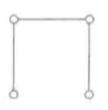

# 声明

和上学期一样，这里本质是ipLee自己的笔记整理，所以很多语言可能会有一定的跳跃性，有的地方会加上自己的理解

在后面的内容中，**这是重点**，下面部分的内容是正文之外的补充，一般用于需要提及但是和正文关联不是非常大的内容

> 需要提及但是和正文关联不是非常大的内容，比如解题建议、吐槽、算法实现（在DS课很重要但是在离散不重要）

# 图论基础

## 图的基本概念

### 图的记号

#### 无序积

对于集合$A,B$，我们定义$A\&B=\{ \ \{a,b\} \ |\ a\in A\and b\in B\}$，称$A\&B$为$A$与$B$的无序积

注意的是，$A\&B$是有两个元素的可重复集合的集合，这里“有两个元素的可重复集合”就是指$\{a,b\}$，也就是$a$是可以等于$b$的，这些集合的集合就是$a\&b$。方便起见我们记$(a,b)=\{a,b\}$，由于这里的二元组本质是一个集合，互换顺序没有影响，所以$(a,b)=(b,a)$、$A\& B=B\&A$


#### 多重子集

元素可以重复出现的集合，某一个元素在集合中出现的次数被称作该元素的重复度。重复度可以在后面简化一些定义


#### 图的定义

一个无向图$G$是一个**有序的二元组**$<V,E>$，其中

1. $V$是一个**非空**有穷集，称为顶点集，其元素被称为顶点或结点
2. $E$是$V\&V$的一个有穷多重子集，称作边集，其元素称作无向边

一个有向图$D$是一个**有序的二元组**$<V,E>$，其中

1. $V$是一个**非空**有穷集，称为顶点集，其元素被称为顶点或结点
2. $E$是$V\times V$的一个有穷多重子集，称作边集，其元素称作有向边

> 上面的都是图的集合表示法，图的图形很简单，把点集画出来后按照边集连边就行了，只是要注意孤立点（没有连边的点，比如$V=\{1,2,3\},E=\{(1,2)\}$一定要画出三个点）

正文会把$G$默认称无向图，把$D$默认成有向图，用$G_{D}$表示任意图


#### 一些其他记号和定义

点集、边集另一种表示方法：$V(G_D),E(G_D)$表示$G_D$的顶点集和边集，则$|V(G_{D})|$表示顶点数、$|E(G_D)|$表示边数

图的阶：顶点数被称作图的阶，$n$个顶点的图被称作$n$阶图

标定图：图形表示图的时候每个点和每条边都被指定了符号；非标定图：不是标定图

平行边：$G_D=<V,E>$，对于$e_i,e_j\in E$，$e_1=e_2\Leftrightarrow\ $$e_i$与$e_j$平行。不形式话的表示的话，在无向图上平行边就是连接同一点对的边，在有向图上就是始点终点一样的边。平行边的条数称为重数

多重图：有平行边的图

简单图：不含平行边也不含自环的图，注意这里没有限制是有向还是无向


### 图的“度”探讨

#### 基图

将有向图的每一条边都改成无向边之后得到的无向图称作这个图的基图

基图的概念会在讨论有向图和无向图的关系的时候起作用


#### 相邻

在无向图$G$中

如果$u,v$有一条边相连，则称这两个点相邻。形式化可以写成：$(u,v)\in E \Leftrightarrow \ u,v$相邻

如果两条边存在一个共同端点，则称两条边相邻（很明显两个自环也可以算相邻）。形式化可以写成：对于$e_i,e_j\in E$，$e_i,e_j$相邻$\Leftrightarrow e_i\cap e_j \not=\varnothing$（别忘了$e_i$本质上是一个有两个元素(就是边端点)的可重复集合）


在有向图$D$中

如果$u,v$中有一条有向边相连，则称这两个点相邻。形式化可以写成：$<u,v>\in E\  \or\ <v,u>\in E \Leftrightarrow \ u,v$相邻。此外，对于边$<u,v>\in E$的话，我们记$u$邻接到$v$，$v$邻接于$u$

如果两条边中一条边的终点是另一条边的起点，则称两条边相邻（很明显两个自环也可以算相邻）。形式化可以写成：对于$e_i=<u_i,v_i>,e_j=<u_j,v_j>\in E$，$e_i,e_j$相邻$\Leftrightarrow u_i=v_j\ \or \ u_j=v_i$（注意单$u_i=u_j$不能称两边相邻）


相邻用于描述**点和点的关系、边和边的关系**


#### 关联与关联次数

在无向图中：

$G=<V,E>$，$e_k=(v_i,v_j)\in E$，称$v_i,v_j$为$e_k$的端点，$e_k$与$v_i,v_j$关联。若$v_i\not=v_j$，则称$e_k$与$v_i,v_j$的关联次数为1；若$v_i=v_j$，则称$e_k$与$v_i,v_j$的关联次数为2，并称$e_k$为环（有时候也会被称为自环）。特别的，如果$e_k$与$v_i$不关联，$e_k$与$v_i$的关联次数计作0


在有向图中：

$D=<V,E>$，$e_k=<v_i,v_j>\in E$，称$v_i,v_j$为$e_k$的端点，其中$v_i$为$e_k$的始点、$v_j$为$e_k$的终点，并且$e_k$与$v_i,v_j$关联。若$v_i\not=v_j$，则称$e_k$与$v_i,v_j$的关联次数分别为$1,-1$（从某点出就记作正数，到某点就记作负数）；若$v_i=v_j$，则称$e_k$为环（有时候也会被称为自环），关联次数可以定义成2。特别的，如果$e_k$与$v_i$不关联，$e_k$与$v_i$的关联次数计作0


从定义可以看出来**关联用来描述边与点是否“相连”**，**而关系次数用来描述边与点是怎么 关联 的**


#### 与点有关系的元素集合

这部分陈乃月老师似乎没讲，但是书上有，所以单独说一下

前面已经研究过点和点的关系（点相邻）、边与边的关系（边相邻）、边与点的关系（关联与关联次数），这里就要考虑把与某点有某种关系的全部放在一个集合


对于无向图$G=<V,E>,\forall u\in V$（与书上符号不一样）

$u$的领域$N_G(u)=\{v\ |\ v\in V\ \and\ (u,v)\in E\ \and\ u\not=v\}$。需要注意领域一定不包括自己，无论有没有自环，这是定义里限制的

$u$的闭领域$\overline{N_G}(u)=N_G(u)\cup \{u\}$。闭领域相当于领域“加”自己，即闭领域一定包括自己

$u$的关联集$I_G(u)=\{e\ |\ e\in E\ \and\ e与u相关联\}$。关联集就是与$u$关联的边的集合，也就是所有至少有一个端点为$u$的边的集合


对于有向图$D=<V,E>,\forall u\in V$

$u$的后继元素(集合)$\Gamma^+_D(u)=\{v\ |\ v\in V\ \and\ <u,v>\in E\ \and\ u\not=v\}$。$u$的后继就是$u$可以通过某条有向边去往的结点，特别的，后继不包括自己

$v$的前驱元素(集合)$\Gamma^-_D(v)=\{u\ |\ u\in V\ \and\ <u,v>\in E\ \and\ u\not=v\}$。$v$的前驱就是通过某条有向边去到$v$的结点，特别的，前驱不包括自己

$u$的领域$N_D(u)=\Gamma^+_D(u)\cup\Gamma^-_D(u)$，由于$u$的后继元素集和前驱元素集都不包括自己，领域也肯定不会包括自己

$u$的闭领域$\overline{N_G}(u)=N_G(u)\cup \{u\}$。闭领域相当于领域“加”自己，即闭领域一定包括自己


#### 度的定义

（建议直接找张图数一下，比如老师PPT中有的图已经给出了正确答案，和正确答案对一下就行，比看定义好）

对于无向图$G=<V,E>$，$\forall u\in V$，称$u$作为边的端点的次数为$u$的度数，简称度，记作$d_G(u)$或简记为$d(G)$

对于无向图$D=<V,E>$，$\forall u\in V$，称$u$作为边的始点的次数为$u$的出度，记作$d_D^+(u)$或简记为$d^+(u)$；$\forall v\in V$，称$v$作为边的终点的次数为$v$的入度，记作$d_{D}^{-}(v)$或简记为$d^-(v)$；称$d^+(u)+d^-(u)$为$u$的度数，记作$d_D(u)$或者简记为$d(u)$


注意下，自环会对点造成两点度的贡献，也就是给一个点增加一个自环会让这个点的度增加2


最大度和最小度的定义就省略了，记得最大度和最小度是针对全图的、最大用$\Delta$最小用$\delta$就行


### 特殊的图

> 这里主要是一些使用特殊记号表示的图

零图和平凡图：$|E(G_D)|=0$、也就是一条边都没有的图被称作零图，$n$阶零图记作$N_n$（$N$是null的意思），特别的1阶零图称作平凡图

空图：规定顶点集为空的图为空图，记空图为$\varnothing$，虽然空图的定义是这么写，但是空图不是图

$n$阶完全图：对于一个$n$阶无向简单图$G$，若$G$中每个顶点均与其余的$n-1$个顶点相邻，那么称$G$为$n$阶完全图，记作$K_n(n\ge 1)$。很明显$|E(G)|=\frac{(n-1)n}{2}$

$n$阶有向完全图：对于一个$n$阶有向简单图$D$，若$D$中每个顶点都**邻接到**（注意不是单纯的相邻）其余的$n-1$个顶点，那么称$D$为$n$阶有向完全图（没有记号）。很明显$|E(G)|=n(n-1)$

$n$竞赛图：对于一个$n$阶==有向简单图==$D$，若$D$的基图是一个$n$阶完全图，则称$D$为$n$阶竞赛图。注意，由于基图的定义是将所有的有向边都变成无向边，所以$D=<\{1,2,3\},\{<1,2>,<2,1>,<1,3>,<2,3>\}>$不是竞赛图，因为替换过后会有两个$(1,2)$边

k-正则图：设$G$为$n$阶==无向简单图==，若$\forall u\in V(G)$，均有$d(u)=k$，则称$G$为k-正则图。书上似乎没怎么讲到k-正则图有什么用，百度了也没有结果。。。


### 握手定理

#### 定理内容

在任何无向图中，所有顶点的度数之和等于边数的两倍。形式化的定义：$G=<V,E>,V=\{v_1,v_2\cdots v_n\},E=\{e_1,e_2\cdots e_m\}$，$\sum\limits_{i=1}\limits^{n}d(i)=2m$

在任何有向图中，所有顶点的度数之和等于边数的两倍，且所有顶点的入度和等于所有顶点的出度和，亦等于边数。形式化定义：$D=<V,E>$$V=\{v_1,v_2\cdots v_n\},E=\{e_1,e_2\cdots e_m\}$，$\sum\limits_{i=1}\limits^{n}d^+(i)=\sum\limits_{i=1}\limits^{n}d^-(i)=\frac 1 2\sum\limits_{i=1}\limits^{n}d(i)=m$


#### 推论

任何图中，奇度顶点个数为偶数

（如果奇度顶点个数为奇，其度数和为奇数，加上偶度顶点度数的度数和就不可能是偶数，也就是违背了握手定理，所以得证）


### 可图化

#### 定义

直接从书上拍照了


#### 可图化定理

非负整数列$d=(d_1,d_2,\cdots,d_n)$是可图化的当且仅当$\sum\limits_{i=1}\limits^{n}d_i$为偶数

前推后就是握手定理，后推前是一种构造性证明，也是从度数列画出一个图的思路：

对于所有奇度，让他们之间互相连边。由于奇度点一定有偶数个，所以这么连边一定可以让奇度点成对消耗完。去掉连掉的边后，这些奇度点的度数可以看作偶数，也就是剩下的都是偶度点。对于偶度点，只需要连接自环就行了

建议自己画一遍保证能够理解


#### 运用

**握手定理要求边数和度数和有一个非常明确的关系**，这种关系限制除了用来解决后面的度数列可图化问题，还可以用来解决最多多少个顶点的问题


已知无向图$G$有10条边，4个度数为3的顶点，其余点的度数小于等于2，问$G$中最少有多少个顶点

这题在陈乃月老师的课件里直接列$10*2=4*3+(n-4)*2$解决的，这么列式意义很明显：假设所有“剩下点”度数为2，那么就可以算出最小的$n$。这么列式有什么严谨的原因吗？实际上是有的，在了解原因之后我们对于类似的题就可以列相似的式子了

我们假设已经规定的度数和为$d_0$，剩下每个点的度数最大值是$d_m$（可以取到）且从$d_1$到$d_n$编号（也就是这里是有$n$个“其他点”），边数为$m$条。我们只要保证$\sum\limits_{i=1}\limits^{n}d_i=2m-d_0$就可以保证这些度取值是可图化的，因为度数和$\sum\limits_{i=1}\limits^{n}d_i+d_0=2m$为偶数。另一个限制条件为$d_i\le d_m$，所以$\sum\limits_{i=1}\limits^{n}d_i\le nd_m$，再带回前式就得到了$2m-d_0\le nd_m$，则$n\ge \frac{2m-d_0}{d_m}$就行（注意$n$需要取正整数）。这样，我们就解决了这一类问题应该怎么列式


比如已知无向图$G$有11条边，3个度数为3的顶点，其余点的度数小于等于3，问$G$中最少有多少个顶点，就列$n\ge \frac{2m-d_0}{d_m}=\frac{22-3*3}{3}=4\frac 1 3$，也就是$n$最小为5，总共最少有8个顶点


#### 可简单图化定理：Havel定理

我尽量简单描述，但是还是建议自己写一遍过程来理解

先说下，$x\equiv y\mod z$ 指$x$和$y$在模$z$意义下相等，也可以说是$x\mod z=y\mod z$。$\sum\limits_{i=1}\limits^{n}d_i\equiv 0\mod 2$就是度数和为偶数

设非负整数列$d=(d_1,d_2,\cdots,d_n)$满足：$\sum\limits_{i=1}\limits^{n}d_i\equiv 0\mod 2$，$n-1\ge d_1\ge d_2\ge \cdots\ge d_n\ge 0$，则$d$可简单图化当且仅当$d'=(d_2-1,d_3-1,\cdots,d_{d_1+1}-1,d_{d_1+2},\cdots,d_n)$可简单图化

一个序列打乱顺序不影响是否可简单图化


所以对于序列是否可以简单图化，我们判断完$\sum\limits_{i=1}\limits^{n}d_i\equiv 0\mod 2$、排序之后的步骤如下：

$(4,4,3,3,2,2)\to (3,2,2,1,2)$，这里把第一个4去掉，分摊减到后面四个数$(4,3,3,2)$上

$(3,2,2,1,2)\to (3,2,2,2,1)$，对序列排序

$(3,2,2,2,1)\to (1,1,1,1)$，把第一个3去掉，分摊减到后面的三个数$(2,2,2)$上

最后一个很明显可简单图化，所以一开始的序列可简单图化

如果这么得到的最后序列不可简单图化，一开始的也不可以简单图化


## 图的关系

### 同构

#### 同构的定义

我们先对同构做一个定义：对于两个图$G_1=<V_1,E_1>,G_2=<V_2,E_2>$，两个图同构当且仅当存在一个双射$f:V_1\to V_2$，使得$\forall u,v\in V_1,if\  (u,v)\in E_1,(f(u),f(v))\in E_2$，并且$(u,v)$和$(f(u),f(v))$的重数一样（对于有向图有一个类似的定义）。使用$G_1\cong G_2$表示两个图同构

同构意味着我们可以仅通过改变图的标号让图$G_1$变成$G_2$

**同构的图的图论性质是一样的，但是具有某些一样图论性质的图不一定同构**

也就是 图同构$\Rightarrow$图论性质一样、图论性质不一样$\Rightarrow$图不同构


#### 图不同构的判断

> 在后文中，会采用不标准的“$k$元环”表示长度为$k$的圈

如果两个图具有某个不同的图论性质，我们就可以说它们不同构，这是不同构的一个判定方法

上面所说的“图论性质”，经过总结可以有：

1. 点数和边数

2. 自环的数量、平行边的数量

3. 度数列：还是强调一下的是，度数列相同并不代表图同构

4. $k$元环的数量：这个思路来自上课的一道题，如下

   

   左图是有两个三元环的，右图则没有三元环

5. 每个顶点的度和其相邻点的度数互相比较：实际上这种方法已经很麻烦了


#### 无向图同构的充要条件

> 这部分不重要，介绍一下

实际上无向图的同构是有充要条件的，我个人不严格地想到了一些，然后一查果然[有人研究过](https://www.ixueshu.com/document/8b95684f221bd283318947a18e7f9386.html)。。。这个方法就看下吧，因为要求特征值，如果是阶数很小的可以直接看是否同构，阶数大的求特征值也要累死，所以对应试没啥用，主要还是拓展视野


#### 同构的判断技巧

前面给过一些不同构的判断条件，这里讨论下同构可以考虑什么角度判断：

对于一张图，如果其很复杂的话，可以做它的补图，然后在补图（后面给定义）上看是否构成同构。这个在$n\le 6$阶的无向图上有一定效果，因为这时候无向简单图最多就15条边，还是比较容易看出来的

举上面那个例子，这两个图的补图还是很好做的，一做出来就很容易看出两个图不同构了

> 实际上两个无向简单图同构与其补图同构互为充要，见课本P313-T24


如果想直接看的话可以考虑是否可以将内外翻一下，比如，(a)和(b)可以看作内外圈翻转了一下

实际上，我也没有想到很好的方法判断两个图是否同构，如果有同学想到好的办法可以和我交流


### 不同构图的枚举

> 请允许我先吐槽一句：在书上明确提出过枚举图问题没有被解决，那还让我们手算干嘛。。。
>
> 另外，这里更多是一种思维训练，方法是会被不断创造出来的

我们做题的时候发现了很多题要枚举不同构的(简单)图，有的甚至~~丧心病狂地~~要全部枚举出来，下面是一些总结的经验和例题：

#### 先枚举点的数量，再枚举边的数量

经典例题课本P313-T16,T17

适用于枚举简单图（或者说完全图的子图），看了答案就知道怎么做了


#### 枚举环的个数

这个是在度比较小的时候，枚举环的数量很容易减少需要枚举的情况

经典例题课本P312-T13，这题是6阶图但是要求所有点度都为2，自环会占据非常多的度，所以枚举环很奏效


#### 枚举度数列

经典例题：老师课件上的题 画出5阶4条边的所有非同构无向简单图

我们一个个度序列枚举就行了。需要注意：(1) 所有度之和为8，枚举的时候不妨直接保证奇度点有偶数个；(2) 有的序列不可简单图化，枚举的时候要标记出来。下面是枚举过程，最好按照从大到小之类的顺序枚举

```c++
(4,4,0,0,0) // 肯定不行
(4,3,1,0,0) // false
(4,2,2,0,0) // false
(4,2,1,1,0) // false
(4,1,1,1,1) // true
// 实际上如果有自信的话根据Havel定理直接枚举(4,1,1,1,1)也行
(3,3,2,0,0) // false 记得度序列内部数字从大到小排序来枚举
(3,3,1,1,0) // false
(3,2,2,1,0) // true
(3,2,1,1,1) // true
// 不可能(3,1,...)了，度不够了
(2,2,2,2,0) // true
(2,2,2,1,1) // true
```

这样枚举虽然很麻烦，但是如果做得好的话应该是不会漏度序列的。。。吧

这之后画的时候，**一个度序列可能确定超过一种不同构的图，不过不同度序列产生的图一定是不同构的**


另一道经典题：课本P313-T25


#### 枚举连通分量数量

连通分量在后面定义

经典例题课本P313-T27，即画出所有所有6阶2-正则的非同构图

可以先画出只有一个连通分量的图，再画只有两个的，再画只有三个的。实际上限制了连通分量数之后就发现并不难画


#### 先枚举补图

经典例题课本P313-T26，要求画出5阶7条边的所有非同构的无向简单图，由于$|E(K_5)|$（也就是5阶无向完全图的边数）只有10，所有这题可以看成画5阶3条边的所有非同构的无向简单图，再对画出来的取补图就行

画5阶3条边的所有非同构的无向简单图可以枚举度序列，就不说了


#### 瞎画

上面的方法实际上在相对宽松且不那么宽泛的条件下画的，但是如果有的题让画8阶不过不用画全的，可能就需要一些奇思妙想了

课本P312-T14-(2)要画度序列$(4,4,3,3,2,2,2,2)$的两个非同构简单图，我个人总结下面的步骤

* 先画出对称点，比如对于8阶就是右图：（可以旋转下）
* 然后将度序列分成对称两组，对于本题就是两个$(4,3,2,2)$
* 然后就是瞎连了，在对称的限制下不需要花费特别多的功夫
* 在画出一个之后，可以通过对这个图的修改得到不同构的另一个


### 母图、子图和导出子图

#### 定义

设$G=<V,E>$，$G'=<V',E'>$ 为两个图（同为无向图或者有向图），若$V'\subseteq V$且$E'\subseteq E$，则称$G'$为$G$的子图，$G$为$G'$的母图，记作$G'\subseteq G$。又若$V'\subset V$或$E'\subset E$，则称$G'$为$G$的真子图。若$V'=V$，则称$G'$为$G$的生成子图

生成子图保证了顶点集不变


设$G=<V,E>$，$V_1\subset V$且$V_1\not =\varnothing$，则称以$V_1$为顶点集，以$G$中两个端点都在$V_1$中的边组成的边集$E_1$的图为$G$的$V_1$导出的子图，记作$G[V_1]$。简单来说就是某非空点集和点集里所有的点包含的边拉出来的图。严格定义：$V_1\subset V,V_1\not= \varnothing$，$E(G[V_1])=E\cap (V_1\& V_1)$

设$G=<V,E>$，$E_1\subset E,E_1\not=\varnothing$，则称以$E_1$为边集，以$E_1$中边关联的顶点作为顶点集$V_1$的图为$G$的$E_1$导出的子图，记作$G[E_1]$。简单来说就是某非空边集和所有与边集里某条边关联的所有点拉出来的图。严格定义：$E_1\subset E,E_1\not=\varnothing$，$V(G[E_1])=V\cap \{u\ |\ u\in V\ \&\&\ \exist v\in V((u,v)\in E_1)\}$


### 补图

#### 定义

==补图是定义在无向图上的==

设$G=<V,E>$为$n$阶无向简单图，令$\overline{E}=\{(u,v)\ |\ u\in V\ \and\ v\in V\ \and\ u\not= v\ \and\ (u,v)\not\in E\}$，则称$\overline{G}=<V,\overline{E}>$为$G$的补图

实际上$\overline{E}=E(K_n)-E$，也就是$\overline{E}$中的边都是$E$中没有但是完全图中有的

特别的，若$G\cong \overline{G}$，则称$G$为自补图

记住一个自补图特例：

### 删除和收缩

直接看定义


虽然在有向图上定义类似的操作没有什么问题，但是书上确实限定了==“删除”、“收缩”和“加边”的对象只能是无向图==


## 通路和回路

### 定义

注意==通路和回路都是针对无向图的==。几个定义的严格表述直接看图，这里就简单解释一下


简单通路/回路：$\Gamma$里没有重边

初级通路/回路：$\Gamma$里没有重复顶点（除了起点终点）

复杂通路/回路：$\Gamma$里有重边

注意，==圈就是初级回路==！以及所有长度相同的圈同构

此外，统计非同构的简单回路时一定要注意：起点从来都不是判断同构需要考虑的东西！（课本P314-T43-(1)）


### 通路、回路的最长限制

> 名字自己起的

在$n$阶图$G$中，若从顶点$u$到$v$（$u\not = v$）存在通路，则从$u$到$v$存在长度小于等于$n-1$的初级通路

证明很简单，把通路中重复点之间的回路给缩掉就行

在$n$阶图$G$中，若有从顶点$u$到自身的回路，则一定存在$u$到自身长度小于等于$n$的初级回路

证明和通路的一样


### 回路不同的定义

两个长度相等的回路一定是同构的。为了区分，在标定图中，圈表示称顶点和边的标记序列后，只要两个标记序列不同，就认为两个圈不同，称两个圈在定义意义下不同


## 无向图的连通性

### 连通和连通图

先看下定义

设无向图$G=<V,E>$，若$u,v\in V$之间存在通路，则称$u,v$是连通的，记作$u\sim v$。特别规定$u\sim u$

若对于无向图$G=<V,E>$，$\forall u,v\in V,u\sim v$，则称$G$是连通图，否则称$G$为非连通图


很容易看出来，$\sim$具有 自反($u\sim u$) 对称($u\sim v\Leftrightarrow v\sim u$) 传递($x\sim y\ \and\ y\sim z\Leftrightarrow x\sim z$) 三个性质，也就是连通关系是等价关系

在等价关系上，很容易想到等价类和划分，于是有


### 连通分支/连通分量

> 后面可能会用连通分量这个不严格的叫法代替连通分支，因为在算法竞赛中叫的都是连通分量。。。

设无向图$G=<V,E>$，$V_i$是$V$关于顶点之间的连通关系$\sim$的一个等价类，则称导出子图$G[V_i]$为$G$的一个连通分支。$G$的连通分支数记作$p(G)$

如果使用数学语言，结合离散上学期的知识，这个定义是这样的：对于无向图$G=<V,E>$，$V_i\in V/\sim $，称$G[V_i]$为$G$的一个连通分支。记$p(G)=|V/\sim|$


### 连通和连通分支的感性理解

实际上，在一个无向图上，每个连通分支就是一个“部分”，而各个连通分支之间是不连通的，如下图，$\{1,2,3,4\}$和$\{5,6,7,8\}$分别属于两个连通分支，而两个连通分支之间没有变连通


> 另外连通分量在计算机上可以通过多次dfs/bfs得到


### 短程线和距离

设$u,v$为无向图$G$中任意两个顶点，若$u\sim v$，则称$u,v$之间长度最短的通路为$u,v$之间的短程线。短程线的长度称为$u,v$之间的距离，记作$d(u,v)$。当$u,v$不连通时，记$d(u,v)=\infty$

距离具有下面的性质：$\forall u,v,w\in V(G)$

非负性：$d(u,v)\ge 0$，并且当且仅当$u=v$时等号成立

对称性：$d(u,v)=d(v,u)$

三角不等式： $d(u,v)+d(v,w)\ge d(u,v)$

> DS会学习最短路/距离的求解方法，可以先[参考学习下](https://oi-wiki.org/graph/shortest-path/)


### 连通程度的比较

我们提出了一些量用于描述图的连通程度

#### 点割集和割点

设无向图$G=<V,E>$，若存在$V'\subset V$使得$p(G-V')>p(G)$，且$\forall V''\subset V'$，均有$p(G-V'')=p(G)$，则称$V'$是$G$的点割集。若$V'=\{v\}$，则称$v$为割点


感性理解的话，点割集将分图分成多个部分，且点割集中少任何一个点都会让分图仍然是连通的（也就是，点割集的任何真子集都不会是点割集）。如下图，$\{1,3\}$是点割集，去掉它们都会让$\{1,2,3,4,5\}$变成两部分，且单个的$\{1\}$或者$\{2\}$都不能让$\{1,2,3,4,5\}$变成两部分；另外$\{1,3,4\}$也不是，因为$\{1,3\}$就可以分割图了；同理$\{1,3,7\}$也不是；$\{7\}$是点割集，并且根据定义$7$也是割点


#### 边割集和桥

设无向图$G=<V,E>$，若存在$E'\subset E$使得$p(G-E')>p(G)$，且$\forall E''\subset E'$，均有$p(G-E'')=p(G)$，则称$E'$是$G$的边割集。若$E'=\{e\}$，则称$e$为桥

边割集只会让连通度加一（$p(G-E')=p(G)+1$，虽然挺显然的，但是到底应该怎么证留坑《！》）

感性理解和点割集一样（边割集的任何真子集都不会是边割集），还是上图，边割集包括：$\{1,2\},\{1,3\},\{3,4\}$等等，但是$\{1,2,3\}$不是边割集，因为$\{1,2\}$已经足够分割图了。特别的，$\{6\}$也是边割集，而且$6$是桥（$7$也是）


#### 点连通度和边连通度

对于一张==无向连通图==，点连通度/边连通度反应了最少需要去掉几个点/边就可以分割图。严格定义如下：

设$G=<V,E>$是==无向连通图==且不是完全图，则$\kappa(G)=\min\{|V'|\ |\ V'为G点割集\}$为$G$的点连通度。规定$K_n$的$\kappa$为$n-1$，非连通图的$\kappa$为$0$
如果$\kappa(G)\ge k$，则称$G$是$k$-连通图

设$G=<V,E>$是==无向连通图==，则$\lambda(G)=\min\{|E'| \ |\ E'为G边割集\}$为$G$的边连通度。明显$\lambda(K_n)=n-1$。定义非连通图的$\lambda$为$0$
如果$\lambda(G)\ge r$，则称$G$是$r$边-连通图

需要注意，**所有非连通图的点连通度和边连通度都是0**！

> 实际上我不是很理解为什么要定义非连通图的连通度为0。。。既然在割点、桥里面没有要求连通这里又何必要求连通

需要记住：$\kappa(K_n)=\lambda(K_n)=n-1$；$k$-连通图的点连通度是大于$k$的、$r$边-连通图的边连通度是大于$r$的


#### Whitney定理

> 应该念“惠特尼”

$\forall G,\kappa(G)\le \lambda(G)\le \sigma(G)$

（即点连通度小于等于边连通度小于等于最小度）

证明很简单，陈乃月老师上课也介绍过怎么理解，这里就不赘述了


### 点割集/边割集的枚举

>  啊，又是最烦人的枚举环节

我们以点割集为例，稍后会看到边割集和点割集的枚举方法一样的


首先有一个很明显的结论，如果一个点集合，存在一个子集为点割集，那么这个点集合一定不是点割集。有了这个之后就让我们~~欢乐地~~枚举吧


我们采用 先枚举点数量再按字典序枚举点的方法（和前面的基本一样）。如果枚举的集合虽然分割了图但是是一个已经求出来的点割集的超集，那就不算。以求出上图所有的点割集为例，下面是枚举过程

```php
1 // false
2 // false
... // 大小为1的点集合都枚举完了，可以发现没有割点存在
1,2 // false
1,3 // true
1,4 // true
1,5 // true
1,6 // false
1,7 // false
2,3 // false	2,1就不要枚举了
2,4 // true
... // 过程省略，
1,2,3 // false，因为已经有答案1,3了，而{1,3}是{1,2,3}的子集
... // 
2,3,4 // false，因为已经有答案2,4了	2,1,3这种就不要枚举了
...
```

大概的过程就是上面这样的。写的时候可以把答案单独写出来方便枚举的时候查看当前集合是不是某一个答案的超集。对于简单的图或许一眼可以看出一些解，但是我觉得如果想要枚举出所有解这种方式还是比较稳妥的


边割集也满足“如果一个边集合，存在一个子集为边割集，那么这个边集合一定不是边割集”，所以方法一样，给边标号之后枚举边就行


> 题外话，割点和桥都可以使用Tarjan算法在计算机上求解，见[oi-wiki的介绍](https://oi-wiki.org/graph/cut/)


### 边割集的其他定理

> 来自陈乃月老师的PPT

定理1：设$E'$是$G$的边割集，则$p(G-E')=p(G)+1$

也就是一个边割集只能让图的某一部分分成两块

很明显点割集没有这个性质，因为去掉某一个点割集可以让图“四分五裂”，如下，去掉点割集$\{1\}$之后图分成了三块$\{2\},\{3\},\{4,5\}$，即$p(G-V')=p(G)+2$


定理2：设$E'$是非完全图$G$的边割集，且$\lambda(G)=|E'|$，设$G-E'$产生的两个连通分支是$G_u,G_v$，则$\exists u\in G_u,v\in G_v$，使得$(u,v)\notin E(G)$

语言描述就是边割集分原图为两个部分$G_u,G_v$后，不可能每一个$G_{u}$里的点都可以到$G_v$

证明如下：

首先有$a\ge 1,b\ge 1\Rightarrow(a-1)(b-1)\ge 0\Rightarrow ab-a-b+1\ge 0 \Rightarrow ab\ge a+b-1$

假设$\forall u\in G_u,v\in G_v$，都有$(u,v)\in E(G)$，那么应该有$|E'|=|V(G_u)|\times|V(G_v)|$

$\lambda(G)=|E'|=|V(G_u)|\times|V(G_v)|=|V(G_u)|+|V(G_v)|-1=n-1$，也就是$\lambda(G)=n-1$，但是这与$G$不是完全图矛盾


## 有向图的连通性

### 可达

设$D=<V,E>$为一个有向图，$\forall u,v\in V$，若存在从$u$到$v$的通路，则称$u$可达$v$，记作$u\to v$。规定$u\to u$。若$u\to v$并且$v\to u$，则称$u$和$v$是相互可达的，记作$u\to v$。定义$u\leftrightarrow v$

很明显$\leftrightarrow$是$V$上的等价关系


### 短程线和距离

设$u,v$为有向图$V$中任意两个顶点，若$u\to v$，则称$u$到$v$长度最短的通路为$u,v$之间的短程线。短程线的长度称为$u,v$之间的距离，记作$d<u,v>$。当$u,v$不连通时，记$d(u,v)=\infty$

距离具有下面的性质：$\forall u,v,w\in V(G)$

非负性：$d<u,v>\ge 0$，并且当且仅当$u=v$时等号成立

三角不等式： $d<u,v>+d<v,w>\ge d<u,v>$

很明显距离没有对称性，即$d<u,v>$和$d<v,u>$不一定相等

> DS会学习最短路/距离的求解方法，可以先[参考学习下](https://oi-wiki.org/graph/shortest-path/)


### 有向图连通度的描述

有向图没有$\kappa$和$\lambda$之类的参数，只有对全图连通性的刻画

对于$D=<V,E>$：

如果$D$的基图是连通图，则称$D$是弱连通图，简称连通图

如果$D$中任意两结点至少可以从一个到另一个，那么称为单向连通图。形式化定义：$\forall u,v\in V,u\to v\ \or\ v\to u=true\ \Leftrightarrow \ D$为单向连通图

如果$D$中任意两结点互相可达，则称$D$为强连通图。形式化定义：$\forall u,v\in V,u\leftrightarrow v\ \Leftrightarrow\ D$为强连通图


### 强连通图的判定定理

#### 内容

对于有向图$D=<V,E>$，$D$是强连通图 当且仅当 $D$中存在经过每个顶点至少一次的回路


#### 证明

> 这里使用的是构造性证明，也就是对于一个问题我们直接通过构造它的解的方法解决它

右推左显然，我们证明左推右：

我们可以构造这么一个回路$\Gamma =v_1v_2\cdots v_nv_1$，这个回路一定存在，因为$v_i$到$v_{i+1}$一定是可达的。显然$\Gamma$经过每个顶点至少一次


### 单向连通图的判定定理

#### 内容

对于有向图$G=<V,E>$，$D$是单向连通图 当且仅当 $D$中存在经过每个顶点至少一次的通路

#### 证明

> 陈乃月老师上课的时候说这里的构造证明过程和上一个相似，但是我个人实践了一下感觉不太一样。。。
>
> 我的构造证明过程见另一个文件“单向连通图判定定理的证明”，需要一定的思维，不用掌握


### 扩大路径法

不知道考不考，课本P306页下面介绍了，个人感觉还是挺有难度的，有兴趣可以看下

例题：P314-T41，P314-T42


## 图矩阵及其运用

事实上第一次接触图的矩阵表示应该在二元关系那里，当时提到了二元关系的矩阵表示和图表示，这两个的互换和现在的图矩阵是一样的


先给一个记号，后面都采用：
对于无向图$G=<V,E>$，$V=\{v_1,v_2,\cdots,v_n\}$，$E=\{e_1,e_2,\cdots,e_m\}$
对于有向图$D=<V,E>$，$V=\{v_1,v_2,\cdots,v_n\}$，$E=\{e_1,e_2,\cdots,e_m\}$


### 关联矩阵

#### 无向图上的定义

对于无向图$G$，关联矩阵$M(G)=[m_{i,j}]_{n\times m}$，其中$m_{i,j}=\begin{cases} 2 & v_i与e_j关联，且e_j是环 \\ 1 & v_i与e_j关联，且e_j不是环 \\ 0 & v_i与e_j不关联 \end{cases}$。实际上$m_{i,j}$反应的是$v_i$与$e_j$的关联次数

#### 无向图关联矩阵性质

1. 每一列记录的是一条边的信息，一条边最多和两个点相连，且会造成两点关联次数，因此：
   * 两条边是平行边当且仅当两列相同
   * 每一列的和一定是2
   * 一条边如果是环当且仅当关联矩阵中该列仅有一个2，其余全是0
2. 每一行记录的是一个点与所有的边的关联次数。根据关联次数的定义：
   * $d(v_i)=\sum\limits_{j=1}\limits^{m}m_{i,j}$（上面的$m$是边的个数，右边的是矩阵$M(G)$的个数）
   * 一个点$v_i$是孤立点当且仅当$\forall j, m_{i,j}=0$
3. 由于每个$m_{i,j}$表示的是点$v_i$与$e_j$的关联次数，而所有的关联次数的和就是度数和，所以
   * $\sum\limits_{i=1}\limits^{n}\sum\limits_{j=1}\limits^{m}m_{i,j}=2m$


#### 有向图上的定义

对于**无环**有向图$D$，关联矩阵$M(D)=[m_{i,j}]_{n\times m}$，其中$m_{i,j}$是点$v_{i}$与$e_j$的关系次数

注意对于边$e_0=<u_0,v_0>$，$u_0$与$e_0$的关联次数是1，$v_0$与$e_0$的是-1

为了定义的严格，环与点的关系次数不好确定，所以这里只讨论无环的图


#### 无向图关联矩阵性质

1. 每一列记录的是一条边的信息，一条边最多和两个点相连，且会造成两点和为0的关联次数，因此：

   * 每列和为0
   * 两条边是平行边当且仅当两列相同

2. 同样也可以从度的角度分析，有：

   * $d^+(v_i)=\sum\limits_{j=1}\limits^{m}(m_{i,j}>0)$

     $d^-(v_i)=\sum\limits_{j=1}\limits^{m}(m_{i,j}<0)$

     这里的$m_{i,j}>0$为1表示不等式成立，为0表示不等式成立。简单来说，一行里大于0的数字数量就是一个点的出度，对应过来，小于的就是入度

3. 由于一条边只会造成和为0的两个关联次数，所以

   * $\sum\limits_{i=1}\limits^{n}\sum\limits_{j=1}\limits^{m}m_{i,j}=0$


### 邻接矩阵

#### 无向图上的定义

对于无向简单图$G$，邻接矩阵$A(G)=[a_{i,j}]_{n\times n}$，其中$a_{i,j}=\begin{cases} 1 & v_i与v_j相邻 \\ 0 & v_i与v_j不相邻 \end{cases}$，另外定义$a_{i,i}=0$


#### 无向图邻接矩阵性质

很明显有下列性质，都很好理解就不解释了

* $A(G)$是斜对称矩阵，即$a_{i,j}=a_{j,i}$
* 每行/列和为顶点度
* 矩阵每个元素的和为度数和，即$\sum\limits_{i=1}\limits^{n}\sum\limits_{j=1}\limits^{m}a_{i,j}=2m$


#### 无向图邻接矩阵的应用

定义$A=A(G)$，$A^l$的元素是$a^{(l)}_{i,j}$

讨论$C=A\cdot B$（三个矩阵都是$n\times n$的），$c_{i,j}=\sum\limits_{k=1}\limits^{n}a_{i,k}\cdot b_{k,j}$，可以理解成：对于所有点$v_k$，$A$中$v_i$到$v_k$的方法数上$v_k$到$v_j$的方法数的和

所以实际上$A^l$的$a^{(l)}_{i,j}$表示的是$v_i$到$v_j$的长度为$l$的通路的个数，也就是如果要求出某两点之间的通路数，只要求出$A^{(l)}$就行

> 另外如果想要枚举长度为$l$的通路数量，可以选择先找一个路径（没有重复点的通路），再在路径的基础上拓展，最后去重

特别的$A^{(l)}_{i,i}$表示的是$v_i$到$v_i$的长度为$l$的回路的数量


另外还有两个推论：

* $a^{(2)}_{i,i}=d(v_i)$，这个是因为长度为2的回路一定是从$v_i$出到$v_j$再回来，这样有几条边就有几种这么走的方法，也就是度数等于长度为2的回路数量
* 另外还有一个明显的结论：$a^{(l)}_{i,j}$不为0就代表$i,j$之间有长度为$l$的通路，而距离$d(v_i,v_j)$表示的是最短通路，所以：$d(v_i,v_j)=\min\{r\ |\ a^{(r)}_{i,j}\neq 0,i\neq j\}$


#### 有向图上的定义

对于有向图$D$（这里没有要求简单）

邻接矩阵$A(D)=[a_{i,j}]_{n\times n}$，其中$a_{i,j}$表示从$v_i$到$v_j$的边数

特别注意，邻接矩阵在无向图上和有向图上的定义是不一样的。在无向图上，由于定义要求简单图没有平行边，所以$a_{i,j}$表示的就是$v_i$和$v_j$是否邻接


#### 有向图邻接矩阵性质

这里直接给结论，推导和无向图的是一样的

$d^+(v_i)=\sum\limits_{j=1}\limits^{n}a_{i,,j}$

$d^-(v_j)=\sum\limits_{i=1}\limits^{n}a_{i,,j}$

握手定理：$\sum\limits_{i=1}\limits^{n}\sum\limits_{j=1}\limits^{m}a_{i,j}=m$（注意这里只是$m$，因为有向图的邻接矩阵上的$a_{i,j}$表示的是从$v_i$到$v_j$有几条边，所以整个矩阵的元素和只是边的数量，这也和无向图的不同）

环的个数：$\sum\limits_{i=1}\limits^{n}a_{i,i}$


#### 有向图邻接矩阵的应用

和无向图是一样的。$A^l$的$a^{l}_{i,j}$表示的是$v_i$到$v_j$的长度为$l$的通路的个数，$A^{(l)}_{i,i}$表示的是$v_i$到$v_i$的长度为$l$的回路的数量


### 连通矩阵和可达矩阵

#### 无向图上

对于无向简单图$G$，连通矩阵$P(G)=[p_{i,j}]_{n\times n}$，$p_{i,j}=\begin{cases} 1 & v_i与v_j连通 \\ 0 & v_i与v_j不连通 \end{cases}$

根据连通的定义，主对角元素都是1，即$\forall i ,p_{i,i}=1$

如果是连通图，所有的元素都应该是1（因为$\forall i,j$，$v_{i}$与$v_j$连通，所以$p_{i,j}=1$）

我们一定可以通过重新标号，将连通矩阵变成一个伪对角阵，即$P(G)\left\{\begin{matrix}   P(G_1) & & & \\ &P(G_2) & & \\ & & \ddots & \\&&&P(G_{p(G)})  \end{matrix}\right\}$

其中每一个$G_k$都是$G$的一个连通分支导出的子图，所以总共有$p(G)$个这样的子图。$P(G_k)$的所有元素都是1，因为这个子图里元素两两连通


回想上册的传递闭包的构造，我们也有结论：设$B_{l}=A+A^2+\cdots +A^{l}=[b^{(l)}_{i,j}]_{n\times n}$，则$\forall i,j$，$p_{i,j}=1\Leftrightarrow b^{(n-1)}_{i,j}>0$

这个结论是这么分析的：$b_{i,j}^{(l)}$表示的是$v_{i}$到$v_j$长度小于等于$l$的通路有多少种，而对于无向图，两个点有通路一定代表两个点有长度小于等于$n-1$的初级通路（之前的定理），所以如果两个点连通（$p_{i,j}=1$），两点之间一定有长度小于等于$n-1$的通路（$b_{i,j}^{n-1}>0$）


#### 有向图上

陈乃月老师课件里似乎没有提到有向图的连通矩阵，但是有可达矩阵

对于有向图$D$，可达矩阵$P(D)=[p_{i,j}]_{n\times n}$，$p_{i,j}=\begin{cases} 1 & v_i\to v_j \\ 0 & v_i\not\to v_j \end{cases}$

和无向图连通矩阵一样，有下列性质：

根据可达的定义，主对角元素都是1，即$\forall i ,p_{i,i}=1$

如果是强连通图，所有元素均为1

我们一定可以通过重新标号，将可达矩阵变成一个伪对角阵，即$P(G)\left\{\begin{matrix}   P(G_1) & & & \\ &P(G_2) & & \\ & & \ddots & \\&&&P(G_{p(G)})  \end{matrix}\right\}$

其中每一个$G_k$都是$G$的一个强连通分支导出的子图，所以总共有$p(G)$个这样的子图。$P(G_k)$的所有元素都是1，因为这个子图里元素两两连通（$p(G)$是强连通分量数，类比连通分量的）

> 补充一下，我写到这里才发现课本里压根没有讲过强连通分支。。。
>
> 感性理解，强连通分支就是一张图的子图，其中任何两个点都是相互可达的
>
> 这和连通分支中任意两个点都是连通的一样。强连通分支的严格定义需要用到传递闭包，就不介绍了。。。


设$B_{l}=A+A^2+\cdots +A^{l}=[b^{(l)}_{i,j}]_{n\times n}$，则$\forall i,j$，$p_{i,j}=1\Leftrightarrow b^{(n-1)}_{i,j}>0$


