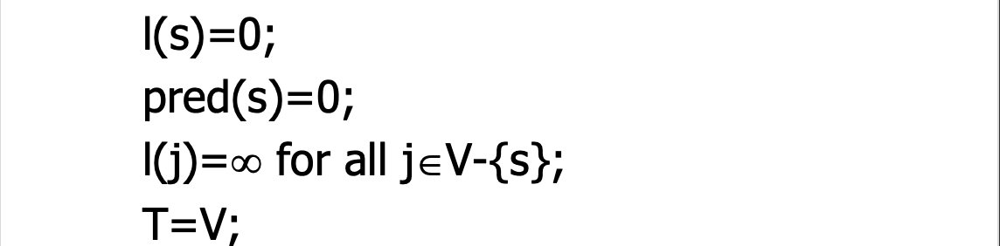

# 欧拉图和哈密顿图

## 欧拉图和半欧拉图

### 定义

对于一张无向图，如果存在一个经过所有边的简单回路，则称其这张图为欧拉图，称这个简单回路为欧拉回路；如果存在一个经过所有边的简单通路，则称这张图为半欧拉图，称这个简单通路为欧拉通路

很明显，一张无向图必须连通才有可能是欧拉图/半欧拉图

对于有向图有同样的定义。另外一张有向图必须强连通才有可能是欧拉图，必须单向连通才有可能是半欧拉图

### 无向欧拉图判定定理

一张无向图是欧拉图，当且仅当图连通并且所有点的度都是偶数

定理的证明可以看课本，使用的是构造性证明，实际上计算机找欧拉回路就是使用这种构造方法

### 无向半欧拉图判定定理

一张无向图是半欧拉图，当且仅当图连通并且只有两个点的度为奇数，其余点均为偶数度

如果我们在唯二的奇度点间连一条边就可以得到欧拉图，将欧拉图的欧拉回路去掉新连的边就可以得到欧拉通路了

### 无向欧拉图的其他定理

定理：$G$是非平凡的欧拉图当且仅当$G$是连通的且是若干个边不重的圈的并

平凡图指$N_1$，也就是一阶零图，这玩意是欧拉图，但是没有任何边，所以不符合这个定义，因此将它排除在外

定理本身很简单，实际上就是欧拉图判定定理构造过程的产物

定理：设$G$是非平凡的欧拉图，则$\lambda(G)\ge 2$

只需要证明$\lambda(G)\neq 0$且$\lambda (G)\neq 1$就行

如果$\lambda (G)=0$，则图不连通或者是平凡图，与“非平凡欧拉图”矛盾

如果$\lambda(G)=1$，则图有桥，但是由于欧拉回路的存在，图中不可能有桥（去掉一条边后一定可以从回路另一边连通）

得证

### 有向欧拉图判定定理

有向图是欧拉图当且仅当图是强连通的且每个点入度等于出度

### 有向半欧拉图判定定理

有向图是半欧拉图当且仅当图是单向连通的且恰有两个奇度点，且其中一个入度比出度大1，另一个出度比入度大1，其余顶点入度等于出度

### Fleury算法

严格表示可以看书P319。简单来说，这个算法就是能不走桥就不走桥、其他的路径随便走的算法

注意Fleury也可以用来找欧拉通路，不过需要从一个奇度点开始走

## 二部图

> 后面也会写成二分图

在讲哈密顿图的时候会用到二分图，不是很确定前面有没有写它的一些内容，所以这里先介绍下

### 定义

对于无向图$G=<V,E>$，若$\exist V_1,V_2,V_1\cup V_2=V,V_1\cap V_2=\varnothing$（可以理解成把$V$中的点分成了两部分），且$\forall u_1,v_1\in V_1,u_2,v_2\in V_2$都有$(u_1,v_1)\notin E,(u_2,v_2)\notin E$，那么就称$G$是一个二部图

对于有向图有同样的定义

注意，对于连通图（或者有向图的弱连通图），上述的$V_1,V_2$并不唯一的，实际上如果是一个$4$元环的话，我们就可以得到两种不同的$V_1,V_2$的划分方法

### 充要条件

一张图是二部图当且仅当图中没有长度为奇数的圈

## 哈密顿图

### 定义

对于一张图，若存在初级通路经过所有点，就称这条初级通路为哈密顿通路；若存在初级回路经过所有点，就称这条初级回路为哈密顿回路。具有哈密顿回路的图被称为哈密顿图，具有哈密顿通路但是没有哈密顿回路的图被称为半哈密顿图

简单来说，如果可以不重复地把图中所有点走完，还走回来了，就是哈密顿图；如果没有走回来，就是半哈密顿图

后面会主要讨论无向图的相关性质

### (半)哈密顿图的必要条件

#### 哈密顿图必要条件

对于$G=<V,E>$，若$G$是哈密顿图，则$\forall V_1\subset V$且$V_1\neq \varnothing$，均有$p(G-V_1)\le |V_1|$

$p(G-V_1)$即去掉点集$V_1$后图的连通分量数，$|V_1|$即点集大小

这个证明还是很简单的，只要将哈密顿回路拉出来考察就行。可以看老师PPT了解

#### 半哈密顿图必要条件

对于$G=<V,E>$，若$G$是半哈密顿图，则$\forall V_1\subset V$且$V_1\neq \varnothing$，均有$p(G-V_1)\le |V_1|+1$

证明：假设$\Gamma =v_1v_2\cdots v_n$为哈密顿通路，构造$G'=<V+\{v_0\},E+\{(v_0,v_1),(v_0,v_n)\}>$，很明显$G'$是哈密顿图，设$V'=\{v_0\}+V_1$，其中$V_1$是满足$V_1\subset V,V_1\neq \varnothing$的任意点集，根据哈密顿图的必要条件，$p(G'-V')\le |V'|$，因为$G'-V'=G-V_1,|V'|=|V_1|+1$，因此有$p(G-V_1)\le |V_1|+1$

#### 二部图上(半)哈密顿的必要条件

设二部图$G=<V_1,V_2,E>$，$|V_1|\le |V_2|$，且$|V_1|\ge 2,|V_2|\ge 2$，则

1. 若$G$是哈密顿图，则$|V_1|=|V_2|$
2. 若$G$是半哈密顿图，则$|V_2|=|V_1|+1$
3. 若$|V_2|\ge |V_1|+2$，则$G$不是哈密顿图，也不是半哈密顿图

### (半)哈密顿图的充分条件

#### 从度考虑

设$G$是$n$阶简单无向图，若对于$G$中任意不相邻的顶点$u,v$，均有$d(u)+d(v)\ge n-1$，则$G$中存在哈密顿通路

设$G$是$n(n\ge 3)$阶简单无向图，若对于$G$中任意不相邻的顶点$u,v$，均有$d(u)+d(v)\ge n$，则$G$中存在哈密顿回路

可以看下证明，用的是极大路径法

#### 从边考虑

来源：KB P327-T18

设$G$是$n(n\ge 3)$阶简单无向图，若边数$m\ge \frac 1 2(n-1)(n-2)+2$，则$G$是哈密顿图

### 哈密顿图的一个充要条件

这是书上介绍了的唯一的充要条件

设$u,v$为$n$阶无向简单图$G$中两个不相邻的顶点，且$d(u)+d(v)\ge n$，则$G$为哈密顿图当且仅当$G\cup (u,v)$为哈密顿图（也就是新加边$(u,v)$）

### 有向半哈密顿图的一个充分条件

$n$（$n\ge 2$）阶竞赛图中都有哈密顿通路

书上关于有向哈密顿图只有这一个结论

## 特殊图的欧拉/哈密顿图性质总结

|          图名          | 欧拉相关                                                 | 哈密顿相关                                                   |
| :--------------------: | -------------------------------------------------------- | ------------------------------------------------------------ |
| $n$阶非平凡完全图$K_n$ | 是欧拉图当且仅当$n$为奇数 $n=2$时是半哈密顿图       | 由于$\forall u,v\in V(K_n),d(u)+d(v)=2n-2\ge n$，故是哈密顿图 |
|       Peterson图       | Peterson图是10阶3正则图，每个点度数都是3，肯定不是欧拉图 | 不是哈密顿图                                                 |
|        $n$阶圈         | 是欧拉图                                                 | 是哈密顿图                                                   |
|        不连通图        | 不是欧拉图                                               | 不是哈密顿图                                                 |

# 有权图上的问题

## 带权图

### 定义

对于图$G$的每一条边上附加一个非负实数$w(e)$，称为$e$上的权（这里要求了边权是非负的）

带权图：图$G$加上各边上的权，记作$G=<V,E,W>$

图的权：所有权的总和。记作$w(G)=\sum\limits_{e\in E(G)}w(e)$

### Dijkstra

Dijkstra解决的是正权图（当然实际上可以有零权）上的单源最短路问题

单源意味着只关注某一个点（一般称为源点$s$）到别的点的最短路（也就是距离）

Dijkstra的过程可以看作不断从点集中取出点，更新拿出的点能到的点的距离的过程

Dijkstra标号法可以看老师课件，但是建议在已经理解了它的过程的基础上学习标号的过程

可以参考[oi-wiki对于Dijkstra的介绍](https://oi-wiki.org/graph/shortest-path/#dijkstra)

标号法的表样式

更新的时候的写法

算法的伪代码：

需要注意的是：

对于每次选的点，它的每一个相邻的点都需要写在更新那一栏表示被更新过，即使可能这个点的距离已经确定（也就是不可能更小）。这与算法竞赛会判点是不是`vis`过不同

对于一开始$\infty$的点，直接写更新的值就行

## 中国邮递员问题

### 定义

给一个带权无向图，其中每条边的权为非负实数，求每一条边至少经过一次的最短回路

### 解法

为陈乃月老师上课的时候讲的解法

1. 求带权图$G$所有奇度顶点之间的短程线
2. 用所有奇度顶点和短程线得完全图$K$
3. 求$K$得最小完美匹配$M$
4. 用$M$给$G$沿短程线加重复边得$G'$
5. 求$G'$得欧拉回路

这里的最小完美匹配指：找一组边，满足互不相邻且使图中每个点都与其中某条边关联，并满足总权值和最小

这个算法简单来说就是，挑出奇度点（一定有偶数个，握手定理），选择给这些奇度点两两加边连接让它们成为偶度点，在加出来的图上跑欧拉图

可以看老师课件上的例题了解怎么做

## 旅行商问题

### 定义

设$G=<V,E,W>$为一个$n$阶完全带权图，各边的全$W(e)$非负且可以为$\infty$（边权为$\infty$可以理解成断开），求$G$中一条最短的哈密顿回路

### 解法

旅行商问题是NPC的，只能枚举。。。可以枚举点，比如5个结点只需要枚举$5!=120$（其中大多数是不可行的）次~~就~~行，和前面的枚举思路一样

